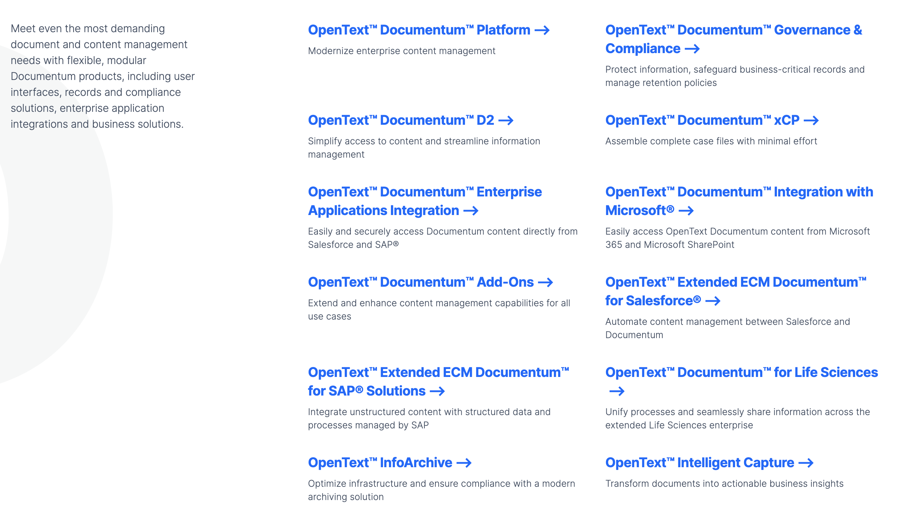

# OpenText Documentum 架构分析

<strong>最后修改于2023-06-07</strong>

- [OpenText Documentum 架构分析](#opentext-documentum-架构分析)
  - [1 产品关系](#1-产品关系)
  - [2 OpenText Documentum](#2-opentext-documentum)
    - [2.1 产品概览](#21-产品概览)
      - [2.1.1 产品定义](#211-产品定义)
      - [2.1.2 产品优势](#212-产品优势)
      - [2.1.3 产品关键特性](#213-产品关键特性)
    - [2.2 组件视图](#22-组件视图)
      - [2.2.1 业务视图](#221-业务视图)
      - [2.2.2 (产品)组件列表](#222-产品组件列表)
    - [2.3 运行视图](#23-运行视图)
    - [2.4 组件说明](#24-组件说明)
      - [2.4.1 OpenText™ Documentum™ Platform](#241-opentext-documentum-platform)
      - [2.4.2 OpenText™ Documentum™ Governance \& Compliance](#242-opentext-documentum-governance--compliance)
      - [2.4.3 OpenText™ Documentum™ D2](#243-opentext-documentum-d2)
      - [2.4.4 OpenText™ Documentum™ xCP](#244-opentext-documentum-xcp)
      - [2.4.5 OpenText™ Documentum™ Enterprise Applications Integration](#245-opentext-documentum-enterprise-applications-integration)
      - [2.4.6 OpenText™ Documentum™ Integration with Microsoft®](#246-opentext-documentum-integration-with-microsoft)
      - [2.4.7 OpenText™ Documentum™ Add-Ons](#247-opentext-documentum-add-ons)
      - [2.4.8 OpenText™ Extended ECM Documentum™ for Salesforce®](#248-opentext-extended-ecm-documentum-for-salesforce)
      - [2.4.9 OpenText™ Extended ECM Documentum™ for SAP® Solutions](#249-opentext-extended-ecm-documentum-for-sap-solutions)
      - [2.4.10 OpenText™ Documentum™ for Life Sciences](#2410-opentext-documentum-for-life-sciences)
      - [2.4.11 OpenText™ InfoArchive](#2411-opentext-infoarchive)
      - [2.4.12 OpenText™ Intelligent Capture](#2412-opentext-intelligent-capture)
    - [2.5 物理视图](#25-物理视图)
    - [2.6 可扩展性](#26-可扩展性)
    - [2.7 可用性](#27-可用性)
    - [2.8 适应性](#28-适应性)
    - [2.9 生态与开放性](#29-生态与开放性)
  - [参考资料](#参考资料)

## 1 产品关系

**OpenText的CSP平台包含在 Content Cloud 产品系列**。OpenText Content Cloud 提供了一套端到端的企业内容管理解决方案，从捕获到完整生命周期管理再到归档。Content Cloud与生产和消费信息的系统相集成，将企业级内容管理更深入地扩展到组织中，并促进结构化和非结构化数据的无缝访问、分发和使用。

**OpenText Content Services Platforms 将信息与人员和流程联系起来，并提供灵活的选项以部署在私有云或公共云中，它包含三个产品**：
* **OpenText Extended ECM** 将内容深度嵌入到企业流程中，
* **OpenText Documentum** 为受监管行业提供安全、高容量的内容管理，
* **OpenText Core** 将两者的优点结合在一个敏捷、快速部署的公共云产品中，提供的是多租户的 SaaS 服务。宣称支持 “run anywhere”，如AWS、Azure、Google Cloud。

## 2 OpenText Documentum
### 2.1 产品概览
#### 2.1.1 产品定义
OpenText Documentum 内容管理是一个分布式的云原生企业内容平台，可为所有用户提供合规、安全的单一真实来源(single-source-of-truth)。
Documentum 软件建立在模块化的基础上，可集成到企业业务应用程序中以支持从任何 UI 进行访问。
Documentum 产品可扩展以满足监管严格的组织对大量内容的需求。

#### 2.1.2 产品优势
Documentum 帮助企业：
* **始终如一地满足SLA**：应对最极端的需求，即使每小时导入 2000 万个对象或保护数十亿个对象，也能使用一致的管理规则。
* **消除生产力障碍**：通过共享内容存储库消除孤岛并应用强大的安全性，通过用户选择的 UI 提供内容。
* **为业务合作伙伴和客户赋能**：通过面向内部和外部用户的简化、自动化的工作流，提供跨业务流程的内聚信息。
* **确保合规性**：无缝支持高度监管行业的标准，包括 DOD5015.2、GCP、基线记录管理和机密记录、通用标准和 NARA。
* **让IT更敏捷**：通过快速、自动化的部署编排（例如 Kubernetes 和 OpenShift）在任何地方运行 Documentum 服务，以实现一致且可预测的配置。
* **满足不断变化的业务需求**：使用 Documentum 的向后兼容 API 适应未来需求并最大限度地降低升级复杂性。

#### 2.1.3 产品关键特性
* **企业内容服务**：支持多种格式的整个内容生命周期，包括 Office 文档、图像、CAD 文件和富媒体，具有灵活的搜索和访问、版本控制和元数据控制。
* **流程管理**：将传统业务流程管理与内容相结合，以协调需要采取行动的人员和时间，在上下文中呈现相关信息以做出一致的高质量决策。
* **内容治理**：提供一个强大的、容错的、云就绪的架构来管理和控制内容，包括多语言支持和全球环境的本地化，并进行扩展以满足和确保治理策略的执行。
* **可扩展和互操作**：利用面向服务的架构，支持与不同的存储库和企业应用程序集成，并使用标准技术（包括 CMIS、SOAP 和 restful API）搜索音频文件。
* **安全且可扩展**：提供强大的加密级别，包括符合 FIPS 标准和默认的 128 位 AES 级别加密，并通过内容保留和处置策略控制整个公司记录生命周期。

### 2.2 组件视图
#### 2.2.1 业务视图

#### 2.2.2 (产品)组件列表

### 2.3 运行视图

### 2.4 组件说明
**从整体来看，OpenText 遵循了模块化和组件化的思想，通过产品系列和服务(组件)的组合来实现整个业务领域的覆盖**。

OpenText Documentum 实际上是一个产品系列，包含这些产品(组件)：
* **OpenText™ Documentum™ Platform**
* OpenText™ Documentum™ Governance & Compliance
* OpenText™ Documentum™ D2
* OpenText™ Documentum™ xCP
* OpenText™ Documentum™ Enterprise Applications Integration
* OpenText™ Documentum™ Integration with Microsoft®
* OpenText™ Documentum™ Add-Ons
* OpenText™ Extended ECM Documentum™ for Salesforce®
* OpenText™ Extended ECM Documentum™ for SAP® Solutions
* OpenText™ Documentum™ for Life Sciences
* OpenText™ InfoArchive
* OpenText™ Intelligent Capture

**其中 OpenText™ Documentum™ Platform 是核心组件**。

#### 2.4.1 OpenText™ Documentum™ Platform
#### 2.4.2 OpenText™ Documentum™ Governance & Compliance
OpenText™ Documentum™ Governance & Compliance 帮助组织遵守严格的监管标准并实现良好的治理最佳实践。治理与合规性包括一套全面的安全与合规性服务，可防止未经授权的访问和使用以保护公司信息。

#### 2.4.3 OpenText™ Documentum™ D2
OpenText™ Documentum™ D2 是一个灵活、直观的用户界面，用于访问存储在 OpenText™ Documentum™ 平台中的内容并与之交互。Documentum D2 可响应所有设备，让用户可以个性化他们的信息和任务视图，以准确了解完成工作所需的内容。

#### 2.4.4 OpenText™ Documentum™ xCP
#### 2.4.5 OpenText™ Documentum™ Enterprise Applications Integration
#### 2.4.6 OpenText™ Documentum™ Integration with Microsoft®
#### 2.4.7 OpenText™ Documentum™ Add-Ons
#### 2.4.8 OpenText™ Extended ECM Documentum™ for Salesforce®
#### 2.4.9 OpenText™ Extended ECM Documentum™ for SAP® Solutions
#### 2.4.10 OpenText™ Documentum™ for Life Sciences
#### 2.4.11 OpenText™ InfoArchive
#### 2.4.12 OpenText™ Intelligent Capture
### 2.5 物理视图
### 2.6 可扩展性
### 2.7 可用性
### 2.8 适应性
### 2.9 生态与开放性

## 参考资料
1. [Content Services Platforms](https://www.opentext.com/products/content-services-platforms)
2. [Content Services Platforms - OpenText Documentum](https://www.opentext.com/products/documentum)
3. [Content Services Platforms - OpenText Documentum Platform](https://www.opentext.com/products/documentum-platform)
4. [Content Services - OpenText Extended ECM](https://www.opentext.com/products/extended-ecm)
5. [Product Overview - OpenText Documentum](https://www.opentext.com/file_source/OpenText/en_US/PDF/opentext-documentum-product-overview.pdf)
6. [How OpenText Documentum on AWS Maximizes the Value of Enterprise Information](https://aws.amazon.com/cn/blogs/apn/how-opentext-documentum-on-aws-maximizes-the-value-of-enterprise-information/)
7. [Docker and Kubernetes: Changing the OpenText Documentum deployment model](https://opentext.com/file_source/OpenText/en_US/PDF/opentext-wp-docker-and-kubernetes.pdf)
8. [What’s new in OpenText Documentum](https://blogs.opentext.com/whats-new-in-opentext-documentum/)