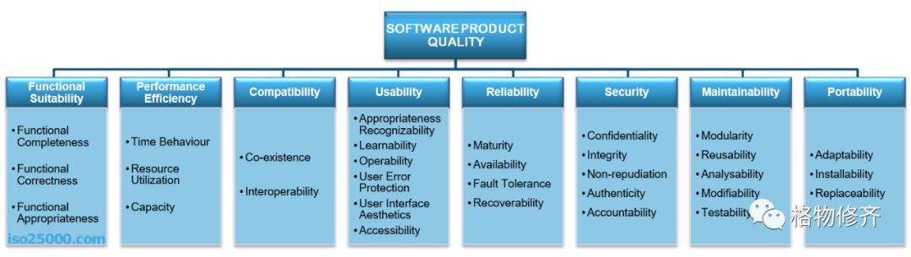

[返回上层](./README.md)

# 「fault tolerance」容错

<strong>最后修改于2022-04-14</strong>

最近需要处理一些系统稳定性问题，所以整理记录一下。

「fault tolerance」，相关的翻译「容错」、「容错性」、「故障容许度」、「故障容忍度」。

**「fault tolerance」，针对一个系统来说，简单讲就是，当故障发生的时候，系统还能继续运行。或者说当故障发生时，系统不中断。**

当然，人、团队组织、汽车、计算机硬件产品、软件产品都可以看作「系统」。关于这个观点，可以看看我之前写的《[我的系统观 2022](http://mp.weixin.qq.com/s?\_\_biz=MjM5MTM4NDE3Mg==\&mid=2247484097\&idx=1\&sn=8e378fd847eff907e8b6f76d5229d800\&chksm=a6b715c291c09cd4011f85dda15650a2051c1bd8a6294cfc25f835ad5e8efa7f5dc068c62c36\&scene=21#wechat\_redirect)》。

* 以人为例，手骨折了，还能活着思考。
* 以团队组织为例，离职一两个人，工作交接给团队其他人，整体工作还能正常运转。
* 以汽车为例，坏了一个车灯，在晚上还能继续开；破了一个车胎破，还能勉强低速开到修理店。

**容错的目的是，发生故障时，系统的运行水平可能有所下降，但是依然可用，不会完全失败。**

「fault-tolerant design」，相关翻译「容错设计」。

**「fault-tolerant design」容错设计的目标就是，当设计的系统某些部分发生故障的时候，因为容错设计，这个系统能够继续按预期运行，运行水平可能有所下降，但不会完全失败。**

「fault-tolerant design」容错设计的例子，可以看看上面提到的组织、汽车。当然，人如果是被「设计出来的」，那就采用了容错设计。

在计算机软件领域，ISO/IEC 25010 中定义的产品质量模型中，定义了八个质量属性：
* 功能适用性(Function Suitability)
* 性能效率(Performance Efficiency)
* 兼容性(Compatibility)
* 可用性(Usability，其实我感觉翻译成「易用性」更容易避免歧义)
* 可靠性(Reliability)
* 安全(Security)
* 可维护性(Maintainability)
* 可移植性(Portability)

**在 ISO/IEC 25010 定义中，「fault tolerance」容错性属于可靠性(Reliability)属性的一个子属性。定义跟上面讲的内容差不多：「Degree to which a system, product or component operates as intended despite the presence of hardware or software faults.」，即：尽管存在硬件或软件故障，系统、产品或组件按预期运行的程度。**

ISO/IEC 25010 定义的可靠性(Reliability)还有几个子属性，如成熟性(Maturity)、可恢复性(Recoverability)、可用性(Availability)。

* 成熟性(Maturity)定义为：系统、产品或组件在正常运行下满足可靠性要求的程度。
* 可恢复性(Recoverability)定义为：在发生中断或故障时，产品或系统能够恢复直接受影响的数据并重新建立系统所需状态的程度。
* 可用性(Availability)定义为：系统、产品或组件在需要使用时，可操作和可访问的程度。经常听到的「高可用」就是「high availability」、「HA」。**「high availability」高可用，指系统能够比正常时间更久地保持一定的运行水平。**

「fault tolerance」容错性跟「无故障」、「无错误」，还是有区别的。

**一个容错的系统，不一定是无故障或者无错误的。**

经过容错设计的系统，故障可以发生，报错可以有，但是系统还会依然可用，即系统不中断。

「high availability」高可用跟「容错性」也有区别，比如AWS EC2的可用性是99.99%，一年中断时间不超过52.56分钟，我们说AWS EC2是**高可用**的。

但在其他时间，AWS EC2持续运行(不中断服务)的过程中，可能遇到过很多个底层组件故障，比如某个内存坏了、某个CPU坏了，AWS EC2的服务还是持续运行的，我们说这是它的**容错能力**。

在这一年中，由于某个网络故障，导致某个区域的AWS EC2故障了。然后花了10分钟修复，那么这是它的**可恢复性(Recoverability)**。如果最终花了1天修复，那相比较而言，就是它的可恢复性比较差了。

那可靠性(Reliability)呢？就是上面这几种能力的集合。

总的来说，**「fault tolerance」容错，就是系统不中断的能力。**
**「fault-tolerant design」容错设计，其实就是故障处理的艺术，让故障可控的发生而对系统没有太大影响。**

参考链接：
1. [https://en.wikipedia.org/wiki/Fault\_tolerance](https://en.wikipedia.org/wiki/Fault\_tolerance)
2. [https://iso25000.com/index.php/en/iso-25000-standards/iso-25010](https://iso25000.com/index.php/en/iso-25000-standards/iso-25010)