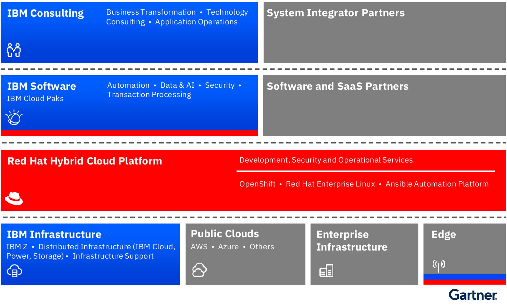
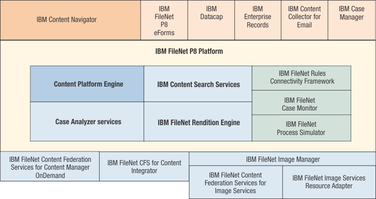
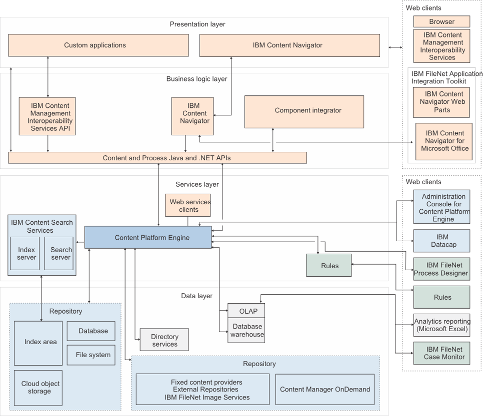
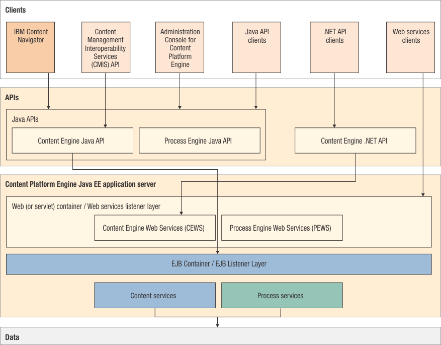
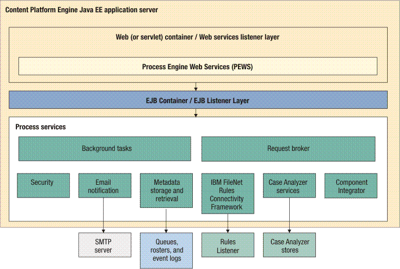

# IBM FileNet Content Manager 架构分析

## 1 IBM CSP 产品关系
### 1.1 IBM 业务单元

**IBM Cloud Pak for Business Automation 是 IBM Software 的一部份。**

### 1.2 IBM CSP (Conent Services Platforms)

**IBM的 CSP(Conent Services Platforms) 是 IBM Cloud Pak for Business Automation 的一部份。**

**IBM的CSP的主要组件是IBM FileNet Content Manager**，以云托管或自托管的形式提供。其他组件完善了内容服务功能，包括：
* IBM Enterprise Records
* IBM Business Automation Workflow
* IBM Business Automation Insights
* IBM Automation Document Processing
* IBM Content Manager OnDemand
* IBM Datacap

除了核心的CSP能力，IBM Cloud Pak for Business Automation还提供了这些能力：
* 过程自动化和应用程序开发
* 内容情报
* 生产力情报新的工作中心连接器
* 业务角色中心连接器
* 企业搜索和联合
* 智能文档处理
* 内容协作
* 信息治理/记录管理
* 输出管理
* 机器人创作

**IBM FileNet Content Manager 是 FileNet P8 产品系列的一个产品**。
FileNet P8 产品系列包括：
* IBM FileNet Content Manager，包含组件：
  * Content Platform Engine
  * IBM Content Search Services
  * IBM FileNet Content Federation Services
  * IBM System Dashboard for Enterprise Content Management
* IBM Content Foundation，包含组件：
  * Content Platform Engine
  * IBM Content Search Services
  * IBM FileNet Content Federation Services
* IBM Case Foundation，包含组件：
  * IBM FileNet Content Manager
  * IBM FileNet Case Monitor
  * Case Analyzer
  * IBM FileNet Process Designer

*注：下文提到 FileNet P8 基本等同于 IBM FileNet Content Manager*。

### 1.3 IBM Content Services
**在AWS应用市场提供了SaaS版本的 IBM 内容服务**，访问地址 https://aws.amazon.com/marketplace/pp/prodview-xxnek4yehitqi

## 2 IBM FileNet Content Manager
### 2.1 产品概览
#### 2.1.1 产品定义
**IBM FileNet Content Manager 是一种灵活且功能齐全的内容管理解决方案，为 IBM Cloud Pak for Business Automation 奠定了基础。它使用 AI 来交付从非结构化内容中获得的深入洞察。利用它可在任何云中创建创新的业务应用，并更有效地管理来自任何来源的一切内容**。

IBM FileNet Content Manager, 一种云原生内容服务解决方案，用于管理、共享和协作内容，以节省员工时间并改善客户体验。

#### 2.1.2 产品优势
* **简化并加速解决方案开发**：内容管理员和业务用户可以利用低代码工具和现代 GraphQL API 来创建以内容为中心的安全应用，这些应用可以处理大量文档以交付结果。
* **节省时间并创建可见性(create visibility)**：快速搜索企业中的内容，包括从纸质文档中提取的信息。从任何设备和现有应用中安全地与外部用户共享内容。
* **提高工作效率**：通过使用深度学习 AI 从非结构化内容中提取洞察和数据来激活内容。通过消除手动文档分类和易出错的元数据输入，最大限度地提高工作效率。
* **改善客户体验**：通过简化内容管理流程并在最需要的地方提供关键内容，缩短周转时间。加快客户支持查询、付款、审批等。

#### 2.1.3 产品关键特性
* **消除孤岛并简化内容管理**：使用由高级搜索、安全和治理功能提供支持的集中式存储库，轻松管理和控制对企业范围内内容的访问。
* **轻松搜索整个企业的内容**：使用针对整个企业中的每个组织调整的完全可定制的 UI 查看、搜索和浏览内容，或者从关键任务应用程序中查看、搜索和浏览内容，以提高生产力和协作。
* **统一内容治理**：通过单一、全面且可扩展的解决方案更安全、一致和智能地管理来自所有存储库和文件共享的内容。

### 2.2 组件视图

**从整体来看，FileNet P8 遵循了模块化和组件化的思想，通过产品系列和服务(组件)的组合来实现整个业务领域的覆盖**。

### 2.3 运行视图

### 2.4 组件说明
#### 2.4.1 IBM FileNet P8 Platform
##### 2.4.1.1 Content Platform Engine
**Content Platform Engine** 是一个 FileNet P8 组件，旨在处理大型企业的大量处理需求。它可以通过提供功能强大且易于使用的管理工具来管理企业范围的工作流程对象，定制对象和文档。通过使用这些工具，管理员可以创建和管理构成企业内容管理 (ECM) 系统基础的类、属性、存储和元数据。

###### 2.4.1.1.1 内容服务
**Content Platform Engine 内容服务负责添加和删除内容以及从对象存储库中检索对象和内容**。除了为来自企业内容管理 (ECM) 应用程序的请求提供服务外，内容服务还会托管各种后台任务，以维护与每个对象存储库相关联的所有资源。

**Content Platform Engine 内容服务包括如下组件或服务**：
* **Security(安全)**: 提供用于授权访问对象和内容的细颗粒度安全模型；与目录服务产品交互以认证用户并检索用户和组帐户信息。
* **Search(搜索)**：提供对特别搜索和存储搜索的支持。可以对系统属性(例如对象创建者或创建日期)、客户定义的属性(例如帐号或客户名称)或文档内容执行搜索。属性搜索可与文本搜索组合使用。用户可以同时搜索多个对象库。
* **Event framework(事件框架)**：启用操作配置以响应在对象存储库中存储的对象上发生的特定活动。例如，创建新文档时，用户可以配置事件以启动用于进一步处理文档的工作流程。
* **Event Auditing(事件审计)**：在 FileNet P8 系统上启用活动监视，对对象执行的操作会导致自动记录审计条目以供以后进行分析。
* 与内容相关的服务：提供从不同类型的存储设备安全地存储和检索内容的功能，并提供管理此内容所需的所有功能。文档或注释由属性和内容组成。属性存储在对象存储库数据库中。内容(例如，Word或PDF文档)也可以存储在对象存储数据库中(称为数据库存储)，或者可以选择将内容存储在网络文件服务器(文件存储区)或外部存储设备(固定存储区)上。
  * **File storage(文件存储器)**：管理一个或多个文件存储，允许文档内容存储在网络文件服务器上。
  * **Fixed content providers(固定内容提供者)**：管理一个或多个 Image Services 和第三方存储设备，以管理这些存储库中的内容。
  * **Federated content systems(联合内容系统)**：管理配置为访问属于联合内容管理系统的外部存储库的固定存储区。
  * **Full-text indexing(全文索引)**：管理与IBM Content Search Services的交互。用户可以对一个或多个文档类和注释类启用全文索引，从而允许对其内容及其属性执行全文搜索。
  * **Content Cache(内容高速缓存)**：如果启用了内容高速缓存，那么会将最近创建或访问的内容的副本存储在本地网络文件共享中，以便后续检索更高效。 内容高速缓存主要用于地理分布的环境中，在这些环境中，对远程内容存储资源的访问可能通过慢速网络链路进行。
  * **Document publishing(文档发布)**：管理发布文档的请求，包括将文档呈现为PDF或HTML格式的选项。 当发出将内容转换为备用格式的请求时，内容服务会将格式转换请求提交到复制引擎。

###### 2.4.1.1.2 流程服务
**Content Platform Engine 流程服务提供软件服务，用于管理业务流程(也称为工作流程)的所有方面，例如工作流程执行、工作流程路由、规则管理、流程模拟和建模以及工作流程分析**。用户可以使用工作流程系统组件来创建、修改和管理工作流程。这些工作流程由应用程序、企业用户或外部用户(例如合作伙伴和客户)实施。

Content Platform Engine 流程服务包括如下组件或服务：
* **Email notification(电子邮件通知)**：允许在发生指定流程相关事件时自动向用户传输电子邮件；电子邮件通知还可用于跟踪工作流程。
* **Rules Connectivity Framework**：为规则集成提供框架。流程设计者或业务分析员使用第三方应用程序来创建业务规则，并将这些规则与工作流程的步骤相关联。当正在运行的工作流程遇到规则时，工作流程系统会向规则监听器发送请求以执行规则集。规则监听器执行规则集中的规则，并将结果返回到工作流程系统。规则引擎提供程序必须实现特定 API 以与工作流程系统集成。
* **Case Analyzer services**：从 Content Platform Engine 审计和事件日志收集事件，并生成保存到 Case Analyzer 存储库的分析数据。
* **Workflow system(工作流程系统)**：包含工作流程系统配置信息以及正在运行的工作流程实例。
* **Component Integrator(组件集成器)**：提供可扩展的集成框架，您可以在其中轻松创建连接器。 提供了Java适配器和Java消息服务(JMS)适配器。Component Integrator 包含适配器，这些适配器是用于将工作流程事件与外部实体(例如Java对象)进行通信的接口。 适配器与工作流程步骤中不同类型的组件进行交互。 FileNet P8 提供了在 Content Platform Engine 服务器上运行的Java适配器和Java消息服务(JMS)适配器。
* **Process Web Services(处理Web Service)**：向工作流程系统提供 Web Service API。
* **Automatic workflow launch(自动启动工作流程)**：事件驱动的组件，用于在工作流程系统中启动工作流程。用户可以配置此组件以启动特定工作流程来响应特定事件。例如，在文件夹中归档文档可能会在工作流程系统中启动复审流程。

##### 2.4.1.2 IBM Content Search Services
Content Platform Engine 预处理文档并将它们发送到 IBM Content Search Services 索引服务器进行索引。IBM Content Search Services 可配置为索引和搜索两种角色。

##### 2.4.1.3 内容组件-IBM FileNet Content Federation Services for Content Integrator
IBM FileNet Content Federation Services for Content Integrator 集成来自多个存储库的文档，包括 IBM Content Manager、IBM FileNet Content Services、Documentum Content Server 和 Open Text Livelink Enterprise Server。

通过 IBM FileNet Content Federation Services for Content Integrator 来联合内容时，可以选择将内容从外部存储库移至由 FileNet P8 对象存储库控制的本地存储区域，也可以只作为外置存储进行使用。

##### 2.4.1.4 内容组件-IBM FileNet Content Federation Services for Image Services
IBM FileNet Content Federation Services for Image Services 集成并联合 IBM FileNet Image Services 存储库中的内容，并使 Content Platform Engine 能够将该存储库用作另一个内容存储设备。 

Content Federation Services for Image Services 使 FileNet P8 应用程序和服务器能够与 Image Manager 应用程序和服务器进行通信和协同工作。FileNet P8 应用程序的用户对存储在现有存储库中的内容具有完全访问权。

##### 2.4.1.5 流程组件-Case Analyzer
**FileNet P8 为业务流程提供了分析和监视工具**。

**Case Analyzer** 用来监视和分析案例和业务流程
* **作为监控工具**。可以使用 Case Analyzer 来监视案例和业务流程。Case Analyzer 从 Content Platform Engine 事件日志收集事件，如果 Content Platform Engine 与 IBM Case Manager集成，那么审计日志将根据活动案例和工作流程数据以及最近的历史数据生成基于图表的统计报告。
* **作为分析工具**。可以使用 Case Analyzer 来分析案例和业务流程。Case Analyzer 从 Content Platform Engine 事件日志收集事件，如果 Content Platform Engine 与 IBM Case Manager集成，那么审计日志将根据活动案例和工作流程数据以及历史数据生成基于图表的统计报告。

#### 2.4.2 与FileNet P8集成的组件和产品
##### 2.4.2.1 IBM Content Navigator
**IBM Content Navigator** 是可以连接到多个 IBM Content Manager Enterprise Edition，IBM Content Manager OnDemand 和 FileNet P8 存储库的 Web 客户端。

##### 2.4.2.2 IBM Datacap
**IBM Datacap** 是文档和数据捕获的完整解决方案。Datacap 快速、准确且经济高效地扫描、分类、识别、验证、验证和导出数据和文档图像。FileNet P8 连接器操作将 IBM Datacap 应用程序与 Content Platform Engine 对象库集成。通过此集成，可以自动执行数据捕获，对文档建立索引和处理表单，作为将文档图像和关联索引值上载和存储在 Content Platform Engine中的前端。

##### 2.4.2.3 IBM Enterprise Records
**IBM Enterprise Records** 可以用来创建和维护准确，安全且可靠的电子和物理信息记录，可以管理任何类型的记录，而不考虑存储介质或格式。

##### 2.4.2.4 IBM Content Collector
**IBM Content Collector** 由多个组件组成，这些组件与 Microsoft Exchange、Lotus Domino、NTFS、DFS和 Novell 文件系统、Microsoft SharePoint 和 IBM Connections 环境以及 Content Platform Engine 对象库的组件进行交互。

##### 2.4.2.5 IBM Case Manager
**IBM Case Manager** 简化了设计和构建案例管理系统的工作，并为案例工作者提供图形用户界面以轻松管理案例。IBM Case Manager 部署在应用程序服务器中，并使用 FileNet P8 来访问和存储内容和解决方案资产。

### 2.5 物理视图和伸缩性

FileNet P8 组件通过多层分布式架构支持企业级可伸缩性。为了满足各种可伸缩性需求，FileNet P8 提供垂直和水平可伸缩性解决方案。
* 服务器的垂直可伸缩性可以定义为其通过增加比例的处理能力来处理额外工作负载的能力。
* 水平可扩展的系统可以通过随着工作负载的增加而增加集群的大小来处理额外的工作负载。

以下描述了 FileNet P8 伸缩性的特点:
* 可以对 Content Platform Engine 进行集群 (水平缩放) 以支持增加的工作负载需求
* 可以通过在单个框上运行多个实例或通过配置单个实例以使用系统资源来垂直缩放 Content Platform Engine。
* 数据库软件可以远程配置为在单独的机器上运行，这有几个好处:
  * 客户对在应用程序和数据库之间分配资源的方式具有最大控制权。
  * 数据库可以位于专用系统上，针对 RDBMS 进行调整，并由数据库管理员单独管理。
  * 与数据库分离允许对应用程序服务器 (例如 Content Platform Engine ) 进行集群。
* 访问内容对象库的服务可以分布在任意数量的机器上，以处理繁重的用户访问。
* 可以在数据库和机器之间分布多个对象库，从而允许同一系统为多个应用程序提供服务。
* 用户可以使用跨对象存储库 (即联合) 搜索来访问已分布在不同对象存储库中的内容。
* 可以轻松地将 Web 站点部署到多个目标以处理大量用户。

在容器化部署的场景下：
* (v5.5.8以上版本)可以使用自动伸缩来扩展或缩减Content Platform Engine部署的Pod数。技术使用的Kubernetes HPA机制。
* Content Search Services 不支持自动缩放功能

**总的来说，在伸缩性这块，FileNet P8提供多层分布式架构，在服务、Web站点、数据库、存储服务等分别提供垂直和水平伸缩的能力**：
* 在主机部署场景下，通过伸缩集群规模来实现能力伸缩；
* 在容器化部署场景下，伸缩性和资源管理主要是依赖于Kubernetes本身的能力提供自动伸缩。

### 2.6 可视化仪表盘和可扩展性
FileNet P8 提供了用于监视和分析系统性能的工具。
**IBM System Dashboard for Enterprise Content Management 是一种机制，用于在独立于操作系统的站点上安装的各种 IBM Enterprise Content Management (ECM) 产品上收集和分发性能数据**。

**System Dashboard for Enterprise Content Management 由两个主要组件组成: 监听器和管理器**。

**监听器**：从应用程序接收事件流和其他性能信息，并将数据发送到管理器以进行分析和存储。监听器相当于 SNMP 代理程序，它使客户机能够选择性地累积和聚集一段时间内的性能数据。监听器以被动方式等待管理员连接到它并查询其性能计数器值。 在没有"管理器"连接的情况下，外部观察者几乎无法看到监听器组件的存在。仪表板提供监听器的 Java 和 Microsoft C++ 实现。**由监听器公开的数据分为三类: 环境，静态和动态**。
* **环境数据**是有关应用程序操作环境的信息，例如操作系统名称和版本号，CPU 数量和类型，可用内存量等。
* **静态数据**特定于实施 "仪表板" 功能的应用程序，但不会随着应用程序的运行而更改。静态数据的示例包括应用程序的名称和版本号。Java 应用程序的静态数据还包含有关 Java 运行时环境的信息，例如其版本号，最大内存等。
* **动态数据**包括操作系统提供的数据，例如 CPU 负载，正在使用的内存，网络流量等，以及特定于应用程序的数据 (计数器，持续时间以及应用程序提供给管理器的其他数据)。因此，动态数据的数量和类型因应用程序中实现的检测级别而异，并且可以随产品的发行版而变化。

**管理器**：连接到监听器并从监听器检索报告，并处理收集的数据，例如存储数据，以图形方式显示数据或使用数据执行其他特定于应用程序的任务。**"仪表板" 提供了两个管理器: "仪表板"和"归档管理器"**。
* **仪表板**：显示性能统计信息。
* **归档管理器**：将从集群中的监听器收集的历史或实时数据保存到随后可在仪表板中装入以进行分析，报告等的文件。

下图是仪表板的架构：

TCP 套接字连接仪表板和监听器。每个监听器都维护其应用程序事件的历史记录。管理器可以随时请求此历史信息。仪表板一旦连接到每个监听器，就会自动请求此历史记录。可以使用仪表板或独立归档管理器来保存监听器的历史记录以供以后进行分析。

下表是 FileNet P8 以及与仪表板集成的相关组件：

| FileNet P8 组件                                            | 包含的组件                                                                 |
| ---------------------------------------------------------- | -------------------------------------------------------------------------- |
| IBM Case Foundation                                        | - Content Platform Engine和 Case Analyzer 的监听器   - 仪表板           |
| IBM FileNet Content Federation Services for Image Services | - IBM FileNet Content Federation Services for Image Services   - 仪表板 |
| IBM FileNet Content Manager                                | - Application Engine 和 Content Platform Engine 的监听器   - 仪表板     |
| IBM Case Manager                                           | - IBM Case Manager 的监听器   - 仪表板                                  |
| Image Manager                                              | - IBM FileNet Image Services   - 仪表板                                 |
| Image Services Resource Adapter                            | - Image Services Resource Adapter 的监听器   - 仪表板                   |
| IBM Enterprise Records                                     | - IBM Enterprise Records 的监听器   - 仪表板                            |
| IDM Web Service/Open Client                                | - Web Service 和 Open Client 的监听器   - 仪表板                        |

**从上面来看，实际上FileNet P8提供了一种基于监听器和管理器的扩展机制，即新增的组件，通过提供监听器和仪表板，按照一定的规则即可接入 IBM System Dashboard for Enterprise Content Management**。

#### 2.6.1 基于指标报告的License管理
与仪表板相关的 **IBM License Management Tools** 随 IBM System Dashboard for Enterprise Content Management 一起安装，包含三个组件：
* **Listener(监听器)**：**每个受支持的 FileNet P8 组件都实时向监听器报告使用情况事件**。监听器汇总一天中的数据，将最多7天的数据存储在内存中。
* **IBM License Metric Tool collector**：使用情况收集器按自动调度运行，通常每天运行一次。它通过 TCP/IP 连接到每个监听器，并下载任何新的使用数据。使用情况收集器将数据永久存储在本地数据库中。
* **IBM License Metric Tool reporter**：管理员可以随时运行系统使用情况报告程序以生成报告。系统使用情况报告程序连接到本地数据库并显示信息。这些信息可以以各种格式 (CSV、HTML或XML) 导出，以供其他工具(例如Excel)进行其他报告分析。

**从上面可以看出，FileNet P8在 License 这块基于监听器和管理器的扩展机制，以及可观测架构实现**。

### 2.7 可用性
主要基于服务器场和服务器集群技术来保证高可用。比如负载均衡器、数据库集群等。

### 2.8 适应性

**IBM FileNet Content Manager 支持容器化部署、传统非容器化部署**。

IBM FileNet Content Manager (v5.5.10) 操作系统兼容性大致：
* AIX 7.1/7.2/7.3 POWER system - Big Endian
* RHEL 7/8/9 x86-64
* RHEL 7/8/9 IBM z System
* SUSE 11/12/15 x86-64
* SUSE 11/12/15 IBM z System
* Windows 10 Enterprise/Pro x86-64
* Windows Server 2012 R2 Datacenter/Essential Edition x86-64
* Windows Server 2016 R2 Datacenter/Essential/Standard Edition x86-64
* Windows Server 2019 R2 Datacenter/Essential/Standard Edition x86-64
* Windows Server 2022 x86-64

Kubernetes 兼容性大致：
* Kubernetes 1.23+
* OpenShift Container Platform 4.8+

### 2.9 生态与开放性
#### 2.9.1 应用集成
**FileNet P8 能与Microsoft Office、SAP、FileNet Collaboration Services、SharePoint 集成**：
* FileNet P8 与 Microsoft Office 应用程序集成，以便用户可以直接从关联的 Office 应用程序管理 FileNet P8 对象库中的文档，电子邮件和附件。Outlook 集成通过自动捕获电子邮件属性(例如"收件人"和"发件人"字段)来扩展搜索功能。
* Content Collector for SAP 提供高级归档功能，可帮助SAP用户更高效地运行其业务。它提供对所有类型的企业信息的访问，支持将较旧的信息转移到较低成本的磁盘和磁带上以改善系统性能。
* IBM FileNet Collaboration Services 使用户能够使用客户机应用程序(例如 IBM Connections 和 IBM Lotus Quickr) 直接存储和访问 FileNet P8 中的内容。
* FileNet P8 和 SharePoint 技术是免费解决方案，当它们一起使用时，它们提供了一个环境，业务用户可以在此环境中轻松协作处理中的工作文档和任务，但在整个企业中遵守内容和合规性计划。SharePoint用户可以继续使用SharePoint易于使用和熟悉的界面，而 FileNet P8 提供对用户透明的强大内容，流程和合规性基础结构。通过此方法，业务用户可以将SharePoint服务站点和SharePoint Portal用于大多数日常内容，流程和合规性活动，而不必学习新应用程序或执行其他内容或合规性管理任务。

#### 2.9.2 内容存储库集成
**使用 IBM FileNet Content Federation Services 能够将外部存储库中的数据与 FileNet P8 集成，并访问文档，就像它们存储在对象存储库中一样**。外部存储库类似于 Content Platform Engine 系统的虚拟存储区。

**IBM FileNet Content Federation Services 实现对象元数据管理、以及对象与文档对象属性映射管理**：
* 在指向外部存储库中的源文档的对象库中创建引用：对象存储库中的文档仅由元数据表示; 外部存储库中的文档包含其所有原始内容。
* Content Federation Services 提供了一种用于将源文档元数据映射到 Content Platform Engine 文档属性的机制（他们成这个映射过程为“联合/federation”）。

在联合文档之后，可以将其与所有标准 FileNet P8 功能(包括属性搜索，记录管理和工作流程)配合使用。其他 Content Federation Services 功能包括故障转移、故障恢复、重复检测、外部存储库更新的联合、文档与版本系列的联合以及常规配置信息的存储。

**IBM FileNet Content Federation Services 是一个类型的统称**，具体的服务包括：
* IBM FileNet Content Federation Services for Content Integrator
* IBM FileNet Content Federation Services for Image Services
* IBM FileNet Content Federation Services for Content Manager OnDemand

在前面2.4节里有关于这些服务的详细说明。

#### 2.9.3 开放性
为了提升开放式可扩展环境，FileNet P8提供了用于开发定制应用程序的API。
* 用于应用程序开发的 XML
  * FileNet P8 API ，应用程序和服务以多种方式支持和使用 XML。
    * XML作为数据格式：许多FileNet结构以XML表示，包括工作流程定义，输入模板，搜索模板，发布模板，发布组合件和站点/用户首选项。
    * 用于数据交换的XML：XML用于导入和导出对象和元数据定义。
* Java Platform, Enterprise Edition 支持
  * IBM提供了在Java EE产品(应用程序服务器) (例如IBM WebSphere Application Server和Oracle WebLogic服务器)中运行的 Java Platform、Enterprise Edition(Java EE)应用程序组件和系统组件。此外，FileNet P8 应用程序使用Java EE应用程序模型来构建多层应用程序，以交付企业应用程序所需的可伸缩性，辅助功能选项和管理。
* IBM Content Services GraphQL API(选装服务)
  * Content Services GraphQL API 提供了一个架构和一个易于理解的查询语言系统，可简化Content Platform Engine的应用程序开发。

**核心能力(内容引擎)的开放率**：
* Content Engine Java API 提供内容引擎的全部能力
* Content Engine .NET API 提供内容引擎的全部能力
* Content Engine Web Service(CEWS) 基于标准的SOAP接口，提供内容引擎大部分功能

## 参考资料
1. [Market Guide for Content Services Platforms, 2023, Gartner](https://www.gartner.com/document/4022795)
2. [Vendor Rating: IBM, 2023, Gartner](https://www.gartner.com/document/4397199)
3. [FileNet, wikipedia](https://en.wikipedia.org/wiki/FileNet)
4. [What is IBM Cloud Pak for Business Automation](https://www.ibm.com/docs/en/cloud-paks/cp-biz-automation/22.0.2?topic=overview-what-is-cloud-pak-business-automation)
5. [FileNet P8 Platform 5.5.x](https://www.ibm.com/docs/zh/filenet-p8-platform/5.5.x)
6. [Detailed system requirements for a specific product, IBM](https://www.ibm.com/software/reports/compatibility/clarity/softwareReqsForProduct.html)
7. [IBM Content Services, AWS Marketplace](https://aws.amazon.com/marketplace/pp/prodview-xxnek4yehitqi)