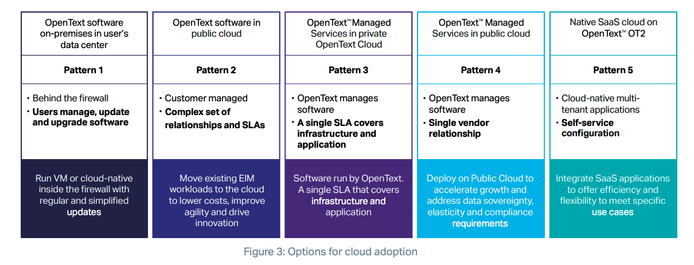
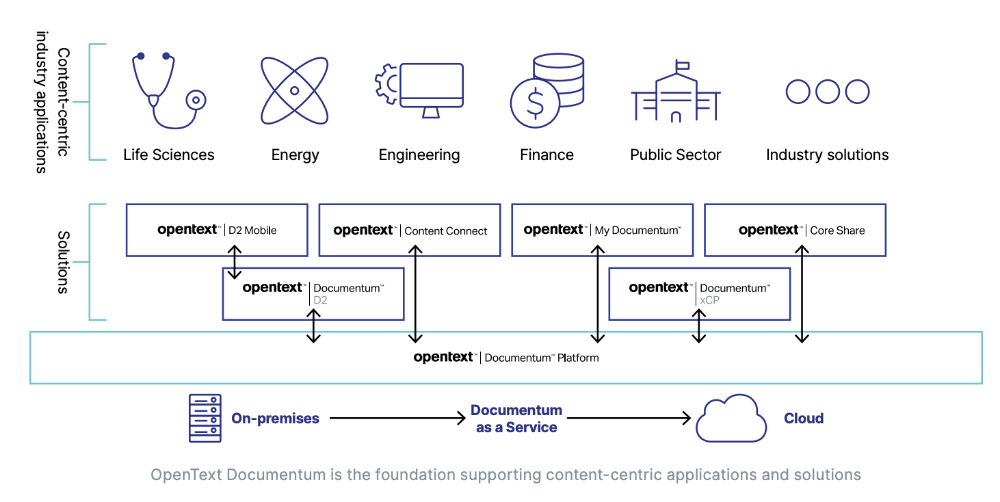
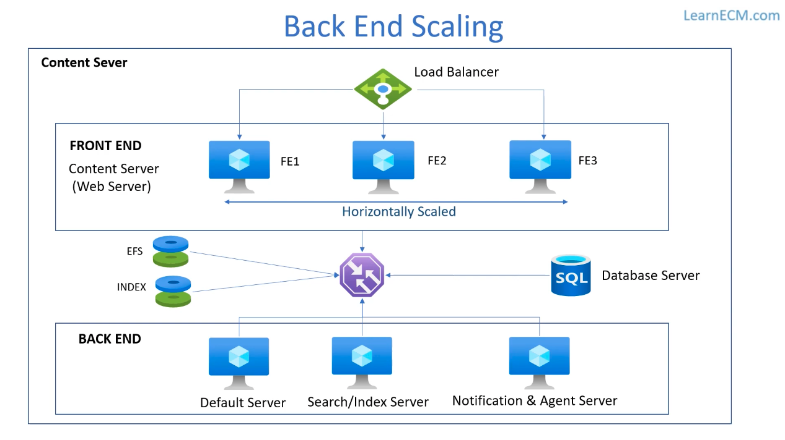
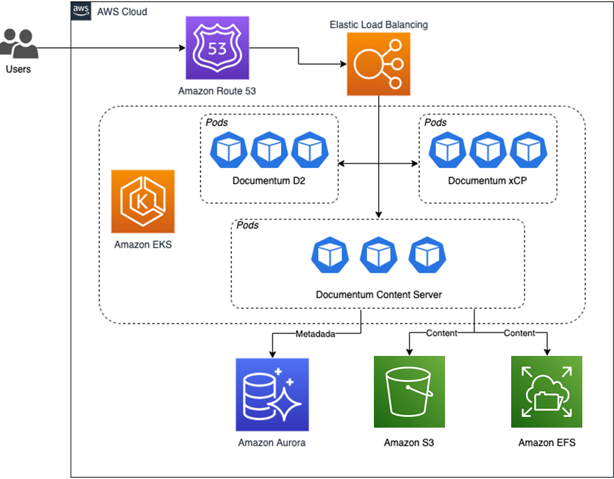
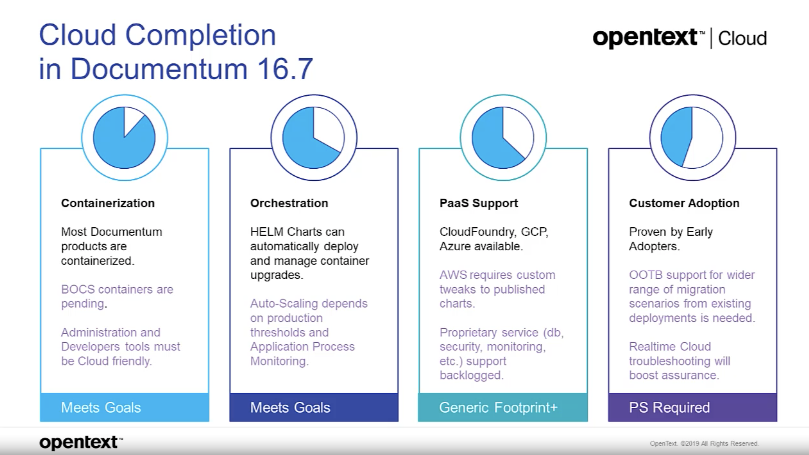

# OpenText Documentum 架构分析

## 1 产品关系
### 1.1 OpenText CSP

**OpenText的CSP平台包含在 Content Cloud 产品系列**。OpenText Content Cloud 提供了一套端到端的企业内容管理解决方案，从捕获到完整生命周期管理再到归档。Content Cloud与生产和消费信息的系统相集成，将企业级内容管理更深入地扩展到组织中，并促进结构化和非结构化数据的无缝访问、分发和使用。

**OpenText Content Services Platforms 将信息与人员和流程联系起来，并提供灵活的选项以部署在私有云或公共云中，它包含三个产品**：
* **OpenText Documentum** 为受监管行业提供安全、高容量的**内容管理**；
* **OpenText Extended ECM** （**以前称为 OpenText Extended ECM Platform 和 OpenText Content Suite Platform**）将业务内容与领先的 ERP、CRM、HCM 应用相集成，将人与信息无缝连接，加速端到端业务。核心目标是**实现信息与业务流程的连接**。
* **OpenText Core** 将两者的优点结合在一个敏捷、快速部署的公共云产品中，提供的是多租户的 SaaS 服务。宣称支持 “run anywhere”，如AWS、Azure、Google Cloud。

### 1.2 OpenText CSP三大产品的定位差异
**我觉得OpenText CSP的三大产品之间的定位差异**：
* OpenText Documentum 侧重内容管理
* OpenText Extended ECM 侧重业务连接
* OpenText Core 是多租户SaaS

### 1.3 OpenText产品交付模式

## 2 OpenText Documentum
### 2.1 产品概览
#### 2.1.1 产品定义
OpenText Documentum 内容管理是一个分布式的云原生企业内容平台，可为所有用户提供合规、安全的单一真实来源(single-source-of-truth)。
Documentum 软件建立在模块化的基础上，可集成到企业业务应用程序中以支持从任何 UI 进行访问。
Documentum 产品可扩展以满足监管严格的组织对大量内容的需求。

#### 2.1.2 产品优势
Documentum 帮助企业：
* **始终如一地满足SLA**：应对最极端的需求，即使每小时导入 2000 万个对象或保护数十亿个对象，也能使用一致的管理规则。
* **消除生产力障碍**：通过共享内容存储库消除孤岛并应用强大的安全性，通过用户选择的 UI 提供内容。
* **为业务合作伙伴和客户赋能**：通过面向内部和外部用户的简化、自动化的工作流，提供跨业务流程的内聚信息。
* **确保合规性**：无缝支持高度监管行业的标准，包括 DOD5015.2、GCP、基线记录管理和机密记录、通用标准和 NARA。
* **让IT更敏捷**：通过快速、自动化的部署编排（例如 Kubernetes 和 OpenShift）在任何地方运行 Documentum 服务，以实现一致且可预测的配置。
* **满足不断变化的业务需求**：使用 Documentum 的向后兼容 API 适应未来需求并最大限度地降低升级复杂性。

#### 2.1.3 产品关键特性
* **企业内容服务**：支持多种格式的整个内容生命周期，包括 Office 文档、图像、CAD 文件和富媒体，具有灵活的搜索和访问、版本控制和元数据控制。
* **流程管理**：将传统业务流程管理与内容相结合，以协调需要采取行动的人员和时间，在上下文中呈现相关信息以做出一致的高质量决策。
* **内容治理**：提供一个强大的、容错的、云就绪的架构来管理和控制内容，包括多语言支持和全球环境的本地化，并进行扩展以满足和确保治理策略的执行。
* **可扩展和互操作**：利用面向服务的架构，支持与不同的存储库和企业应用程序集成，并使用标准技术（包括 CMIS、SOAP 和 restful API）搜索音频文件。
* **安全且可扩展**：提供强大的加密级别，包括符合 FIPS 标准和默认的 128 位 AES 级别加密，并通过内容保留和处置策略控制整个公司记录生命周期。

### 2.2 组件视图
#### 2.2.1 业务视图

#### 2.2.2 (产品)组件列表

### 2.3 运行视图(非官方)
#### 2.3.1 Content Server 运行架构

大致看出 Content Server 分为四层服务：
1. 负载均衡
2. 前端服务
3. 后端服务
4. 数据存储：数据库、分布式存储、索引服务等

#### 2.3.2 集成目录服务

### 2.4 组件(主要产品)说明
**从整体来看，OpenText 遵循了模块化和组件化的思想，通过产品系列和服务(组件)的组合来实现整个业务领域的覆盖**。

OpenText Documentum 实际上是一个产品系列，包含这些产品(组件)：
* **OpenText™ Documentum™ Platform**，内容管理的基本平台
* OpenText™ Documentum™ Governance & Compliance，安全合规服务
* OpenText™ Documentum™ D2，用户界面
* OpenText™ Documentum™ xCP，实现自动化工作流的服务
* OpenText™ Documentum™ Enterprise Applications Integration 企业应用集成的服务，应该是为后面对应的集成服务提供基础能力支持
* OpenText™ Extended ECM Documentum™ for Salesforce®，集成到Salesforce，并提供配置方式定义业务流程
* OpenText™ Extended ECM Documentum™ for SAP® Solutions，集成到SAP
* OpenText™ Documentum™ Integration with Microsoft®，集成到微软的应用
* OpenText™ Documentum™ Add-Ons
* OpenText™ Documentum™ for Life Sciences，面向生命科学领域的服务
* OpenText™ InfoArchive，归档服务
* OpenText™ Intelligent Capture，智能采集服务

**其中 OpenText™ Documentum™ Platform 是核心组件**，其他组件基于之上进行扩展，从而满足不同的业务场景需求。

#### 2.4.1 OpenText™ Documentum™ Platform
OpenText™ Documentum™ Platform 组织、保存信息并使信息易于访问，同时确保其遵守所有隐私和安全协议。
#### 2.4.2 OpenText™ Documentum™ Governance & Compliance
OpenText™ Documentum™ Governance & Compliance 帮助组织遵守严格的监管标准并实现良好的治理最佳实践。治理与合规性包括一套全面的安全与合规性服务，可防止未经授权的访问和使用以保护公司信息。

#### 2.4.3 OpenText™ Documentum™ D2
OpenText™ Documentum™ D2 是一个灵活、直观的用户界面，用于访问存储在 OpenText™ Documentum™ 平台中的内容并与之交互。Documentum D2 可响应所有设备，让用户可以个性化他们的信息和任务视图，以准确了解完成工作所需的内容。

#### 2.4.4 OpenText™ Documentum™ xCP
OpenText™ Documentum™ xCP 为开发人员和 IT 架构师提供了一个框架，即提供可重复使用的组件、基于模型的配置、可配置的用户界面和仪表板工具，**使开发人员和 IT 架构师能够使用图形工具编写和维护应用程序**，实现快速设计和部署案例管理应用程序。利用 OpenText™ Documentum™ 的高级功能，Documentum xCP 可轻松实现复杂的信息密集型业务流程的自动化，以推动更好的业务决策。

#### 2.4.5 OpenText™ Documentum™ Enterprise Applications Integration
OpenText™ Documentum™ Enterprise Applications Integration 允许用户在熟悉的 Salesforce® 和 SAP® 应用程序和 UI 中工作，而 Documentum 在后台透明地处理记录管理和合规性要求。Documentum 集成简化了用户体验，减少了用户的困惑并简化了文档访问和编辑。

#### 2.4.6 OpenText™ Extended ECM Documentum™ for Salesforce®
OpenText™ Extended ECM Documentum for Salesforce® 为世界领先的 CRM 系统中的内容添加了治理和生命周期管理。借助 Extended ECM Documentum for Salesforce，组织可以 360 度全方位了解客户、销售运营和客户服务案例。

特点：
* 完全嵌入Salesforce Lighting用户界面以创建身临其境的用户体验
* 简单的Web配置界面，提供从基本用例到高级用例的简单配置，无须编码
* 提供对标准和自定义Salesforce对象类型的支持
* 自动从Salesforce业务对象复制相关数据以进行内容上下文分类和管理
* 集成Salesforce社区云，允许用户从Salesforce UI共享信息并直接在Salesforce社区云中进行交互
* 利用Salesforce权限概念定义角色并分配内容访问权限，同时维护组织安全模型。

#### 2.4.7 OpenText™ Extended ECM Documentum™ for SAP® Solutions
OpenText™ Extended ECM Documentum for SAP® Solutions 将 OpenText Documentum 与 SAP 解决方案（例如 ERP、ECC 和 S/4HANA）集成在一起。在 SAP 业务流程的上下文中，用户可以直接在 SAP 界面内轻松访问 Documentum 中包含的相关信息。该解决方案还允许在 Documentum 中工作的用户查看内容的层次结构，这些层次结构使用来自 SAP 的关键业务数据进行了丰富。

特点：
* 直接在 ERP 系统中标记、编辑和注释文档，无需切换应用程序即可完成流程。
* 利用常见 SAP 用例（例如采购和工厂维护）的加速器来提供预配置的文件夹和安全性。
* 链接现有的 Documentum 环境和 SAP，允许内容保留在 Documentum 中，而无需长期迁移项目。
* 内置模版，根据预定义的文件夹结构和分配的用户权限组织数据。平台之间的单点登录和继承的安全模型可确保遵守公司安全策略。

#### 2.4.8 OpenText™ Documentum™ Integration with Microsoft®
OpenText™ Documentum™ Integration with Microsoft® 通过一系列集成，无需离开熟悉的 Microsoft 环境，即可在线和在桌面上快速访问和编辑 OpenText Documentum 文档,例如 Microsoft 365® 或 Microsoft® SharePoint®，同时在后台处理记录管理和合规性要求。

#### 2.4.9 OpenText™ Documentum™ Add-Ons
使用来自 OpenText 和值得信赖的技术合作伙伴的附加应用程序、解决方案和实用程序，进一步增强 OpenText™ Documentum™ 中强大的内容管理。这些扩展的功能支持不同的业务和行业需求。从将人工智能和自动化注入基础内容服务到行业特定的解决方案，附加组件甚至可以实现最苛刻的用例。

#### 2.4.10 OpenText™ Documentum™ for Life Sciences
OpenText™ Documentum™ for Life Sciences 是一套全面的、专门构建的解决方案，用于改变组织访问、管理和共享受监管内容的方式。利用机构指南和行业领先实践，Documentum for Life Sciences 打破了信息孤岛，降低了复杂性，同时统一和简化了流程。

#### 2.4.11 OpenText™ InfoArchive
OpenText™ InfoArchive 是一种现代归档解决方案，为归档内容和元数据提供多阶段、事件驱动的保留、合法保留和完整的审计跟踪，可为结构化和非结构化信息提供可扩展、经济且合规的归档。无论是主动归档业务流程还是停用遗留应用程序，InfoArchive 都是降低 IT 成本并加速向基于云的现代化架构迁移的灵活且经济高效的方式。

特点：
* **停用过时的遗留应用程序**：将数据从不活动的应用程序迁移到具有成本效益的合规存档，以实现大规模保存和安全数据访问。
* **保持生产应用程序的可扩展性并降低成本**：从活动应用程序卸载数据，同时让用户可以访问这些数据，以控制基础设施、可扩展性和长期支持成本的固定成本。
* **保护敏感的个人信息以确保隐私合规**：对敏感的个人数据应用数据屏蔽和访问控制，保留数据以供长期保留和持有，同时防止代价高昂的数据泄露。支持重要的存档安全控制，包括内容加密、访问控制和 SSO 集成。包括与不可变存储的集成以确保数据完整性。
* **连接和归档来自数据库和文档存储的数据**：从应用程序、关系数据库、文档和记录存储中捕获信息，例如 OpenText™ Documentum™、OpenText™ Extended ECM 和 Microsoft® SharePoint®。

#### 2.4.12 OpenText™ Intelligent Capture
OpenText™ Intelligent Capture 使用机器学习和 AI 来自动化手动内容流程，例如应付账款、后台文件转换和入职，并将纸质和数字内容转换为可操作的数据。组织可以安全高效地将信息路由到正确的用户和系统，确保在需要的时间和地点提供准确的信息。

### 2.5 物理视图和伸缩性
#### 2.5.1 (v16.7)运行时容器列表

**这是 Documentum 在2019年容器化的规划，从这里能看出，以上OpenText产品运行时的服务(容器)，可以看到上面提到的产品，可能每个产品对应到一两个容器**。如，D2、xCP等

#### 2.5.2 AWS部署架构

这是OpenText近期基于AWS的部署架构。OpenText实现了基于容器化和云原生架构，整体通过多层分布式架构支持企业级可伸缩性。

#### 2.5.3 伸缩性

这是OpenText关于20.2版本的规划(当前23.2)，从这里看OpenText 容器化之后，会基于Kubernetes实现自动伸缩。从OpenText的发布说明来看(参考资料9，从版本20.4到23.2)，没有关于容器化、伸缩性等的新增能力。从技术层面来讲，可以推断OpenText在伸缩这块应该就是用的Kubernetes原生HPA。

总结下来，**OpenText应该是从整体通过多层分布式架构支持可伸缩性**：
* 使用负载均衡、数据库、存储等基础设施
* 在容器层面基于Kubernetes HPA实现Pod副本水平伸缩；

### 2.6 可扩展性
### 2.7 可用性
从上面来看，OpenText Documentum 主要基于云原生和服务器集群技术来保证高可用。比如负载均衡器、数据库集群、云基础设施服务、Kubernetes等。

### 2.8 适应性

**基于容器化来实现各种环境的适应性**。

### 2.9 生态与开放性
#### 2.9.1 集成技术
Documentum REST Services 提供了一个可部署的 Java Web 存档 (WAR) 文件，该文件在 Java EE 应用程序服务器的 Web 容器中运行。WAR 文件将接口公开为由 URI 标识的网络可访问资源。通过安装 Documentum REST Services，可以提供 RESTful API，并通过这些API扩展平台能力。

#### 2.9.2 Extended ECM集成架构

## 参考资料
1. [Content Services Platforms](https://www.opentext.com/products/content-services-platforms)
2. [Products - OpenText Documentum](https://www.opentext.com/products/documentum)
3. [Products - OpenText Documentum Platform](https://www.opentext.com/products/documentum-platform)
4. [Products - OpenText Extended ECM](https://www.opentext.com/products/extended-ecm)
5. [Product Overview - OpenText Documentum](https://www.opentext.com/file_source/OpenText/en_US/PDF/opentext-documentum-product-overview.pdf)
6. [How OpenText Documentum on AWS Maximizes the Value of Enterprise Information](https://aws.amazon.com/cn/blogs/apn/how-opentext-documentum-on-aws-maximizes-the-value-of-enterprise-information/)
7. [Docker and Kubernetes: Changing the OpenText Documentum deployment model](https://opentext.com/file_source/OpenText/en_US/PDF/opentext-wp-docker-and-kubernetes.pdf)
8. [What’s new in OpenText Documentum](https://blogs.opentext.com/whats-new-in-opentext-documentum/)
9. [5 ways containerization can help Documentum administrators](https://blogs.opentext.com/5-ways-containerization-can-help-documentum-administrators/)
10. [Products - Documentum Governance & Compliance](https://www.opentext.com/products/documentum-protection-and-governance)
11. [Products - OpenText Documentum D2](https://www.opentext.com/products/documentum-d2)
12. [Products - OpenText Documentum xCP](https://www.opentext.com/products/documentum-xcp)
13. [Products - Documentum Enterprise Applications Integration](https://www.opentext.com/products/documentum-enterprise-applications-integration)
14. [Products - Documentum Integration with Microsoft](https://www.opentext.com/products/documentum-microsoft-integration)
15. [Products - OpenText Documentum Add-Ons](https://www.opentext.com/products/documentum-add-ons)
16. [Products - OpenText Extended ECM Documentum for Salesforce](https://www.opentext.com/products/extended-ecm-documentum-for-salesforce)
17. [Products - OpenText Extended ECM Documentum for SAP Solutions](https://www.opentext.com/products/extended-ecm-documentum-for-sap-solutions)
18. [Products - OpenText Documentum for Life Sciences](https://www.opentext.com/products/documentum-for-life-sciences)
19. [Products - OpenText InfoArchive](https://www.opentext.com/products/infoarchive)
20. [Products - OpenText Intelligent Capture](https://www.opentext.com/products/intelligent-capture)
21. [OpentText Content Server Architecture, YouTube](https://www.youtube.com/watch?v=HEOwjtgmmr4)
22. [Extended ECM Platform Development Integrations](https://www.opentext.com/assets/documents/en-US/pdf/opentext-eb-platform-development-integrations-en.pdf)