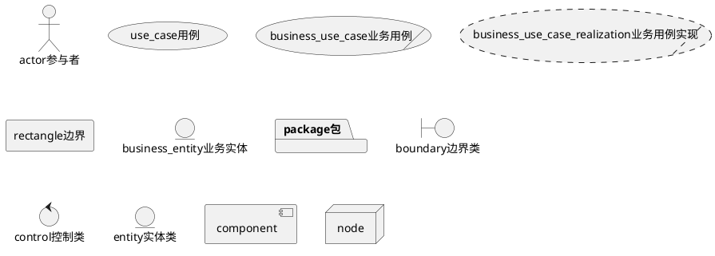
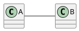
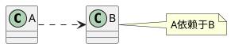
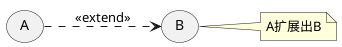
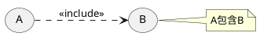
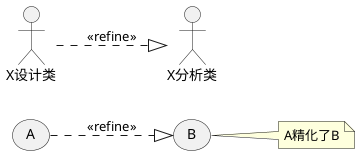
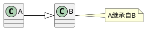
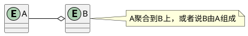
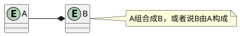

# UML
## 1 为什么需要UML？
## 2 UML是什么？
## 3 UML核心元素

### 3.1 版型
### 3.2 参与者
**参与者(actor)** 是在系统之外与系统交互的某人或者某物。
### 3.3 用例
### 3.4 边界
### 3.5 业务实体
### 3.6 包
### 3.7 分析类
### 3.8 设计类
### 3.9 关系
#### 3.9.1 关联关系(association)

**关联关系** 描述不同类的对象之间的结构关系，它是一段时间内将多个类的实例连接在一起。关联关系是一种静态关系，通常与运行状态无关，而是由“常识”、“规则”、“法律”等因素决定的，所以关联关系是一种“强关联”的关系。关联关系用来定义对象之间静态的、天然的结构。这与依赖关系是不同的，依赖关系表达的是对象之间的临时的、动态的关系。在最终的代码里，关联对象通常是以实例变量(成员变量)的形式实现的。

#### 3.9.2 依赖关系(dependency)

**依赖关系** 描述一个对象在运行期会使用到另一个对象的关系。与关联关系不同的是，依赖关系是一种临时性的关系，它通常都是在运行期产生，并且随着运行场景的不同，依赖关系也可能发生变化。依赖关系是一种“弱”关系，它不是天然存在的，并且会随着运行场景的变化而变化。一般而言，依赖关系在最终的代码里体现为类构造方法、类方法的传入参数。

#### 3.9.3 扩展关系(extends)

**扩展关系** 用于在用例模型中说明向基本用例中的某个扩展点插入扩展用例。一般来说，扩展用例是带有抽象性质的，它表示了用例场景中的某个“支流”，由特定的扩展点触发而被启动。所以严格来说扩展用例应当用在概念用例模型中，通过分析业务用例场景抽象出关键的可选核心业务而形成扩展用例。不过，在业务模型当中使用也是可以接受的，它可以更显示地表示出一个复杂业务用例的各个“分支”。与包含关系不同的是，扩展表示的是“可选”，而不是“必需”，这意味着即使没有扩展用例，基本用例也是完整的；如果没有基本用例，扩展用例是不能单独存在的；如果有多个扩展用例，同一时间用例实例也只会使用其中的一个。

#### 3.9.4 包含关系(include)

**包含关系** 用于用例模型，说明在执行基本用例的用例实例过程中插入的行为段。包含用例总是带有抽象性质的，基本用例可控制与包含用例的关系，并可依赖于执行包含用例所得的结果，但基本用例和包含用例都不能访问对方的属性。从这种意义上讲，包含用例是被封装的，它代表可在各种不同基本用例中复用的行为。因此，与扩展用例一样，包含用例也应当用在概念用例模型中，通过分析业务用例场景而抽象出关键的必选的核心业务而形成包含用例。同样，在业务模型中使用也是可以接受的，它可以显式地表现出那些可复用的业务过程。

#### 3.9.5 实现关系(realize)

**实现关系** 特别用于在用例模型中连接用例和用例实现，说明基本用例的一个实现方式。实现所代表的含义是，基本用例描述了一个业务目标，但是该业务目标有多种可能的实现途径，每一种实现途径可以用用例实现(或称用例实例)来表示，而用例实现与基本用例之间就构成了实现关系。换言之，每个实现途径都实现了基本用例的业务目标。

#### 3.9.6 精化关系(refine)

**精化关系** 特别用于用例模型，一个基本用例可以分解出许多更小的关键精化用例，这些更小的精化用例更细致地展示了基本用例的核心业务。精化关系用来连接基本用例和精化用例，说明精化用例是有基本用例精化得来的。

精化关系也可以用于模型与模型之间，表示某个模型是通过精化另一个模型而得来的。比如，我们认为设计类是通过精化分析类而得来的，我们可以用 XX 设计类<<refine>> XX 分析类来表示它们之间的关系。

与泛化关系不同的是，精化关系表示由基本对象可以分解为更明确、精细的子对象，这些子对象并没有增加、减少、改变基本对象的行为和属性，仅仅是更加细致和明确化了。在泛化关系中，基本对象被泛化成为子对象后，子对象继承了基本对象的所有特征，并且子对象可以增加、改变基本对象的行为和属性。

另一方面，精化关系仅仅用于建模阶段，在实现语言中是没有精化这一语义的。泛化则等同于实现语言中的继承语义。

#### 3.9.7 泛化关系(generalization)

**泛化关系** 可用于建模过程中的任意一个阶段，说明两个对象之间的继承关系。泛化关系表示一个类对另一个类的集成。继承而得的类成为后代，被继承的类称为祖先。继承意味着祖先的定义(包括任何特征，如属性、关系或对其对象执行的操作)对于后代的对象也是有效的。泛化关系是从后代类到其祖先类的关系。

#### 3.9.8 聚合关系(aggregation)

**聚合关系** 用于类图，特别用于表示实体对象之间的关系，表达整体由部分构成的语义。例如，一个部门由许多人员构成。

与组合关系不同的是，整体和部分不是强依赖的，即使整体不存在了，部分依然存在。例如，部门撤销以后，人员不会因此而消失，他们依然存在。

#### 3.9.9 组合关系(composition)

**组合关系** 用于类图，特别用于表示实体对象关系，表达整体拥有部分的语义。例如，母公司拥有许多子公司。

组合关系是一种强依赖的特殊聚合关系，如果整体不存在了，则部分也将消亡。例如，母公司解体了，子公司也将不再存在。

### 3.10 组件
### 3.11 节点

## 4 UML核心视图
### 4.1 静态视图-用例图
### 4.2 静态视图-类图
### 4.3 静态视图-包图
### 4.4 动态视图-活动图
### 4.5 动态视图-状态图
### 4.6 动态视图-时序图
### 4.7 动态视图-协作图

## 5 UML核心模型
### 5.1 用例模型
### 5.2 业务用例模型
### 5.3 概念用例模型
### 5.4 系统用例模型
### 5.5 领域模型
### 5.6 分析模型
### 5.7 软件架构和框架
### 5.8 设计模型
### 5.9 组件模型
### 5.10 实施模型

## 6 统一建模核心工作流
### 6.1 业务建模工作流程
### 6.2 系统建模工作流程
### 6.3 分析设计建模工作流程
### 6.4 实施建模工作流程

## 参考资料
1. 《Thinking in UML》