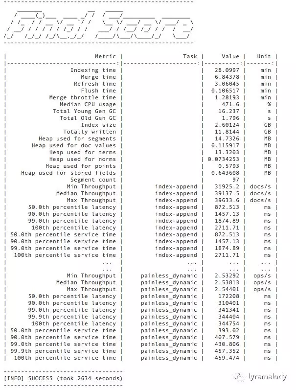
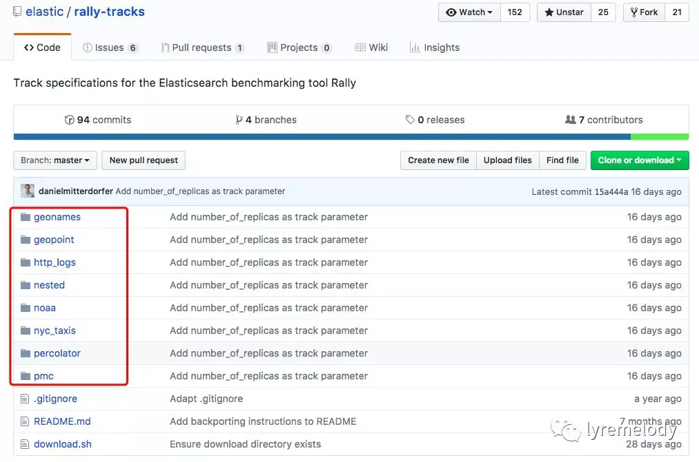

去年了解过 esrally，这是 Elasticsearch 官方基于 Python 3 开发的基准测试框架。最近又在看，感觉是要把所有的遗憾都整理一遍。哈哈

那时候还是0.4.7版本。后来几乎每月一个版本，到现在已经0.9.1了，文档丰富了不少，估计1.0也不远了。

今天我先不讲这个技术，我发现老外挺有意思的，多才多艺。

要理解他的理念，可能还得了解一些其他非技术的知识。

## 一些概念

从前没注意 Rally 是啥意思，还有里面一些术语，比如car、race、track、tournament、challenge。

去年在看的时候，看文档云里雾里的。因为基本概念没搞清楚嘛。

原来，作者把基准测试比作汽车拉力赛。Rally就是拉力赛的意思。然后这些术语就这么“借鉴”过来了。

我来做个非专业的解读，比如：

* 比赛(race) 是车(car) 在赛道(track)上跑吧
* 车(car)有不同型号配置吧
* 赛道(track)里有各种挑战(challenge)。赛道不仅仅全是直，还有S弯啥的，各种各样，我也讲不清楚。这些赛道和弯都是主办方自定义的。
* 锦标赛(tournament)中会有一堆车(手)完成自己的比赛，然后看看谁成绩最好

「总结」一下：在汽车拉力赛(Rally)中，汽车(car)会在赛道(track)开过各种弯道(challenge)完成一次比赛(race)，通过比赛成绩能看出车(手)的能力；通过锦标赛(tournament)可以看出哪个车(手)的水平比较高。

再来理解Elasticsearch Rally中的概念应该就容易些了：

* Rally定义一次基准测试就是一个“race”
* car就是指用来基准测试的Elasticsearch集群，car可以指定各种配置，比如1GB堆内存、16GB堆内存，还有其他自定义配置
* track就是基于特定数据集的一个或者多个测试场景(challange)。默认的数据集包括geonames、geopoint、http**_**logs 等公开的数据，当然这也可以自定义
* challange描述一个基准测试场景，可自定义。比如通过4个客户端以最大吞吐量索引文档，同时每秒从另外两个客户端发起10个短语查询

这样，再总结一下，Elasticsearch Rally做基准测试，就是需要指定一个数据集和定义一些测试场景，针对某个Elasticsearch集群做基准测试，从而看出这个Elasticsearch集群的能力；通过Rally的tournament模式，可以比较多个测试的结果，这样便于直观地查看配置修改(调优)的效果。

## 使用场景

下面分享了一下，esrally 的另外一个概念 pipeline。

其实就是讲 esrally 有哪些使用场景，以及对应的使用方法。

你会说，“不就是执行一下，出个性能报告吗？” 

确实，从结果来看，报告格式是一样的，但是目标却各有不同。

从**用途**来看，大约有三种：

1. 测试代码调优的效果。比如针对某内容，修改了 Elasticsearch 的源代码，看看优化的部分是否有效
2. 测试配置调优的效果。比如修改了 Elasticsearch 的堆内存配置（由2GB改为4GB）或者新增了搜索线程数，看看是否有优化
3. 测试集群的基准性能。能够提供一份性能测试报告，关于索引吞吐率、查询吞吐率、延迟率、延迟时间等

从**面向的对象**来看，大约有三种类型：

1. 针对源代码。即 esrally 能够从 Elasticsearch 源代码构建和启动 Elasticsearch 集群，并对此进行基准测试
2. 针对发型版。即 esrally 能够下载 Elastic 官方已经发布的 Elasticsearch 版本、启动集群，并对它进行基准测试
3. 针对已搭建好的集群。即 esrally 通过提供的 Elasticsearch 集群访问地址，仅进行基准测试

前两种，不需要自己搭建 Elasticsearch 集群，esrally 会自动创建和销毁相应的 Elasticsearch 集群。

这三种场景对应 esrally 里面的四种 pipeline；通过在执行 esrally 时，指定不同的 pipeline，会执行不同的操作。（注：本文所有例子的执行参数，均省略不相关的内容）

### 针对源代码

由于对构建工具的支持问题，这种方式只能支持 Elasticsearch 5.0及以上版本

```bash
esrally --pipeline=from-sources-complete --revision=latest
```

这里 revision 的选择也有技巧，可以指定 Elasticsearch 源代码的 git 版本、标签或者相近的时间戳。即你写个大概的时间，也能把跟这个时间最近的版本弄出来测试。

但注意，如果指定`--revision=current`，会直接使用当前工作目录下的源代码，这种就是针对源代码修改的测试了。

相对上面的步骤，如果已经构建好，下面这种方式会跳过构建过程，节省时间：

```bash
esrally --pipeline=from-sources-skip-build
```

### 针对发型版

类似下面这种，可以指定发型版的版本号，esrally会从官网下载相应的版本：

```bash
esrally --pipeline=from-distribution --distribution-version=6.0.0
```

### 针对自己搭建的集群

只做基准测试，就是如下方式，需要指定 Elasticsearch 集群的访问地址：

```bash
 esrally --pipeline=benchmark-only \
     --target-hosts=search-node-a.intranet.acme.com:9200,search-node-b.intranet.acme.com:9200
```

esrally 在过程中也可以采集一些系统指标，但 benchmark-only 模式不会做。

所以在做自己 Elasticsearch 集群基准性能测试的时候，我们常常需要依赖一些系统监控程序，比如nmon、zabbix。现在比较火的 Prometheus + Grafana 也不错，配合node exporter、elasticsearch exporter、cadvisor等，省掉了很多麻烦。

使用场景和用法差不多就这些了。

注意：调优和压测一定要分开，别掉坑里。

## 使用

下面我们来看看 esrally 作为自建 Elasticsearch 集群的基准测试工具是怎么用的。当然，过程中还要搭配监控工具，比如 Prometheus + Grafana，这部分今天先不展开。

### 基于Docker

esrally 基于 Python 3 开发，通过 pip 可以很容易部署，不过你得有 Python 3 的环境。

我更推荐使用 Docker 的方式，比较省事。

你可能会想到，esrally 在测试过程中，会下载测试数据集到本地，然后读取数据发送到 Elasticsearch 集群。

这个过程不是会对于Docker 容器的文件系统进行大量读写操作吗？那么性能测试是否有可能因此不准，比如文件系统IO不行？

这个问题是无需担心的。

我们知道，esrally 对于本地文件系统的读写会在 `~/.rally/benchmarks` 目录下，那么我们可以将 Docker 容器中的 `~/.rally/benchmarks` 目录通过宿主机目录 bind mount 的方式进行挂载。

Docker 的数据卷有几种方式，其中 bind mount 对于宿主机文件系统读写性能几乎没有损耗，以后有时间再来专门讨论。

今天我们先记住这个结论就好。

好了，可以放心的使用 Docker 容器方式了。

我为测试自建 Elasticsearch 集群，做了一个 esrally 的 Docker 镜像。在 Docker Hub 上连接我的 Github 库，创建了自动化构建的项目。

当前的版本是 `lyremelody/esrally:0.9.0`，基于 esrally 0.9.0。

你可以把镜像拉到本地：

```bash
docker pull lyremelody/esrally:0.9.0
```

### 基本使用

假设你的 Elasticsearch 集群有三个节点，IP地址分别为：`192.168.1.5:9200，192.168.1.6:9200，192.168.1.7:9200`。

那么可以这么启动对于 Elasticsearch 集群的测试：

```bash
mkdir -p $PWD/.rally/benchmarks
docker run -it --net=host -v \
    $PWD/.rally/benchmarks:/root/.rally/benchmarks \
    -e TARGET_HOST="192.168.1.5:9200,192.168.1.6:9200,192.168.1.7:9200" \
    lyremelody/esrally:0.9.0
```

这样，esrally 会默认下载 geopoint 数据集进行基准测试，完成会报告结果。

结果大约形如：

<div align=center></div>

结果会包含诸如索引消耗的总时间、GC信息、堆使用情况、索引吞吐量、(各种类型堆)搜索吞吐量、延迟百分率等，具体内容可以查看[「Summary Report」](https://esrally.readthedocs.io/en/0.9.1/summary_report.html)一章，看看具体指标的解释。

### 离线使用

上面是在线的使用方式，即数据集是在测试过程中联网下载的。

esrally 也可以使用离线的方式，即预先在能访问互联网的机器上，下载好测试数据集。然后将测试数据集解压到使用 esrally 的测试机。

这种离线方式，适用于在某些企业中，服务器不能访问互联网的场景。我喜欢用这种方式，省时间嘛。

esrally 目前提供了很多[「测试数据集」](https://github.com/elastic/rally-tracks.git)，如下图：

<div align=center></div>

可以通过如下方式进行下载（例如下载 http**_**logs 数据集）：

```bash
curl -O https://raw.githubusercontent.com/elastic/rally-tracks/master/download.sh
chmod u+x download.sh
./download.sh http_logs
```

上面的执行结果，会生成一个压缩包 rally-track-data-http**\_**logs.tar，即数据集。将此数据集复制到需要使用 esrally 的机器上，解压会在当前目录下生成 `.rally/benchmarks` 目录。

这样可以按照前面类似的方式运行测试了，但过程中，esrally 不会再下载相应的数据集，会使用本地的。

当然，这里还要指定 track （之前是默认 geoname ），如：

```bash
docker run -it --net=host \
    -v $PWD/.rally/benchmarks:/root/.rally/benchmarks \
    -e TRACK=http_logs \
    -e TARGET_HOST="192.168.1.5:9200,192.168.1.6:9200,192.168.1.7:9200" \
    lyremelody/esrally:0.9.0    
```

同样，执行完会出与上面类似的结果报告。

这就是 esrally 的基本用法了，在线、离线的使用方式，测试数据集和测试场景的指定，目标集群的指定等。

还有高级的用法，比如分布式 esrally，针对比较大规模的集群的基准测试，一个节点的负载发生器 (esrally) 做不到很高的并发和数据量，这里就先不展开了。

最后我们来看看这个 Docker 镜像的 Dockerfile：

```bash 
FROM python:3.6.4-alpine3.6
LABEL maintainer "https://github.com/lyremelody"
ENV TARGET_HOST="elasticseach.host:9200"
ENV REPORT_FORMAT="markdown"
ENV TRACK="geopoint"
RUN apk add --update --no-cache --no-install-recommends git build-base linux-headers python-dev && rm -rf /var/lib/apt/lists/*
RUN pip install esrally==0.9.0
COPY rally.ini /root/.rally/
CMD esrally --pipeline=benchmark-only --target-hosts=$TARGET_HOST --track=$TRACK --report-format=$REPORT_FORMAT
```
