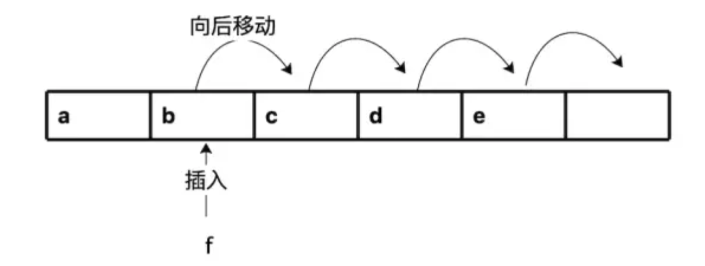
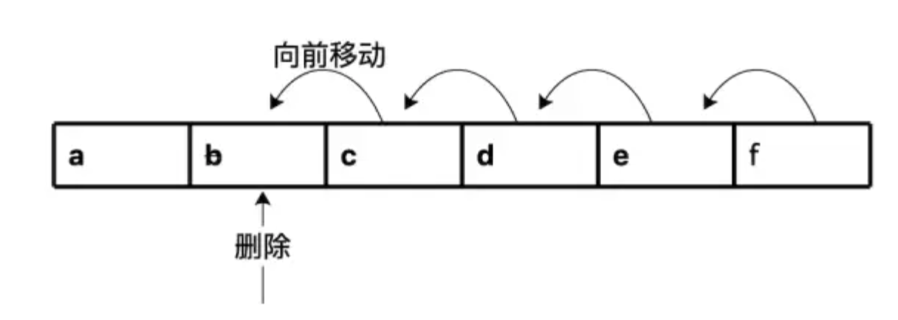

## 1 线性表
线性表（Linear List）是一种数据结构，它具有线性关系，即数据元素之间存在一对一的关系。具体来说，线性表中的数据元素之间除了第一个元素和最后一个元素外，其余元素都有且仅有一个前驱元素和一个后继元素。线性表在数据结构中是最基本、最简单、也是最常用的一种数据结构。

线性表的基本操作主要包括以下几个方面：
* 初始化：创建一个空的线性表。
* 插入：在指定位置插入一个新的元素。
* 删除：删除指定位置的元素。
* 查找：查找线性表中是否存在某个元素，如果存在，返回其位置（索引）。
* 修改：修改指定位置的元素的值。
* 遍历：按顺序访问线性表中的每个元素。

线性表按其存储方式的不同，可以分为顺序存储的线性表(简称顺序表) 和链式存储的线性表(简称链表)：
1. 顺序表：使用一段地址连续的存储单元依次存储线性表的数据元素。其优点是存取速度快，因为可以通过计算元素的地址直接存取；缺点是插入和删除操作需要移动大量元素，效率较低。
2. 链表：通过一组任意的存储单元来存储线性表的数据元素。为了建立数据元素之间的线性关系，对每个数据元素除了存储其本身的信息外，还需存储一个指示其后继元素的存储地址的信息（即指针或链接）。其优点是插入和删除操作不需要移动大量元素，效率较高；缺点是存取速度慢，因为需要遍历链表才能找到指定位置的元素。

## 2 数组
数组（Array）是一种线性表数据结构。它用一组连续的内存空间，来存储一组具有相同类型的数据。数组能让我们通过下标(index)或与其等价的存储地址高效地对其中的元素进行定位。

在实际生活中：
1. 一条盖满房屋的街道可以看作一个数组，数组元素相当于这条街道上的房屋，数组下标相当于房屋门牌号。如果所有的房屋大小相同，从1到n依次编号，那么可通过门牌号迅速算出每间房屋的精确位置。
2. 另外，还有电影院的座位，也可以看作是二维数组的例子。

### 2.1 数组的优缺点
数组有这些优点：
1. **支持随机访问**：给定下标可在常数时间内访问元素。由于数组数组中每个元素的下标直接对应了内存中的特定地址，如果知道下标，则可迅速访问该数据，时间复杂度为 O(1)
2. **节约空间**：
   * 数组完全由数据构成，不存在因链接或其他格式信息而造成浪费，像链表需要额外空间存储前后链接信息
   * 数组由数量固定的若干记录构成，所以也不需要记录终止信息来标记数组结束
3. **内存局部/连续性**：编程常常需要对数据结构中所有元素从头到尾进行迭代，由于数组体现了极好的内存局部性，因此它非常适合进行迭代。在对数据进行相继访问时，数据地址在物理上的连续性有助于充分利用现代计算机系统结构中的高速缓存
4. **类型安全**：由于数组中的元素都具有相同的类型，因此数组是类型安全的。这意味着编译器可以在编译时检查类型错误，从而提高代码的安全性和可靠性。

数组的不足之处：
1. **插入效率低、删除效率低**：
   * 在数组最后插入数据，可以直接操作；但是，在数组的中间插入一个数据，不能直接插入，需要将这个位置的后面所有数据向后一位复制 (见下图)。最差的时间复杂度为 O(n)
   * 在数组的中间删除一个数据，不能直接删除，需要将这个位置的后面所有数据向前一位复制 (见下图)。最差的时间复杂度为 O(n)
2. **无法直接调整数组大小**：当插入的数据超出了数组大小时，无法在程序执行过程中直接调整数组的大小
3. 数组的空间需要预先申请，额外申请的空间可能根本用不上

<div align=center></div>
<div align=center></div>

数组的第二个缺点，我们可以通过**动态数组**来进行优化。即，根据需要对数组进行扩容。假定数组的初始大小为m，当面临空间耗尽的时候，便将其大小加倍，从m扩容到2m：
1. 首先新分配一个大小为2m的新数组
2. 然后将原数组中的数据复制到新数组的前半部分
3. 再将要插入的数据插入新数组
4. 最后将原数组所占空间释放
5. 上面这个扩容操作的时间复杂度是 O(n)

上面这种成倍的内存扩容只是一种选择，实际上，还可以按照数据特点，选择扩容的步长，比如每次扩容10个单位或者20个单位。

当然，这种选择，实际上是要在“预分配空间浪费的可能性”与“插入新数据时数组数据搬迁耗时”上做平衡选择。

### 2.2 数组的应用场景
1. 在图形图像处理领域中，数组可以用来表示图像的像素矩阵。每个像素的颜色信息可以存储在数组中的一个元素中，通过对数组进行操作，可以实现图像的处理、修改和合成。
2. 在游戏开发中，需要处理大量角色、怪物、道具，这些在游戏中的数量是固定的。所以数组也经常被用来存储游戏中的这些信息，方便进行游戏逻辑的处理。
3. 在数据库中，关系型数据库使用二维数组来表示表格中的行和列。

### 2.3 数组的C/C++表示
```cpp {.line-numbers}

```
### 2.4 数组的Golang表示
```
// 创建类型为int，长度为3的数组，元素自动初始化为0
var a [3]int

// 创建类型为int，2*2的二维数组
b := [2][2]int{
  {1, 2},
  {3, 4},
}

// 创建符合类型的数组，可省略元素初始化类型标签
type user struct{
  name string
  age byte
}

c := [...]user{
  {"Tom": 20}, // 省略了类型标签
  {"Mary": 18}
}

// 创建多维数组，仅第一维允许使用"..."
d := [...][2]int{
  {10, 20},
  {30, 40},
}

e := [...][2][2]int{
  {
    {1, 2},
    {3, 4},
  },
  {
    {10, 20},
    {30, 40},
  }
}

// 内置函数len和cap都返回第一维度长度
// len(e)、cap(e)的输出都是2

// Golang 数组是值类型(与C数组变量隐式为指针不同)，赋值和传参操作都会复制整个数组数据
// 下面的代码段输出：
// a: 0xc820076050, [10 20]
// b: 0xc820076060, [10 20]
// x: 0xc8200760a0, [10 20] 
func test(x []int) {
  fmt.Printf("x: %p, %v\n", &x, x)
}

func main() {
  a := [2]int{10, 20}
  var b [2]int
  b = a
  fmt.Printf("a: %p, %v\n", &a, a)
  fmt.Printf("b: %p, %v\n", &b, b)
  test(a)
}

```

### 2.5 数组的Python表示
### 2.6 数组的仓颉语言表示
``` {.line-numbers}
// 仓颉使用 Array<T> 来表示 Array 类型。T 表示 Array 的元素类型，T 可以是任意类型。
let a: Array<String> = []
let b = [1, 2, 3, 3, 2, 1]

// 创建类型为Int64的空数组
let c = Array<Int64>()

// 使用数组c初始化d
let d = Array<Int64>(c) 

// 创建类型为Int64长度为5的数组，每个值初始化为1
let d = Array<Int64>(5, item: 1)

// 创建类型为Int64长度为5的数组，每个值通过初始化函数赋值
let e = Array<Int64>(5, {i => i + 1})

// 访问 Array 成员
// 遍历数组d
for (i in d) {
  println("The element is ${i}")
}

// 通过下标访问数组，使用数组d的第1个元素赋值给f。下标范围不支持-1、-2
let f = d[0]

// 使用数组d的第1-3个元素初始化数组g，数组g包含3个1
let g = d[1..4] 

// 使用数组d的第0-2个元素初始化数组h，数组h包含3个1
let h = d[..3] 

// 使用数组d的第1-4个元素初始化数组k，数组k包含4个1
let k = d[1..] 
```

## 3 链表
### 3.1 链表的基本工作原理
### 3.2 链表的优缺点
### 3.3 链表的应用场景
### 3.4 链表的C++表示
### 3.5 链表的Golang表示
### 3.6 链表的Python表示

## 4 栈
### 4.1 栈的基本工作原理
### 4.2 栈的优缺点
### 4.3 栈的应用场景
### 4.4 栈的C++表示
### 4.5 栈的Golang表示
### 4.6 栈的Python表示

## 5 队列
### 5.1 队列的基本工作原理
### 5.2 队列的优缺点
### 5.3 队列的应用场景
### 5.4 队列的C++表示
### 5.5 队列的Golang表示
### 5.6 队列的Python表示

## 6 总结和对比

## 7 应用
### 7.1 链表：实现LRU缓存淘汰算法
### 7.2 栈：实现浏览器的前进和后退功能
### 7.3 队列：实现线程池等有限资源池等请求排队功能？

## 参考资料
1.  [数据结构与算法之美(05-09)，极客时间](https://time.geekbang.org/column/intro/100017301?tab=intro)
2.  [《算法图解》第2、3章](https://book.douban.com/subject/26979890/)
3.  [《算法》第3章](https://book.douban.com/subject/19952400/)
4.  [《算法：C语言实现-(第1～4部分)基础知识、数据结构、排序及搜索》第3、4章](https://book.douban.com/subject/4065258/)
5.  [《算法导论》第10章](https://book.douban.com/subject/1885170/)
6.  [文心一言](https://yiyan.baidu.com/)
7.  [仓颉：数组类型](https://developer.huawei.com/consumer/cn/doc/openharmony-cangjie/array)