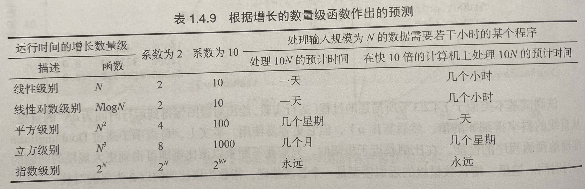

## 1 从猜数游戏开始
猜数游戏：比如两个人玩游戏，在1-100之间，让对方随便想一个数，你来猜，对方只提示大了还是小了，怎么快速猜准？

比如有几种策略：
1. 策略一：从1开始，顺着猜；如果对方想的就是1，那就很快，只要猜1次；如果对方想的是100，就很惨，要猜100次
2. 策略二：用二分法，每次选最中间的数，比如第一次猜50，如果大了就再猜75 (50-100中间的数)，如果小了就猜25 (1-50中间的数)

可以看出策略一和策略二用了不同的“算法”，我们怎么评估哪种算法哪种更快呢？

用策略二玩几把，就会发现最多猜7次就猜到。用策略一就不太确定了。

如果是在1-40亿之间猜一个数呢？

## 2 为什么需要复杂度分析？
数据结构和算法本身解决的是“快”和“省”的问题，即如何让代码运行得更快，如何让代码更省存储空间。所以，执行效率是算法一个非常重要的考量指标。

那如何来衡量编写的算法代码的执行效率呢？要么经过实际测试和统计(事后统计法)、要么基于理论分析(复杂度分析)。

**事后统计法有一些局限**：
1. **测试结果非常依赖测试环境，测试环境中硬件的不同会对测试结果有很大的影响**： 
   * 比如，我们拿同样一段代码，分别用Intel Core i9处理器和Intel Core i3处理器来运行，不用说，i9处理器要比i3处理器执行的速度快很多。像开头的猜数游戏，如果按照玩一局的时间来对比，两个幼儿园的小孩子玩、两个正常的成年人玩，即使用同样的策略，最后玩一局的时间也是会有差异的 (比如小孩说话慢、数的比较慢等)。
   * 还有，比如原本在这台机器上a代码执行的速度比b代码要快，等我们换到另一台机器上时，可能会有截然相反的结果。
2. **测试结果受数据规模的影响很大**：
   * 对同一个排序算法，待排序数据的有序度不一样，排序的执行时间就会有很大的差别。极端情况下，如果数据已经是有序的，那排序算法不需要做任何操作，执行时间就会非常短。
   * 除此之外，如果测试数据规模太小，测试结果可能无法真实地反映算法的性能。比如，对于小规模的数据排序，插入排序可能反倒会比快速排序要快！

可以看到，事后统计法受到测试环境和数据规模的影响，因此结果可能不够准确。所以，我们需要一个不用具体的测试数据来测试，就可以粗略地估计算法的执行效率的方法。而理论分析法，通过分析算法的基本操作次数和所需额外存储空间来估算算法的时间复杂度和空间复杂度。**理论分析法不依赖于具体的运行环境和测试数据，结果更加可靠**。

## 3 什么是复杂度分析？
复杂度分析是评估算法执行效率和资源消耗的关键方法，它主要关注算法在运行过程中所需的时间和空间资源。复杂度分析包括时间复杂度分析和空间复杂度分析。

一般用大O表示法来表示复杂度。大O表示法(Big O notation) 用于描述算法执行时间或所需资源的上限。具体来说，它表示随着输入数据量的增长，算法所需时间或资源的渐近行为。它关注算法在最糟糕情况下的性能，并忽略常数项和低阶项。通过比较不同算法的大O表示法，我们可以了解它们在不同数据量下的相对性能。

## 4 时间复杂度分析
时间复杂度用于描述算法执行时间随输入规模增长的变化趋势，也就是从算法执行效率的角度来分析。通常，我们使用大O表示法（Big O notation）来描述时间复杂度。
1. 基本操作次数：算法的执行时间可以通过基本操作（如加法、乘法、比较等）的次数来衡量。当输入规模增大时，基本操作次数的增长趋势决定了算法的时间复杂度。
2. 增长幅度：对于小规模输入，不同算法的运行时间差异可能不明显。但在处理大规模输入时，算法的执行时间将受到基本操作次数增长幅度的影响。因此，我们需要关注算法在大规模输入下的表现。
3. 最优、最差和平均效率：时间复杂度通常关注算法的最差效率，即在最坏情况下算法的执行时间。这是因为在实际应用中，我们往往无法预知输入数据的特点，因此需要考虑算法在最坏情况下的性能。然而，在某些情况下，我们也可能关注算法的最优效率和平均效率。

### 4.1 时间复杂度分析的三个实用方法
1. 只关注循环执行次数最多的一段代码
2. 加法法则：总复杂度等于量级最大的那段代码的复杂度
3. 乘法法则：嵌套代码的复杂度等于嵌套内外代码复杂度的乘积

#### 4.1.1 只关注循环执行次数最多的一段代码
大O这种复杂度表示方法只是表示一种变化趋势。我们通常会忽略掉公式中的常量、低阶、系数，只需要记录一个最大阶的量级就可以了。所以，我们在分析一个算法、一段代码的时间复杂度的时候，也只关注循环执行次数最多的那一段代码就可以了。这段核心代码执行次数的n的量级，就是整段要分析代码的时间复杂度。

```cpp {.line-numbers}
 int cal(int n) {
   int sum(0), i(1);
   for (; i <= n; ++i)
     sum = sum + i;
   return sum;
 }
```

针对上面这段代码的时间复杂度分析：
1. 第2行代码都是常量级的执行时间，与n的大小无关，所以对于复杂度并没有影响
2. 循环执行次数最多的是第3、4行代码，这两行代码被执行了n次，所以总的时间复杂度就是O(n)。

#### 4.1.2 加法法则：总复杂度等于量级最大的那段代码的复杂度
```cpp {.line-numbers}
  int cal(int n) {
    int sum_1(0), p(1);
    for (; p < 100; ++p)
      sum_1 = sum_1 + p;

    int sum_2(0), q(1);
    for (; q < n; ++q)
      sum_2 = sum_2 + q;

    int sum_3(0), i(1), j(1);
    for (; i <= n; ++i) {
      j = 1; 
      for (; j <= n; ++j)
        sum_3 = sum_3 +  i * j;
    }

    return sum_1 + sum_2 + sum_3;
  }
```

针对上面这段代码的时间复杂度分析：
1. 这个代码分为三部分，分别是求sum_1、sum_2、sum_3。我们可以分别分析每一部分的时间复杂度，然后把它们放到一块儿，再取一个量级最大的作为整段代码的复杂度。
2. 第一段的时间复杂度是多少呢？这段代码循环执行了100次，跟n的规模无关，是一个常量的执行时间。所以时间复杂度是O(1)
3. 第二段代码的时间复杂度是O(n)
4. 第三段代码的时间复杂度是O(n^2)
5. 综合这三段代码的时间复杂度，我们取其中最大的量级。所以，整段代码的时间复杂度就为O(n^2)。也就是说：总的时间复杂度就等于量级最大的那段代码的时间复杂度。

#### 4.1.3 乘法法则：嵌套代码的复杂度等于嵌套内外代码复杂度的乘积
```cpp {.line-numbers}
  int cal(int n) {
    int ret(0), i(1); 
    for (; i < n; ++i)
      ret += f(i);
  }

  int f(int n) {
    int sum(0), i(1);
    for (; i < n; ++i)
      sum += i;
    return sum;
  }
```

针对上面这段代码的时间复杂度分析：
1. 单独看cal()函数。假设f()只是一个普通的操作，那第3～4行的时间复杂度就是，T1(n)=O(n)。
2. 但f()函数本身不是一个简单的操作，它的时间复杂度是T2(n)=O(n)
3. 所以，整个cal()函数的时间复杂度就是，T(n) = T1(n) * T2(n) = O(n*n) = O(n^2)。

### 4.2 复杂度量级对比
* 多项式量级
  * 常量阶 O(1)
  * 对数阶 O(logn)
  * 线性阶 O(n)
  * 线性对数阶 O(nlogn)
  * 平方阶 O(n^2)、立方阶 O(n^3)、k次方阶 O(n^k)
* 非多项式量级
  * 指数阶 O(2^n)
  * 阶乘阶 O(n!)

这些**复杂度按数量级递增**，即:
* 复杂度常量阶 < 对数阶 < 线性阶 < 线性对数阶
* 线性对数阶 < 平方阶 < 立方阶 ...
* k次方阶 < 指数阶 < 阶乘阶

时间复杂度为非多项式量级的算法问题叫作NP问题 (Non-Deterministic Polynomial，非确定多项式)。当数据规模n越来越大时，非多项式量级算法的执行时间会急剧增加，求解问题的执行时间会无限增长。所以，非多项式时间复杂度的算法其实是非常低效的算法。

**直观感受一下，不同复杂量级在不同数据规模下的耗时趋势对比**：
<div align=center></div>


### 4.3 几种常见时间复杂度实例分析
分析：O(1)、O(logn)、O(nlogn)、O(m+n)、O(n^2)

#### 4.3.1 时间复杂度 O(1)
O(1)只是常量级时间复杂度的一种表示方法，并不是指只执行了一行代码
  * 只要代码的执行时间不随n的增大而增长，这样代码的时间复杂度我们都记作O(1)。
  * 或者说，一般情况下，只要算法中不存在循环语句、递归语句，即使有成千上万行的代码，其时间复杂度也是Ο(1)。

#### 4.3.2 时间复杂度 O(logn)
开头的猜数例子中，策略二的二分查找的时间复杂度就是 O(logn)。代码大致如下：

```cpp {.line-numbers}
  int guess(int min, int max, int x) {
    if ((x < min) || (x > max))
      return -1;

    int tmp_max(max), tmp_min(min), guess_time(1);
    int guess_num = (tmp_max + tmp_min)/2;
    while (guess_num != x) {
      if (guess_num > x) 
        tmp_max = guess_num - 1;
      else 
        tmp_min = guess_num + 1;

      guess_num = (tmp_max + tmp_min)/2;
      guess_time++;
    } 

    return guess_time;
  }
```

针对上面这段代码的时间复杂度分析：
1. 这里的数据规模是min到max之间有多少个数，即max-min+1，记为数据范围n
2. 7-14行的执行次数跟n有关，7-14行本身的执行时间可以看作常量；其他代码行跟n无关
3. 每次循环，数据范围n的数值会缩小一半，即n个数会变成n/2个数，最终当n=1的时候，就找到了数x。假设查找了m次找到x，即 2^m=n，m=logn
4. 所以上面这段代码的时间复杂度为 O(logn)

#### 4.3.3 时间复杂度 O(nlogn)
快速排序(略)

#### 4.3.4 时间复杂度 O(m+n)
```python {.line-numbers}
  def concatenate_and_sum(list1, list2):  
      n = len(list1)  
      m = len(list2)  
      result = []  

      for i in range(n):  
          result.append(list1[i])  

      for i in range(m):  
          result.append(list2[i])  
        
      return result  
  

  list1 = [1, 2, 3]  # 假设n=3  
  list2 = [4, 5, 6, 7]  # 假设m=4  
  result = concatenate_and_sum(list1, list2)  
  print(result)
```

针对上面这段代码的时间复杂度分析：
1. 上面这段代码的复杂度由两个数据的规模来决定
2. m和n是表示两个数据规模。我们无法事先评估m和n谁的量级大，所以我们在表示复杂度的时候，就不能简单地利用加法法则，省略掉其中一个
3. 所以，上面代码的时间复杂度就是O(m+n)。

#### 4.3.5 时间复杂度 O(n^2)
双重嵌套循环(略)

### 4.4 最好、最坏情况时间复杂度
O(n)复杂度的算法是不是比O(logn)的算法更快呢？不一定。比如，开头的猜数游戏，如果对方选的数就是1，策略一虽然是O(n)的复杂度，但只要猜一次；策略二虽然是O(logn)，要猜7次。

这里就引出两个概念，最好情况时间复杂度和最坏情况时间复杂度：
* 最好情况时间复杂度（best case time complexity）就是，在最理想的情况下，执行这段代码的时间复杂度。
* 最坏情况时间复杂度（worst case time complexity）就是，在最糟糕的情况下，执行这段代码的时间复杂度。

再举个例子，在一个无序的数组（array）中，查找变量x出现的位置；如果没有找到，就返回-1。
* 在最理想的情况下，要查找的变量x正好是数组的第一个元素，那就不需要继续遍历剩下的n-1个数据了，那时间复杂度就是O(1)。这个时候对应的时间复杂度就是最好情况时间复杂度。
* 如果数组中没有要查找的变量x，我们需要把整个数组都遍历一遍才行，时间复杂度就成了O(n)。这种最糟糕情况下对应的时间复杂度就是最坏情况时间复杂度。

### 4.5 平均情况时间复杂度
最好情况时间复杂度和最坏情况时间复杂度对应的都是极端情况下的代码复杂度，发生的概率其实并不大。为了更好地表示平均情况下的复杂度，我们需要引入另一个概念：平均情况时间复杂度，后面我简称为平均时间复杂度。

实际上平均时间复杂度，就是算各种情况时间和概率的加权平均，然后忽略常数确定量级。

还是这个例子，在一个无序的数组（array）中，查找变量x出现的位置；如果没有找到，就返回-1。

```cpp {.line-numbers}
  // size表示数组array的长度
  int find(int array[], int size, int x) {
    for (int i=0; i < size; ++i) {
      if (array[i] == x)
        return i;
    }
    return -1;
  }
```

平均情况时间复杂度分析：
1. 要查找的变量x在数组中的位置，有n+1种情况：在数组的0～n-1位置中和不在数组中。
2. 为了简化，假设变量x在数组中和不在数组中的概率都是1/2，假设每步骤执行时间为常量t
3. 在第一个位置找到变量x的概率是(1/n)*(1/2)，即1/(2n)；执行了一步，时间为 t
4. 在第二个位置找到变量x的概率是(1/n)*(1/2)，即1/(2n)；执行了两步，时间为 2 * t
5. 在第j个位置找到变量x的概率是(1/n)*(1/2)，即1/(2n)；执行了j步，时间为 j * t
6. 在第n个位置找到变量x的概率是(1/n)*(1/2)，即1/(2n)；执行了n步，时间为 n * t
7. 没找到的概率为1/2；执行了n步，时间为 n * t
8. 上面的概率和时间加权，t/(2n) + 2t/(2n) + ... + jt/(2n) + ... + nt/(2n) + nt/2，即t(1+2+...+n)/(2n) + nt/2，即t(3n+1)/4
9. 上面算出的时间函数是t(3n+1)/4，去除常数，所以平均时间复杂度为O(n)

### 4.6 平摊时间复杂度
平摊时间复杂度是一个特殊的平均时间复杂度。跟上面的场景有点区别，我们并不需要像之前讲平均复杂度分析方法那样，找出所有的输入情况及相应的发生概率，然后再计算加权平均值。
通过平摊分析来确定算法的平摊时间复杂度。
平摊分析可以用来证明在一系列的操作中，通过对所有操作求平均之后，即使其中单一的操作具有较大的代价，平均代价还是很小的。
平摊分析与平均分析的不同之处在于它不牵涉到概率；平摊分析保证在最坏情况下，每个操作具有平均性能。

平摊分析包括三种常用的技术：
1. 聚集分析
2. 记账方法
3. 势能方法

具体内容有点复杂，后续再补。

## 5 空间复杂度分析
空间复杂度全称就是渐进空间复杂度（asymptotic space complexity），表示算法的存储空间与数据规模之间的增长关系。

空间复杂度用于描述算法在执行过程中所需的额外存储空间，也就是从算法需要的存储资源的角度来分析。与时间复杂度类似，我们也使用大O表示法来描述空间复杂度。
1. 额外存储空间：算法的空间复杂度主要关注算法在执行过程中所需的额外存储空间，而不包括输入数据本身所占用的空间。
2. 递归算法的空间复杂度：对于递归算法，空间复杂度还需要考虑递归调用栈所占用的空间。递归深度越大，所需的额外存储空间就越多。

### 5.1 空间复杂度 O(1)
还是这个例子，在一个无序的数组（array）中，查找变量x出现的位置；如果没有找到，就返回-1。

```cpp {.line-numbers}
  // size表示数组array的长度
  int find(int array[], int size, int x) {
    for (int i=0; i < size; ++i) {
      if (array[i] == x)
        return i;
    }
    return -1;
  }
```

空间复杂度分析：这段代码没有引入跟n的规模有关的内存空间，所以空间复杂度为O(1)

### 5.2 空间复杂度 O(n)
```python {.line-numbers}
  def create_list(n):  
      # 创建一个列表并填充从1到n的整数  
      result = []  
      for i in range(1, n+1):  
          result.append(i)  
      return result  
    
  n = 10  
  my_list = create_list(n)  
  print(my_list)  # 输出: [1, 2, 3, 4, 5, 6, 7, 8, 9, 10]
```

空间复杂度分析：result列表的大小随着n的增加而线性增加，因此该算法的空间复杂度为O(n)。

### 5.3 空间复杂度 O(n^2)

```python {.line-numbers}
  def create_matrix(n):  
      # 创建一个n x n的二维列表（矩阵）  
      result = [[0 for _ in range(n)] for _ in range(n)]  
      return result  
    
  # 示例用法  
  n = 5  
  my_matrix = create_matrix(n)  
    
  # 打印矩阵  
  for row in my_matrix:  
      print(row)  
  # 输出:  
  # [0, 0, 0, 0, 0]  
  # [0, 0, 0, 0, 0]  
  # [0, 0, 0, 0, 0]  
  # [0, 0, 0, 0, 0]  
  # [0, 0, 0, 0, 0]
```

空间复杂度分析：
1. result是一个二维列表（矩阵），其大小为 n * n。
2. 随着n的增加，所需的空间会按照n的平方的比例增长，因此该算法的空间复杂度为O(n^2)。

## 6 数学推导
略，后续再补

## 参考资料
1.  [数据结构与算法之美(03-04)，极客时间](https://time.geekbang.org/column/intro/100017301?tab=intro)
2.  [《算法图解》第1章](https://book.douban.com/subject/26979890/)
3.  [《算法》第1章](https://book.douban.com/subject/19952400/)
4.  [《算法导论》第2、3、17章](https://book.douban.com/subject/1885170/)
5.  [文心一言](https://yiyan.baidu.com/)
