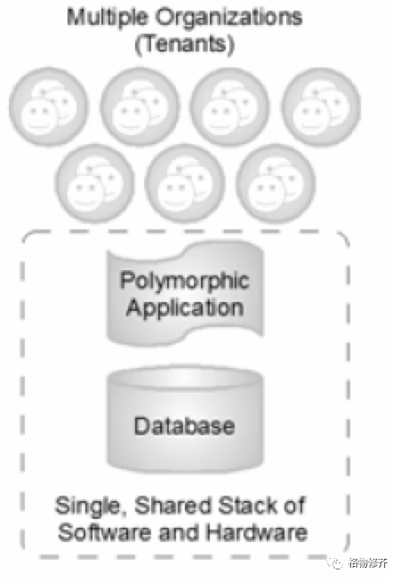

## **原文信息**

### **原文地址**

http://cloud.pubs.dbs.uni-leipzig.de/sites/cloud.pubs.dbs.uni-leipzig.de/files/p889-weissman-1.pdf

译注：原文发表于 ACM，2009年6月

### 作者
1. Craig D Weissman, CTO, Salesforce.com
2. Steve Bobrowski, Technical Marketing Consultant, Salesforce.com

## 摘要
Force.com 是当今杰出的按需应用程序开发平台，支持着 55000 多个组织。个体企业和商业软件即服务 (SaaS) 供应商相信该平台能够提供强大、可靠的、互联网规模的应用程序。为了满足大规模用户需求，Force.com 通过以元数据驱动的软件架构为基础来支持多租户应用。

本论文的重点是多租户，这是一种可以大大改善 SaaS 应用程序管理的基本设计方法。本论文定义了多租户，解释它的优点，以及说明了为什么元数据驱动的软件架构是实现多租户的首选。

## 目录结构
1.介绍
2.多租户应用
3.对比云计算和 PaaS
4.元数据驱动架构
5.架构总览
6.数据定义和存储
    6.1 对象元数据表
    6.2 字段元数据表
    6.3 数据表
    6.4 CLOBs 表
    6.5 索引数据透视表
    6.6 UniqueFields 数据透视表
    6.7 关系数据透视表
    6.8 附加数据透视表
    6.9 数据与元数据的分区
7.应用开发、逻辑和处理
    7.1 应用框架
    7.2 元数据和 Web Service APIs
    7.3 通过 API 调用进行批量处理
    7.4 删除、取消删除和回收站
    7.5 数据定义处理
    7.6 APEX
8.内部查询优化
9.全文检索引擎
10.结论

## 正文

### 1.介绍
历史表明，每一个在技术上频繁和增量的进步以及在商业模式上的变更，都会造成软件应用的主要模式转型，这种转型体现在在设计、构建以及对于终端用户的交付。如今，可靠带宽的互联网访问、面向服务的架构 (SOA)，以及效率低下的专用内部部署应用程序管理，这些都推动着向一种可管理、可共享、基于Web Service的交付模式转型，这种交付模式称之为软件即服务 (SaaS)。

### 2.多租户应用
为了降低成本，越来越多的应用程序是多租户的，向许多不同用户提供相同的应用程序。传统的单租户应用程序为了满足一个组织的需求，要求一组专用的资源；多租户的应用程序可以通过使用硬件资源和管理单个软件实例，来满足多个租户 (多个公司或者一个公司内的多个部门等) 的需求，如图1。

图1 一个多租户应用程序共享单一堆栈资源以满足多个组织的需求
 

租户使用同一个多租户服务，同时能够实现 (与其他租户) 相互之间虚拟隔离。组织可以使用和定制一个应用程序，就像它们各自拥有一个单独的实例一样，但是他们的数据和自定义设置仍然是安全的，并且与所有其他租户的活动保持隔离。单个应用程序实例在运行时可以在任何时候对于任何特定租户进行有效地变形。

译注：这里的「变形」的理解：对于不同的租户，功能表现上按需做不同的变更和呈现。

多租户是一种架构方法，它能够同时为应用程序供应商和最终用户带来收益。通过一个应用程序为多个组织服务，将为应用程序供应商带来巨大的经济效益。只需一组硬件资源即可满足所有用户的需求，只需要相对较少和经验丰富的 (运维) 管理人员就能有效地管理一套软件和硬件，并且开发人员只需要在一个平台 (操作系统、数据库等) 上构建和维护一套代码库。从经济上来讲，多租户使得应用软件提供商能够更低成本地为客户服务。

多租户还有一些有趣的附加好处，包括提升了质量、用户满意度和客户留存率。单租户应用程序部署在应用程序供应商无法访问的隔离孤岛上，与这不同的是，多租户应用程序是由供应商本身托管的一个大型社区。这种设计转变使得供应商可以从用户群收集操作信息 (如哪些查询响应慢、发生错误等)，并对服务进行频繁、渐进地改进，使得整个用户社区立即受益。

基于多租户平台的两个附加好处是协作和集成。由于所有用户在一个空间运行所有应用程序，因此很容易允许任何应用程序的任何用户对特定的数据集进行不同的访问。这个能力极大地简化了集成相关应用程序及其管理的数据所需的工作。

### 3.对比云计算和 PaaS
原先的云计算是「以机器为中心」的服务，可以为应用程序部署按需提供基础设施，即基础设施即服务 (IaaS)。这样的云只提供了执行包含应用程序的虚拟服务器所需的计算能力和存储能力。一些希望快速进入市场的 SaaS 供应商，通过基于 IaaS 实现单租户实例交付的策略，避免了开发真正多租户方案的技术挑战。

译注：这里可以看出，「基于 IaaS 实现单租户实例交付」在 salesforce.com 看来是「伪多租户」。但实际上随着时代的发展，这也被认为是多租户的一种形态。后来在 Gartner 定义的多租户七层模型中，这种属于「Shared Nothing」或者「Shared Hardware」。

平台即服务 (PaaS)，比如 Force.com，基于一个「以应用为中心」的方法，它抽象了服务器的概念。PaaS 让开发者在一开始就专注在应用开发，并且通过一键部署应用。供应商无需担心多租户、高可用、负载均衡、可伸缩性、系统备份、补丁和安全性以及其他基础架构相关的问题。

译注：PaaS 鼻祖 Heroku 2007年6月起开始开发，2010年被 Salesforce.com 收购。

### 4.元数据驱动架构
仅当多租户可以支持应用 (实现) 可靠、可自定义、可升级、安全和快速 (迭代)，它才是实用的。但是，多租户应用程序如何允许每个租户为标准的数据对象创建自定义扩展，以及定制全新的自定义数据对象？如何在共享数据库中确保特定租户的数据的安全性？租户如何自定义应用程序的界面和业务逻辑，而不会影响所有其他租户的应用程序功能或可用性？如何在不破坏租户自定义内容的情况下，打补丁和升级应用程序？

创建一个静态编译的可执行应用程序来满足这些和其他独特的多租户挑战，这是很困难的。本质上，多租户应用程序必须本质上是动态的或多态的，才能满足各种租户及其用户的个人期望。

图2 定义良好的元数据驱动架构
 

由于这些原因，多租户应用程序设计需要演变成，使用一个运行时引擎从元数据 (有关应用程序本身的数据) 生成应用程序组件，见图2。在定义良好的元数据驱动架构中，**已编译的运行时引擎(内核)、应用程序数据、描述应用程序基本功能的元数据、以及对应租户数据和定制相关的元数据**，这些内容之间有明显的边界。有了这些不同的边界，使得可以独立更新系统内核、修改核心应用程序或者自定义特定租户的组件，并且没有互相影响的风险。&#x20;

译注：从租户的角度，考虑抽象出系统中变与不变的部分、租户特有和公用的部分，把系统按照这些分解成有确定边界的部分。

### 5.架构总览
Force.com 经过优化过的元数据驱动架构，可以为按需的多租户应用提供出色的性能、可伸缩性和可自定义能力。

在 Force.com 中，暴露给开发人员和应用程序用户的全部内容，在内部表示为元数据。表单、报表、工作流、用户访问权限、特定租户自定义和业务逻辑，甚至是底层数据表和索引的定义，都是抽象结构，仅作为元数据存在于 Force.com 的通用数据字典 (UDD) 中。例如，当开发人员构建新的自定义应用程序并定义一个自定义表、布置表单或编写一些过程代码时，Force.com 不会在数据库中创建「实际」的表或者编译任何代码。取而代之的是，Force.com 只是存储元数据，平台引擎可以在运行时使用元数据生成「虚拟」的应用程序组件。当某人想要修改或者自定义应用程序的某些内容时，只需要对相应的元数据进行简单的无阻塞更新即可。

由于元数据是 Force.com 应用程序的关键组成部分，因此平台的运行时引擎必须优化对元数据的访问；否则，频繁的元数据访问将妨碍平台扩展。考虑到这一潜在瓶颈，Force.com 使用元数据缓存来维护内存中最近使用的元数据，避免降低磁盘 I/O 和代码重新编译的性能，并缩短应用程序响应时间。

Force.com 将所有虚拟表的应用程序数据存储在一些用作堆存储的大型数据库表中。然后平台引擎会在运行时通过考虑相应的元数据来实现 (进行不同的表现) 虚拟表的数据。

为了优化对系统大表中数据的访问，Force.com 的引擎依赖于一组专门的数据透视表，这些数据透视表为各种目的维护非规范化的数据，例如索引、唯一性、关系等。

Force.com 的数据处理引擎通过透明地批量执行数据修改操作来帮助简化大型数据负载和在线事物处理应用程序的开销。这个引擎具有内置的故障恢复机制，该机制可在排除导致错误的记录之后自动重试批量保存操作。

为了进一步提高应用程序的响应时间，该平台采用了外部搜索服务，该服务可优化全文索引和搜索。随着应用程序更新数据，搜索服务的后台进程几乎实时地异步更新租户和用户特定的索引。应用程序引擎和搜索服务之间的这种职责分离使平台应用程序可以有效地处理事务，而不会增加文本索引更新的开销，同时可以快速为用户提供准确的搜索结果。

Force.com 的运行时应用程序生成器可以响应特定用户的请求，动态构建应用程序，因此，引擎严重依赖其「多租户感知」查询优化器来尽可能高效地执行内部操作。查询优化器考虑哪个用户正在执行给定的应用程序功能，然后使用通用数据字典 (UDD) 中维护的相关特定于租户的元数据以及内部系统数据透视表，构建并执行作为优化数据库查询的数据访问操作。

现在你对构成 Force.com 的底层机制的关键架构组件有了大致了解。以下各章将更详细地说明各种内部系统元素的结构和构建目的。&#x20;

译注：定义元素到通用数据字典 (UDD)，通过「元数据」描述应用程序，实现引擎基于元数据动态生成「租户特定的虚拟应用程序」。分别针对元数据访问、大表数据访问、数据处理、搜索等进行了相应的优化。

### 6.数据定义和存储
Force.com 存储模型不是试图管理一个庞大的、不断变化的、代表每个应用和租户的一组实际的数据库结构集，而是使用一组元数据、数据和数据透视表来管理「虚拟」数据库结构，如图 3 所示。&#x20;

图3 Force.com 的数据定义和存储模型
 

当组织创建自定义应用程序对象时，通用数据字典 (UDD) 会跟踪有关的对象、其字段、关系和其他对象定义特征的元数据。

同时，一些大型数据库表存储所有虚拟表的结构化和非结构化数据，还有一组相关的专用数据库透视表维护非规范化数据，使数据集极其有用。

译注：在「逻辑上」实现隔离

#### 6.1 对象元数据表
对象元数据表，存储组织为应用程序定义的自定义对象 (又名，表或者实体)的信息，包括对象的唯一标识符 (ObjID)，拥有该对象的组织 (OrgID) 以及为其指定的对象名称 (ObjName)。

#### 6.2 字段元数据表
字段元数据表，存储组织为自定义对象定义的自定义字段 (又名，列或者属性)，包括字段的唯一标识符 (FieldID)，拥有该对象的组织 (OrgID)，包含该字段的对象 (ObjID)，该字段的名称 (FieldName)，该字段的数据类型，标识该字段是否需要索引 (IsIndexed) 的布尔值以及该字段在对象中相对于其他字段的位置 (FieldNum)。

#### 6.3 数据表
数据表存储应用程序可访问的数据，该数据映射到所有自定义对象及其字段，这由对象和字段中的元数据定义。每行包括标识字段，例如全局唯一标识符 (GUID)，拥有该行的组织 (OrgID) 以及包含对象标识符 (ObjID)。数据表的每行还具有一个名称字段，该字段存储相应对象的「自然名」；例如，一个 Account 对象可能会使用「Account Name」，一个 Case 对象，可能会用「Case Name」，等等。Value0，…，Value500 等这些列存储应用数据，分别映射到对象表和字段表中声明的对象和字段。所有「flex」列都可以使用可变长度的字符串数据类型，因此它们可以存储任何结构化类型的应用程序数据 (字符串、数字、日期等)。

自定义字段可以使用多种标准结构化数据类型中的任何一种，例如文本、数字、日期和时间，以及特殊用途的结构化数据类型，如选择列表 (枚举字段)、自动编号、公式、主从关系 (外键)、复选框 (布尔值)、电子邮件、URL等。自定义字段也可能是必需的，并且有自定义验证规则 (例如，一个字段必需大于另一个字段)，这两个规则均由平台的应用服务器强制执行。

当一个组织声明或者修改一个自定义应用对象，Force.com 将在对象表中管理定义该对象的元数据行。同样，对于每个自定义字段，Force.com 管理字段表中的一行，包括将字段映射到数据表中特定弹性列的元数据，以存储相应的字段数据。因为 Force.com 将对象和字段定义作为元数据而不是实际的数据库结构来管理，所以该平台可以容忍多租户应用程序架构的维护活动，而不会阻止其他租户和用户的并发活动。

同一对象的两个字段都不能映射到数据表中的同一 flex 列 (slot) 进行存储；但是，只要每个字段都来自不同的对象，则单个 flex 列就可以管理多个字段的信息。

图4 单个 flex 列
 

如图 4 中的数据表的简化表示所示，flex 列具有通用数据类型（可变长度字符串），这允许 Force.com 在多个字段间共享一个 flex 列，使用各种结构化数据类型 (字符串，数字、日期等)。

Force.com 使用规范格式存储所有 flex 列数据，当应用程序向 flex 列读写数据，必要时可以使用基础数据库系统的数据类型转换功能 (例如TO_NUMBER，TO_DATE，TO_CHAR)。&#x20;

#### 6.4 CLOBs 表
Force.com 支持将字段声明为字符大对象 (CLOB)，以允许存储最多 32,000 个字符的长文本字段。 对于数据表中具有字符大对象 (CLOB) 的每一行，Force.com 将 CLOB 离线存储在称为 CLOBs 的数据透视表中，系统可以根据需要将其与数据表中的相应行合并。

#### 6.5 索引数据透视表
传统的数据库系统依靠索引来快速定位数据库表中具有匹配特定条件的字段的特定行。 但是，为数据表的 flex 列创建本机数据库索引是不切实际的，因为 Force.com 可能使用单个 flex 列来存储具有不同结构化数据类型的许多字段的数据。 相反，Force.com 通过将标记为建立索引的字段数据同步复制到数据透视表中称为索引的适当列中，从而管理数据表的索引。

索引表包含强类型化的索引列，例如 StringValue，NumValue 和 DateValue，Force.com 用来查找对应数据类型的字段数据。 例如，Force.com 会将数据表 flex 列中的字符串值复制到索引中的 StringValue 字段，将日期值复制到 DateValue 字段中，等等。索引表的基础索引是标准的非唯一数据库索引。 当内部系统查询包含引用自定义对象中结构化字段的搜索参数时，平台的查询优化器将使用索引表来帮助优化关联的数据访问操作。

注意：Force.com 可以处理多种语言的搜索，因为该平台的应用程序服务器使用大小写折叠算法，该算法将字符串值转换为不区分大小写的通用格式。 索引表的 StringValue 列以这种格式存储字符串值。 在运行时，查询优化器将自动构建数据访问操作，以便优化的 SQL 语句根据与搜索请求中提供的文字相对应的大小写折叠的 StringValue 进行过滤。

#### 6.6 UniqueFields 数据透视表
Force.com 使组织可以声明对象中的字段何时必须包含唯一值（区分大小写或不区分大小写）。考虑到数据表的排列和「值」列对于自定义字段数据的共享用法，为该表创建唯一的数据库索引是不切实际的。

为了支持自定义字段的唯一性，Force.com 使用了名为 UniqueFields 的数据透视表。该表与「索引数据透视表」非常相似，不同之处在于 UniqueFields 表的基础数据库索引具有唯一性。 当应用程序尝试在要求唯一性的字段中插入重复值，或者管理员尝试对包含重复值的现有字段强制执行唯一性时，Force.com 会将适当的错误消息传递到应用程序。

#### 6.7 关系数据透视表
Force.com 提供了「关系」数据类型，组织可以使用该数据类型来声明应用程序对象之间的关系 (参照完整性)。当组织使用关系类型声明对象的字段时，平台会将该字段映射到数据表中的值字段，然后使用该字段存储相关对象的 ObjID。

为了优化 join 操作，Force.com 维护一个关系数据透视表。关系索引表具有两个基础数据库唯一的复合索引，这些索引可根据需要在任一方向上高效地遍历对象。

#### 6.8 附加数据透视表
以下数据透视表还为 Force.com 提供了重要功能：
* FallbackIndex 表：记录所有对象的名称，允许应用程序服务器在 Name 字段上执行 fall-back 搜索，并在平台的外部搜索引擎过载的情况下返回合理的搜索结果。
* NameDenorm 表：存储每个对象实例的 ObjID 和名称，这使 Force.com 可以执行一个简单的查询，检索每个引用的对象实例的名称以显示为超链接的一部分。
* 历史记录跟踪表：存储有关所有字段更改的信息，这使 Force.com 可以提供审核跟踪中使用的历史记录跟踪。

#### 6.9 数据与元数据的分区
所有 Force.com 数据、元数据以及数据透视表结构 (包括基础数据库索引) 均使用原生数据库分区机制由 **OrgID (按租户)** 进行物理分区。 数据分区是数据库系统提供的一种行之有效的技术，可以将大型逻辑数据结构物理上分成较小的，更易于管理的部分。 分区还可以帮助提高大型数据库系统 (如多租户环境) 的性能、可伸缩性和可用性。 例如，根据定义，每个 Force.com 应用程序查询都针对特定租户的信息，因此查询优化器只需要考虑访问包含租户数据的数据分区，而不是访问整个表或索引，这种常见的优化有时称为「partition pruning」。

译注：可以看到主要的设计中都会体现租户标识 (OrgID)，在数据和元数据的存储上也可以基于「物理隔离」。

### 7.应用开发、逻辑和处理
Force.com 支持两种不同的方式来创建自定义应用程序及其各个组件：通过使用本机平台应用程序框架进行声明式声明，以及通过使用应用程序编程接口 (API) 以编程方式进行声明。

以下各节详细介绍了每种方法和相关的应用程序开发主题。

#### 7.1 应用框架
开发人员可以使用 Force.com 应用程序框架以声明方式构建自定义 Force.com 应用程序。 该平台的原生界面支持应用程序开发过程的所有方面，包括创建应用程序的数据模型 (自定义对象及其字段、关系等)、安全性和共享模型 (用户、组织层次结构、配置文件等) 、用户界面 (屏幕布局、数据输入表单、报表等) 以及逻辑和工作流程。

由于不涉及任何编码，因此 Force.com 应用程序框架的用户界面易于构建。 在后台，它们支持所有常见的数据访问操作，包括查询、插入、更新和删除。

Force.com 的原生集成开发环境 (IDE) 可以轻松访问许多内置的平台功能，从而可以轻松实现常见的应用程序功能，而无需编写复杂且易于出错的代码。这些功能包括：
* 声明式工作流：由对象实例 (行) 的插入或更新触发的预定义操作。工作流程可以触发任务、发送电子邮件告警、更新数据字段或发送消息。
* 加密/屏蔽的字段：开发人员配置为加密相应数据并使用输入掩码隐藏屏幕信息的文本字段。
* 验证规则：无需任何编程即可强制执行域完整性规则的规则。
* 公式字段：Force.com 应用程序框架的声明式功能，可轻松将计算出的字段添加到对象。
* 汇总摘要字段：跨对象字段，可轻松在父对象中汇总子字段信息。

#### 7.2 元数据和 Web Service APIs
Force.com 还提供用于构建应用程序的编程API。 这些 API 与基于 SOAP 的开发环境兼容，包括 Visual Studio .NET (C#) 和 Apache Axis (Java and C++)。

Force.com 元数据 API 可用于管理应用程序组件 - 创建和修改与自定义对象定义、页面布局、工作流等相对应的元数据。应用程序可以使用 Force.com Web服务 API 创建、检索、更新或删除对象实例 (数据行)。

要访问 Force.com Web服务，开发人员首先下载 Web 服务描述语言 (WSDL) 文件。 然后，在开发平台使用 WSDL 文件生成API，以访问组织的相应 Force.com Web服务 (数据模型)。

有两种类型的 Force.com WSDL 文件。企业 WSDL 文件适用于构建特定于组织的应用程序的开发人员。企业 WSDL 文件是组织数据模型的强类型表示。它为开发环境提供有关组织的架构、数据类型和字段的信息，从而可以使其与 Force.com Web服务进行更紧密的集成。如果将自定义字段或自定义对象添加、重命名或从组织的应用程序架构中删除，则企业 WSDL 会发生变化。 相反，合作伙伴 WSDL 文件适用于为多个组织开发客户端应用程序的 Salesforce.com 合作伙伴。 作为 force.com 对象模型的松散表示形式，合作伙伴 WSDL 提供了一个API，可用于访问任何组织内的数据。

#### 7.3 通过 API 调用进行批量处理
事务密集型应用程序在**合并和执行批量重复操作**时产生的开销较小，并且性能更高。 例如，对比应用程序可以加载对象的许多新实例的两种方式。 一种低效的方法是使用带有循环的例程，该例程插入单个对象实例，并为每个插入操作进行一个 API 调用。一种更有效的方法是创建对象实例的数组，并使例程通过单个 API 调用将所有实例插入。

Force.com Web服务 API ，例如create()，update() 和delete() 等支持批量操作。 为了获得最高效率，该平台隐式批量处理与显式批量操作相关的所有内部步骤，如图5所示。

图5 Force.com 批量处理引擎
 

图5 还显示了 Force.com 的批量处理引擎如何解决整个过程中任何步骤遇到的孤立故障。 当批量操作以部分保存模式开始时，引擎会识别一个已知的启动状态，然后尝试执行过程中的每个步骤 (批量验证字段数据，bulk fire pre-triggers，批量保存记录等)。 如果引擎在任何步骤中都检测到错误，则引擎会回退有害的操作和所有副作用，删除造成错误的行，然后继续尝试批量处理其余的行子集。 此过程反复遍历过程的每个阶段，直到引擎可以提交行的子集而没有任何错误。 应用程序可以检查返回对象，以识别哪些行失败以及它们引发了哪些异常。

注意：根据应用程序的判断，批量操作也可以使用全有或全无模式 (all-or-nothing mode)。 同样，在批量操作期间执行触发器要受内部工作量的限制。

#### 7.4 删除、取消删除和回收站
当有人从自定义对象中删除单个对象实例 (记录) 时，Force.com 只需通过修改对象实例的 IsDeleted 字段 (在数据表中) 将其标记为删除即可。 这样可以有效地将对象放置在平台的回收站中。 Force.com 允许用户从回收站中查看和还原选定的对象实例长达30天，然后才能将其从内部数据表中永久删除。 平台会根据组织的用户许可证总数来限制其为组织保留的记录总数。

当某人删除涉及主从关系的父记录时，Force.com 会自动删除所有相关的子记录，前提是这样做不会破坏任何完整性规则。 例如，当用户删除 SalesOrder 时，Force.com 会自动将删除级联到相关的 LineItems。 如果随后有人从回收站还原了父记录，则平台也会自动还原所有子对象实例。

相反，当有人删除涉及查找关系的引用父记录时，Force.com 会自动将所有从属键设置为 null。 如果随后有人还原了父记录，Force.com 将自动还原以前为空的查找关系，但在删除和还原操作之间重新分配的关系除外。

回收站还存储丢弃的字段及其数据，直到组织永久删除它们或45天过去之后 (以先到者为准)。 在此之前，整个字段及其所有数据都可用于恢复。

#### 7.5 数据定义处理
某些类型的对象定义修改，不仅仅需要简单地更新通用数据字典 (UDD) 元数据。在这种情况下，Force.com 使用有效的机制来帮助减少对平台多租户应用程序的总体性能影响。

例如，考虑当有人将一列的数据类型从「选择列表」修改为「文本」时，后台发生的事情。Force.com 首先为该列的数据分配一个新的 slot，批量复制与当前值关联的选择列表标签，然后更新该列的元数据，使其指向新的 slot。 尽管发生了所有这些情况，但是对数据的访问是正常的，应用程序继续运行不会产生任何明显的影响。

译注：通过冗余来实现平滑变更。

另一个示例，考虑当某人向表中添加「汇总摘要字段」时会发生什么。 在这种情况下，Force.com 使用高效的批量操作在后台异步计算初始摘要。 在进行后台计算时，查看新字段的用户会收到一个提示，说明 Force.com 正在计算该字段的值。

#### 7.6 APEX
Apex 是一种强类型的，面向对象的过程编程语言，开发人员可以使用它来声明程序变量和常量并执行传统的流控制语句 (if-else，循环等)，数据操作操作 (插入、更新、向上插入、删除)，以及代表 Force.com 应用程序的事务控制操作 (setSavepoint，回滚)。开发人员可以构建 Apex 例程，以将自定义业务逻辑添加到大多数应用程序事件中，包括按钮单击、数据更新、Web 服务请求、自定义批处理服务等。

Apex 与 Java 类似，是一个不可或缺的 Force.com 组件，可帮助平台交付可靠的多租户应用程序。 例如，Force.com 自动验证 Apex 类中的所有嵌入式 Sforce 对象查询语言 (SOQL) 和Sforce对象搜索语言 (SOSL) 语句，以防止代码在运行时失败。 然后，平台会为有效的 Apex 类维护相应的对象依赖项信息，并使用此信息来防止对元数据进行更改，否则这些更改会破坏被依赖的应用程序。

为了防止共享的多租户平台资源被恶意或无意垄断，Force.com 具有与 Apex 代码执行相关的大量调控器和资源限制。例如，Force.com 密切监视 Apex 脚本的执行情况，并限制它可以使用多少 CPU 时间，它可以消耗多少内存，它可以执行多少查询和 DML 语句等等。平台优化器认为过于昂贵而无法执行的单个查询会向调用者抛出运行时异常。尽管这样的限制听起来有些限制性，但对于保护所有相关应用程序的共享平台的总体可伸缩性和性能而言，它们是必需的。从长远来看，这些措施有助于在平台开发人员中推广更好的编码技术，并为每个人创造更好的体验。例如，最初尝试编写一个循环以低效率地一次更新一千行的循环的开发人员将由于资源限制而收到运行时异常，然后开始使用 Force.com 的高效批量处理 API 调用。

为了进一步避免编写不当的应用程序引起的潜在平台问题，新生产应用程序的部署是严格管理的过程。 在组织可以将新的自定义应用程序从开发状态转换为生产状态之前，Salesforce.com 需要进行单元测试，以验证该应用程序的 Apex 例程的功能。 提交的单元测试必须覆盖不少于应用程序源代码的75％。Salesforce.com 在 Force.com 沙盒环境中执行提交的单元测试，以确定该应用程序是否会对整个多租户群体的性能和可伸缩性产生不利影响。 单个单元测试的结果提供基本信息，例如执行的总行数，以及有关测试未执行的代码的特定信息。

一旦 Salesforce.com 对应用程序进行了生产验证，则部署过程将由单个事务组成，该事务将所有应用程序的元数据复制到生产 Force.com 实例中并重新运行相应的单元测试。 如果该过程的任何部分失败，Force.com 只会回滚事务并返回异常以帮助解决问题。

生产应用程序上线后，Force.com 的内置性能分析器会自动分析并向管理员提供相关的反馈。 性能分析报告包括有关慢查询，数据操作和子例程的信息，开发人员可以查看这些信息并使用它们来调整应用程序功能。 该平台还记录有关运行时异常的信息，并将其返回给管理员，以帮助调试其应用程序。

译注：资源管控、故障管理、性能分析反馈一个都不能少。

### 8.内部查询优化
大多数现代数据库系统通过采用基于成本的查询优化器来确定最佳查询执行计划，该优化器考虑了有关目标表和索引数据的相关统计信息。但是，常规的基于成本的优化器统计信息是为单租户应用程序设计的，无法解决在多租户环境中执行查询的任何给定用户的数据访问特征。 例如，针对具有大量数据的对象 (表) 的给定查询最有可能针对具有高可见性的用户 (可以查看所有对象实例的管理者) 与具有低可见性的用户 (只能看到与自己相关的行的销售人员) 使用不同的执行计划来更有效地执行。

为了提供足够的统计信息来确定多租户平台中的最佳查询执行计划，Force.com 为每个虚拟多租户对象维护了一套完整的优化器统计信息 (租户级、组级和用户级)。 统计信息反映了特定查询可能访问的行数，并仔细考虑了特定于特定租户的对象统计信息 (租户整体拥有的总行数等等) 以及更精细的统计信息 (特定的特权组或最终用户可以访问等)。

Force.com 还维护其他类型的统计信息，用来证明某些查询有帮助的。 例如，平台维护所有自定义索引的统计信息以显示相应字段中非空值和唯一值的总数，以及维护选择列表字段的直方图以显示每个列表值的基数。

当现有统计数据不存在或不被认为有用时，Force.com 的优化器会使用几种不同的策略来帮助构建合理的最佳查询。 例如，当查询在对象的「名称」字段上进行过滤时，优化器可以使用 FallbackIndex 数据透视表来有效地找到请求的对象实例。在其他情况下，优化器将在运行时动态生成丢弃的统计信息。

与优化器统计信息一起使用时，Force.com 的优化器还依赖于内部安全相关表 (组、成员、GroupBlowout 和 CustomShare)，这些表维护有关平台用户安全域的信息，包括指定用户的组和自定义对象访问权限。

图6 Force.com 数据查询过程
 

图6中的流程图说明了 Force.com 截取数据请求时发生的情况，比如在一个大堆表 (例如数据表) 中的数据请求。 该请求可能来自许多来源，例如来自应用框架的应用程序的页面请求，Web服务 API 调用或 Apex 脚本。 首先，平台执行考虑多租户感知统计信息的「预查询」。 然后，考虑预查询返回的结果，平台将构建一个最佳数据库查询以在特定设置中执行。

表1 Force.com 根据预查询的结果为数据访问请求构建数据库查询
 

如表1所示，Force.com 可以通过四种不同的方式执行相同的查询，具体取决于提交查询的人和的选择的查询过滤条件。

### 9.全文检索引擎
基于Web的应用程序的用户期望交互式搜索功能可以扫描应用程序的数据，以及最新排名结果秒级反馈。为了为平台应用程序提供这种强大的功能，Force.com 使用基于外部搜索引擎的架构。

当应用程序更新文本字段 (CLOB、名称等) 中的数据时，索引服务器池将异步更新相应的索引，搜索引擎将其维护在核心数据库之外。为了优化索引过程，Force.com 在事务提交时将修改后的文本数据块同步复制到内部「待索引」表中，从而提供了一个相对较小的数据源，该数据源最大程度地减少了索引服务器必须从中读取的数据量磁盘。搜索引擎自动为每个租户维护单独的索引。

根据索引服务器的当前负载和利用率，文本索引更新可能会明显滞后于实际事务。为了避免源自过时索引的意外搜索结果，Force.com 还维护了平台应用程序服务器在实现全文搜索结果时考虑的最近更新对象的 MRU 缓存。该平台在每个用户和每个组织的基础上维护 MRU 缓存，以有效地支持可能的搜索范围。

Force.com 使用几种不同的方法来优化搜索结果中记录的排名。例如，系统考虑执行搜索的用户的安全域，并权衡当前用户有权访问的那些对象。该系统可以将比较活跃的更新对象排在相对静态的对象之前。用户可以选择根据需要对搜索结果进行加权，例如，将重点放在最近修改的对象上。

译注：使用外部搜索引擎，更新数据的时候冗余数据用于「索引」，缩小范围；为每个租户维护单独索引，考虑租户的权限范围，实现隔离和提升性能。

### 10.结论
平台即服务 (PaaS) 和软件即服务 (SaaS) 是当代的软件应用程序开发和交付模型，越来越多的组织正在使用这种模型来缩短产品上市时间，减少资本支出并提高在具有挑战性的全球经济中的整体竞争力。基于互联网的共享计算平台之所以具有吸引力，是因为它们使企业能够按需快速访问托管的、被管理的软件资产，并且避免了在本地数据中心模式下相关的购买、安装、配置和持续维护相关的成本和复杂性。

按需 SaaS/PaaS 最成功的公司是 salesforce.com。该公司开发了 Force.com 平台，该平台的元数据驱动架构使任何人都可以有效地构建和交付复杂的、可定制的、关键任务的、互联网规模扩展的多租户应用程序。使用基于标准的Web、服务 API和原生平台开发工具，Force.com 开发者能够轻松构建基于 Web 的应用程序的所有组件，包括数据模型、用户界面、业务逻辑，与其他应用程序集成等。

在过去的十年中，salesforce.com 工程师针对多租户优化了 Force.com 平台的所有层，其功能使该平台能够提供前所未有的因特网可扩展性，每天高达 1.7 亿个事务。诸如批量数据处理 API、Apex 编程语言、外部全文搜索引擎及其独特的查询优化器之类的平台功能可帮助多租户平台的应用程序变得高效、可扩展，而开发人员几乎无需考虑。

Salesforce.com 用于生产应用程序部署的托管方法，可确保所有相关应用程序具有一流的性能、可伸缩性和可靠性。此外，salesforce.com 持续监控和收集来自 Force.com 应用程序的操作信息，以帮助推动增量改进和新的平台功能，这些功能将立即使现有和新应用程序受益。
