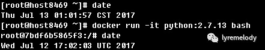

# 那些年踩过的坑--Docker篇

第一次听说Docker，还是在2014年。那时候参加了普元搞的一个技术沙龙，然后听池老师分享了相关的内容。

不过回来就忘记了，直到前年，当看到当时产品线的构建环境管理混乱得太浪费时间了，就想到了Docker。但是要基于Docker，需要调整系统架构，动作太大，最终还是搁浅了。

后来我调到一个新产品线，负责全新的产品。这个产品会包装很多开源产品，我首先就想到了Docker，简化部署，是我的第一个理由。不用关心JDK版本、不用关心系统库版本冲突、不用关心卸载不干净影响环境......

我们产品线所需的大部分开源项目，在Docker Hub上都能找到官方镜像，部署起来就两个步骤：

```bash
docker pull {image_name}:{image_tag}
docker run -itd -v xx:xx -p xx:xx xxxxxx {image_name}:{image_tag}
```

当然，这仅仅是开始。我们已经实践了一年多。踩过的坑总结一下。

## 容器时区问题

很多容器的时钟是UTC，比如

<div align=center></div>

很多对于时钟依赖的服务就会出问题，比如日志处理服务。

那么在容器里面配个NTP？这不是虚拟机。一般来讲，容器是跑单进程的。

我们的做法是将主机的/etc/localtime映射到容器中，使得容器时钟与宿主机一致，然后将宿主机配置NTP就行了。如下

<div align=center></div>

## 不要使用latest版本的镜像

之前由于没经验，使用了latest版本的镜像，然后过了一段时间，想到一个问题，我们用的什么版本？因为有时候基于latest镜像构建新镜像，会出现莫名奇妙的问题，比如有些产品的版本有兼容性的时候。

有的镜像可以通过version看主进程版本，比如

```bash
docker run -it {image_name}:{image_tag} version
```

还有的镜像可以通过ps，看具体进程参数，比如jar包会有版本号。

还有些镜像...呵呵。最后我们去Docker Hub上比对镜像大小......

现在，我们都会指定具体的镜像版本，比如 python:2.7.13 而不是 python:latest。

## 镜像构建时间长

对于这个问题，我们采用了至少三个方法：

* 自建Docker Registy
* 构建基础镜像
* 系统/库更新使用国内的源

### **自建Docker Registry**

Docker在下载镜像的时候会把镜像分层拉到本地，然后再解压成Docker格式。

其中下载镜像会浪费大量时间（比如1个小时！），有时候还可能下到一半超时。

通过自建Docker Registry，对于我们持续集成来说可以节省大量时间。

自建一个Docker Registry也是相当容易

```bash
docker pull registry:2.5.1
docker run -d -p 5000:5000 \
    --restart=always \
    --name registry-v2 \
    -v /opt/data/registry-v2:/var/lib/registry \
    registry:2.5.1
```

然后在需要使用该Docker Registry的Docker Engine配置中加上（Registry所在机器地址为192.168.1.6）

```bash
--insecure-registry 192.168.1.6:5000
```

当然也可以通过配置 --registry-mirror 来加速docker pull，国内的daocloud的源速度还是不错的，具体可以去他们的网站博客找找。

话说，在使用Registry这块，也是遇到一个坑，困扰了很久。之前用的Registry V1，构建任务有时候莫名其妙就会在push images的挂掉，报EOF错误，并导致Docker Engine挂掉。后来发现是版本兼容性问题，再加上官方也发声明不再维护V1，后面果断换了Registry V2，并在Docker Engine配置禁用了V1

```bash
--disable-legacy-registry
```

### **构建基础镜像**

这个问题，处理方式跟代码重构思想比较像，比如提取公共模块，这里是提取基础镜像，即将一些公用的库、框架统一构建到一个基础镜像中，然后基于此镜像再做各应用服务的镜像。这样就避免了每个应用服务的镜像构建都需要下载和更新系统库，这也是很耗时的。

### **系统/库更新使用国内的源**

我们知道，镜像可以使用Dockerfile来进行版本控制，在Dockerfile中，我们可以通过RUN指令来执行一些操作，比如

```bash
RUN apt-get update \
    && apt-get -y --no-install-recommends libmysqlclient-dev
```

我遇到过1KB/s的速度，当时那个绝望啊。

在Dockerfile中配上国内的源，就快多了，比如163的，当然还有其他的

```bash
RUN echo "deb http://mirrors.163.com/debian/ jessie main non-free contrib" >> /etc/apt/sources.list
RUN echo "deb http://mirrors.163.com/debian/ jessie-updates main non-free contrib" >> /etc/apt/sources.list
RUN echo "deb http://mirrors.163.com/debian/ jessie-backports main non-free contrib" >> /etc/apt/sources.list
RUN echo "deb-src http://mirrors.163.com/debian/ jessie main non-free contrib" >> /etc/apt/sources.list
RUN echo "deb-src http://mirrors.163.com/debian/ jessie-updates main non-free contrib" >> /etc/apt/sources.list
RUN echo "deb-src http://mirrors.163.com/debian/ jessie-backports main non-free contrib" >> /etc/apt/sources.list
RUN echo "deb http://mirrors.163.com/debian-security/ jessie/updates main non-free contrib" >> /etc/apt/sources.list
RUN echo "deb-src http://mirrors.163.com/debian-security/ jessie/updates main non-free contrib" >> /etc/apt/sources.list
```

基于前面讲的基础镜像，然后配上国内的源，现在镜像的构建任务，基本在一分钟之内。
