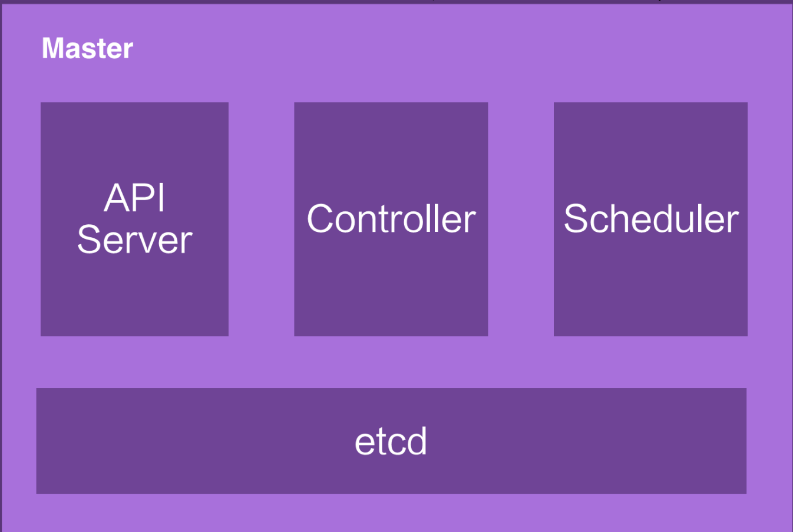
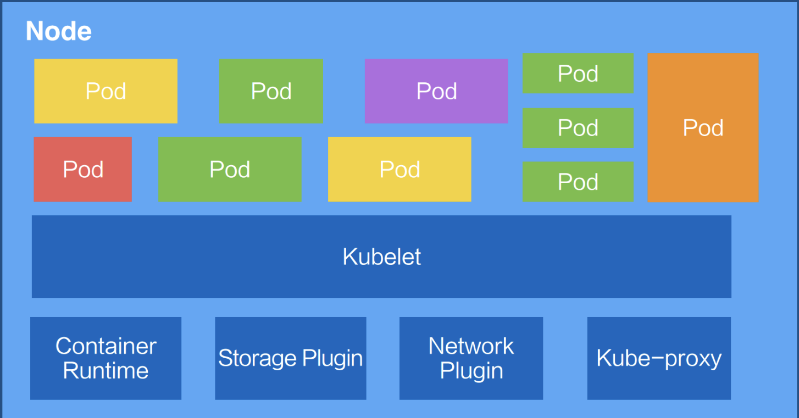
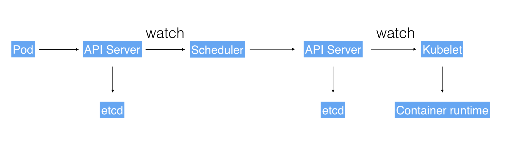

# Kubernetes是什么？

## 1 **Kubernetes 是什么意思? k8s?**

名称 **Kubernetes** 源于希腊语，意为 “舵手” 或 “飞行员”， 且是英文 “governor” 和 [“cybernetic”](http://www.etymonline.com/index.php?term=cybernetics)的词根。 k8s 是通过将 8 个字母 “ubernete” 替换为 8 而导出的缩写。另外，在中文里，k8s 的发音与 Kubernetes 的发音比较接近。

Kubernetes 为什么要用“舵手”来命名呢？可以看一下这张图：

这是一艘载着一堆集装箱的轮船，轮船在大海上运着集装箱奔波，把集装箱送到它们该去的地方。 容器英文container， 这个英文单词也有另外的一个意思就是“集装箱”。Kubernetes 也就借着这个寓意，希望成为运送集装箱的一个轮船，来帮助我们管理这些集装箱，也就是管理这些容器。

上面是这个名称的由来，那么Kubernetes是什么呢？

Kubernetes 是一个跨主机集群的 [开源的容器调度平台，它可以自动化应用容器的部署、扩展和操作](http://www.slideshare.net/BrianGrant11/wso2con-us-2015-kubernetes-a-platform-for-automating-deployment-scaling-and-operations) , 提供以容器为中心的基础架构。

Kubernetes 是一个工业级的容器编排平台。

Kubernetes是Google多年大规模容器管理技术Borg的开源版本，也是CNCF最重要的项目之一，是容器编排领域的事实标准。

## 2 Kubernetes 有哪些功能？

Kubernetes 可以在物理或虚拟机集群上调度和运行应用程序容器

主要功能包括:

* 服务发现和负载均衡
* 基于容器的应用部署、维护和滚动升级
  * 自动容器恢复
  * 自动发布与回滚
  * 自动伸缩
* 存储编排、广泛的Volume支持
* 配置与密文管理
* 批量执行
* 跨机器和跨地区的集群调度
* 无状态服务和有状态服务
* 插件机制保证扩展性

## 3 Kubernetes总体架构

### 3.1 总体架构

Kubernetes 架构是一个比较典型的二层架构和 server-client 架构。

#### 3.1.1 Master

“Master“是指管理集群状态的一组进程的集合。通常这些进程都跑在集群中一个单独的节点上，并且这个节点被称为 Master 节点。Master 节点也可以扩展副本数，来获取更好的可用性及冗余。

Kubernetes Master 节点负责维护集群的目标状态。Master 作为中央的管控节点，会去与 Node 进行一个连接。当你要与 Kubernetes 通信时，使用如 `kubectl` 的命令行工具，就可以直接与 Kubernetes Master 节点进行通信。

所有 UI 的、clients、这些 user 侧的组件，只会和 Master 进行连接，把希望的状态或者想执行的命令下发给 Master，Master 会把这些命令或者状态下发给相应的节点，进行最终的执行。

Kubernetes 的 Master 包含四个主要的组件：API Server、Controller、Scheduler 以及 etcd。

* **API Server(kube-apiserver)：**顾名思义是用来处理 API 操作的，Kubernetes 中所有的组件都会和 API Server 进行连接，组件与组件之间一般不进行独立的连接，都依赖于 API Server 进行消息的传送；它提供了 HTTP REST 接口，是 Kubernetes 里所有资源的增、删、改、查等操作的唯一入口，也是集群控制的入口进程
* **Controller(kube-controller-manager)：**是控制器，它用来完成对集群状态的一些管理，是 Kubernetes 里所有资源对象的自动化控制中心。
* **Scheduler(kube-scheduler)：**是调度器，“调度器”顾名思义就是完成调度的操作，能够把一个用户提交的 Container，依据它对 CPU、对 memory 请求大小，找一台合适的节点，进行放置；
* **etcd：**是一个分布式的一个存储系统，API Server 中所需要的这些原信息都被放置在 etcd 中，etcd 本身是一个高可用系统，通过 etcd 保证整个 Kubernetes 的 Master 组件的高可用性。

API Server，它本身在部署结构上是一个可以水平扩展的一个部署组件；Controller 是一个可以进行热备的一个部署组件，它只有一个 active，它的调度器也是相应的，虽然只有一个 active，但是可以进行热备。

#### 3.1.2 Node

Kubernetes 的 Node 是真正运行业务负载的，每个业务负载会以 Pod 的形式运行。一个 Pod 中运行的一个或者多个容器，真正去运行这些 Pod 的组件的是叫做 **kubelet**，也就是 Node 上最为关键的组件，它通过 API Server 接收到所需要 Pod 运行的状态，然后提交到 Container Runtime 组件中。

在 OS 上去创建容器所需要运行的环境，最终把容器或者 Pod 运行起来，也需要对存储跟网络进行管理。Kubernetes 并不会直接进行网络存储的操作，他们会靠 Storage Plugin 或者是网络的 Plugin 来进行操作。用户自己或者云厂商都会去写相应的 **Storage Plugin** 或者 **Network Plugin**，去完成存储操作或网络操作。

在 Kubernetes 自己的环境中，也会有 Kubernetes 的 Network，它是为了提供 Service network 来进行搭网组网的。真正完成 service 组网的组件的是 **Kube-proxy**，它是利用了 iptable 的能力来进行组建 Kubernetes 的 Network，就是 cluster network，以上就是 Node 上面的四个组件。

Kubernetes 的 Node 并不会直接和 user 进行 interaction，它的 interaction 只会通过 Master。而 User 是通过 Master 向节点下发这些信息的。Kubernetes 每个 Node 上，都会运行刚才提到的这几个组件。

总结一下，每个 Node 上都会运行这三个关键组件：kubelet、kube-proxy、Docker Engine(docker)。

* kubelet：负责 Pod 对应的容器的创建、启动、停止等任务，同时与 Master 节点密切协作，实现集群管理的基本功能
* kube-proxy：实现 Kubernetes Service 的通信与负载均衡机制
* Docker Engine(docker)：负责本机的容器创建和管理工作

#### 3.1.3 例子

以一个例子再去看一下 Kubernetes 架构中的这些组件，是如何互相进行 interaction 的。

用户可以通过 UI 或者 CLI 提交一个 Pod 给 Kubernetes 进行部署，这个 Pod 请求首先会通过 CLI 或者 UI 提交给 Kubernetes API Server，下一步 API Server 会把这个信息写入到它的存储系统 etcd，之后 Scheduler 会通过 API Server 的 watch 或者叫做 notification 机制得到这个信息：有一个 Pod 需要被调度。

这个时候 Scheduler 会根据它的内存状态进行一次调度决策，在完成这次调度之后，它会向 API Server report 说：“OK！这个 Pod 需要被调度到某一个节点上。”

这个时候 API Server 接收到这次操作之后，会把这次的结果再次写到 etcd 中，然后 API Server 会通知相应的节点进行这次 Pod 真正的执行启动。相应节点的 kubelet 会得到这个通知，kubelet 就会去调 Container runtime 来真正去启动配置这个容器和这个容器的运行环境，去调度 Storage Plugin 来去配置存储，network Plugin 去配置网络。

这个例子我们可以看到：这些组件之间是如何相互沟通相互通信，协调来完成一次Pod的调度执行操作的。

### 3.2 部署架构

## 4 参考资料

1. [Kubernetes官方文档 - Concepts - What is Kubernetes](https://kubernetes.io/docs/concepts/overview/what-is-kubernetes/)
2. [云原生技术公开课](https://edu.aliyun.com/roadmap/cloudnative)，阿里云
3. [Kubernetes官方文档 - 概念](https://kubernetes.io/zh/docs/concepts/)
4. [Kubernetes权威指南](https://book.douban.com/subject/27112874/)，2017
