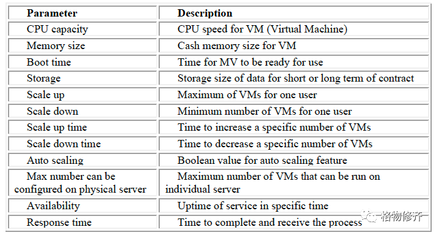
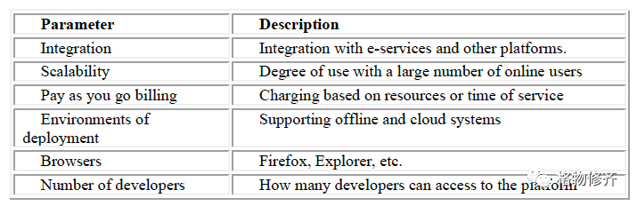
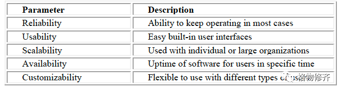
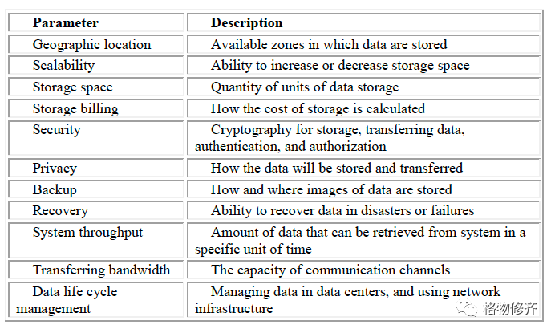
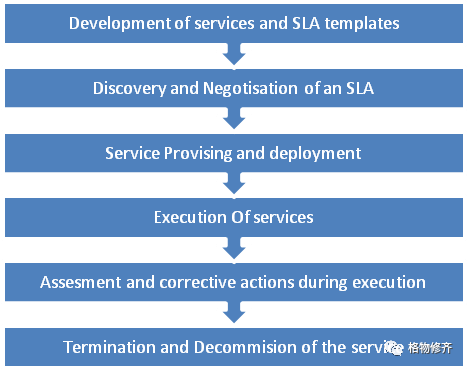
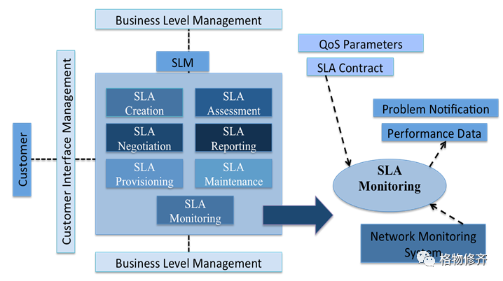

[返回上层](./README.md)

# 一文理解「SLA/服务等级协议」

<strong><font color="red">最后修改于2022-05-29</font></strong>

**SLA(Service Level Agreement)：服务等级协议。**

本文主要参考两篇论文：
1. [《An Objective of Service Level Agreement (SLA) in Cloud Computing Environment》](http://data.conferenceworld.in/IETEE/7.pdf)。这篇论文发表于2017年11月26日。
2. [《SLA in Cloud Computing Architectures: A Comprehensive Study》](http://article.nadiapub.com/IJGDC/vol8_no5/2.pdf)。这篇论文发表于2015年。

本文的写作风格不再基于翻译和注解的形式，而是以原论文为基础，理解之后转述的方式。一方面避免生硬的翻译，另一方面不会被原文束缚。

## 1.背景
如今，很多公司不希望组建一个大规模的 IT 支持团队，一方面是业务太广导致小规模的 IT 团队难以支持所有 IT 运营，另一方面 IT 团队的投入在分散公司重点业务的投入。而与此同时，一些关键业务，又不能容忍过多的停机时间。

大约在十几年前，云计算产生了，它正在成为通用 IT 基础设施的替代品。云计算是一种提供动态、弹性和可扩展资源的 IT 服务形态，比如我们熟知的基础设施即服务(IaaS)、平台即服务(PaaS)等。开发者基于云开发应用程序，可以使用公有云的云主机、云数据库、云存储、负载均衡等云服务；客户基于云部署IT系统。云计算服务基于「按使用付费」，由云服务提供商按协议提供给客户。这个时候就需要服务等级协议了。

随着越来越多的客户 (云消费者) 将他们的工作负载分派给云提供商，消费者和提供商之间的服务等级协议 (SLA) 变得至关重要，以确保无论云环境的动态性质如何都能将服务质量保持在令人满意的水平。

实际上，除了云计算场景，在很多 IT 运维/运营场景下都会有 SLA 的概念。

## 2.SLA
**SLA(Service Level Agreement)：服务等级协议。**

SLA 涉及到基本概念主要有这些：
* SLA的定义和优点
* SLA的类型
* SLA的需求
* SLA的等级
* SLA的组成
* SLA中的服务质量度量
* SLA的生命周期
* SLA的管理

## 3.SLA 的定义和优点
**服务等级协议 (SLA) 是服务提供商与其内部或外部客户之间的协议。**在这个协议文件中，服务提供商将提及服务，并定义服务提供商有义务满足的服务质量标准以及在服务不达标情况下的服务赔偿。这可以是**具有法律约束力的正式或非正式「合同」**。

通过 SLA 定义明确的服务提供边界，有三方面的优点：
1. 提高客户接受水平：一个明确解释的 SLA 扩大了客户认可水平，因为它支持服务提供商专注于客户需求并确认工作以正确的方式进行。
2. 加强各方之间的关系：一个明确的 SLA 规定了所提供服务的标准和赔偿政策。消费者可以根据 SLA 中确定的服务等级目标 (SLO) 检查服务。此外，明确的合同可以帮助各方毫无困难地解决分歧。
3. 驱动服务提供商提升服务质量(QoS)：合同是阐明提供者和用户的需求差异的一种手段。客户和服务提供商之间的约定合同包含 SLO。服务提供商将系统运行中实际服务质量与合同中规定的值进行比较，以制作用于评估的质量报告，并提供技术手段来进行改进。

**可以看到 SLA 并不是一个技术术语，而是一个业务术语，代表的是「协议」或「合同」。**

## 3.SLA 的类型
SLA 主要有两种类型：
1. 现成的 SLA「Off-the-shelf SLAs」：这种类型的 SLA 可以在云服务提供商的网站上找到，这些是不可协商的，通常由云服务提供商定义。
2. 可协商的 SLA「Negotiable SLAs」：对于希望在云上托管关键服务的企业来说，现成的服务或者SLA并不能很好地满足需求，需要定制服务。这些服务更昂贵，因为它们是为客户定制的。这种现在国内很多大型政企跟云厂商在建专有云，类似把公有云的服务搬到专有云来部署和运维，这种服务跟云厂商提供公有云有一些区别。

一般在云计算场景下，开发者和客户面对的都是第一种，即现成的 SLA「Off-the-shelf SLAs」。

## 4.SLA 的需求
编写的 SLA 声明必须是可衡量的、可实现的、相关的和及时的，并且应该针对特定云服务，旨在最大限度地减少云消费者和云服务提供商的歧义。SLA 必须定义各种考虑因素。下面描述了一些有助于制定紧凑 SLA 的关键要素： 
* 服务可用性
* 数据位置
* 停机时间积分
* 信用发起
* 安全数据加密
* 设置计划的维护周期
* 阅读隐藏成本
* 浮动条款

**服务可用性**：保证服务可用的时间百分比。SLA 文档必须包含有关服务正常运行时间的信息。承诺时间被认为是 99.5% 或更高。该服务将始终可用，并且应根据用户的要求为用户提供更新信息。以下是需要仔细定义和阅读的几个方面：
* 指定服务提供商将如何通知用户正常运行时间。理想情况下，它应该是每个计费周期，通常是每月一次。
* 指定符合停机时间的最短停机时间。例如，5 分钟、10 分钟、20 分钟或更长时间。这些必须在 SLA 中指定。
* 一些云服务提供商会将 SLA 定义的停机时间平均到年为单位。这意味着服务可能会在几周内停止更长的时间。 

**数据位置**：SLA 必须指定数据位置。许多国家禁止将公民的个人数据存储在境外。例如，有一些法规强制将医疗保健和金融等敏感数据置于特定地理边界内。SLA 必须指定您的信息所在的位置和数据中心。用户应有权访问和审核数据中心的物理和网络安全、灾难恢复策略、维护流程、电气和冷却冗余等属性。

**停机时间积分**：提供商可能会限制客户账单中可减少停机时间积分的百分比。信用通常是微薄的，小于诸如失去销售机会、商誉、品牌形象、生产力等硬性和软性损失。 

**信用发起**：注意谁有发起信用的责任。大多数提供商都将责任推给了用户。这是 SLA 的问题。此外，SLA 可能会要求您在特定时间内发起信用请求。例如：停电后 30 天内或收到账单后 10 天内。另外，请注意 SLA 中的信用处理时间。确定信用额度是否会显示在用户下个月的账单上或 6 个月后。

**安全数据加密**：SLA 必须指定是否对静态和动态数据进行加密。必须指定加密程序和访问策略的详细信息。

**设置计划的维护周期**：SLA 必须指定服务是否在计划的维护周期内可用。如果是，则应指定维护窗口期间的 SLA 正常运行时间以及有关在计划维护期间或主数据副本关闭时的复制和业务连续性计划 (BCP) 工作的信息。

**阅读隐藏成本**：阅读隐藏成本。用户 SLA 可能有一个条款，如果发现报告的问题是由于消费者的过错造成的，则可以向消费者收取用于调查问题的时间和材料的费用。在这种情况下，可能没有账单金额上限或任何关于如何确定报告的问题是否是由于消费者的过错造成的声明。

**浮动条款**：SLA 是双方签署的纸质文件，但也可能指网站上发布的政策和条款。云提供商可能不需要通知客户更改条款。但是，他们必须指定可以更改或不能更改的内容，并且新条款应适用于所有客户。他们必须在更改前通知客户。如果新条款不可接受，SLA 必须有一个简单的退出条款。消费者应了解数据中心和云提供商所在的当地法律。如果执法机构没收云提供商的设备或云提供商破产，他们应该给予消费者足够的通知，以便将数据保存或迁移到另一个云服务提供商。

## 5.SLA 的等级
SLA 服务等级协议也定义在不同的级别，主要有三个：
1. 基于客户的 SLA「Customer-based SLA」基
2. 于服务的 SLA「Service-based SLA」
3. 多级 SLA「Multilevel SLA」

<div align=center></div>

**基于客户的 SLA「Customer-based SLA」**：与单个客户组的协议，涵盖他们使用的所有服务。 例如，供应商 (IT 服务提供商) 与大型组织的财务部门之间针对财务系统、工资单系统、计费系统、采购/采购系统等服务的 SLA。

**基于服务的 SLA「Service-based SLA」**：针对使用服务提供商提供的服务的所有客户的协议。 例如：移动服务提供商向所有客户提供常规服务，并提供某些维护作为通用充电服务的一部分。 另一个例子是整个组织的电子邮件系统。 此类 SLA 可能支持起来会比较困难，因为所提供的服务等级可能因不同客户而异（例如，总部员工可能使用高速 LAN 连接，而当地办事处可能不得不使用低速租用线路）。

**多级 SLA「Multilevel SLA」**：SLA 被分成不同的级别，每个级别针对相同的服务在相同的 SLA 中针对不同的客户集。
1. 公司级别的 SLA「Corporate-level SLA」：涵盖适用于整个组织的每个客户的所有通用服务等级管理（通常缩写为 SLM）问题。这些问题的波动性可能较小，因此更新（SLA 审查）的需求较少。
2. 客户级 SLA「Customer-level SLA」：涵盖与特定客户群相关的所有 SLM 问题，无论使用何种服务。
3. 服务等级 SLA「Service-level SLA」：涵盖与特定服务相关的所有 SLM 问题，与该特定客户群相关。

一般在云计算场景下，开发者和客户面对的都是第二种，即**基于服务的 SLA「Service-based SLA」**。

## 6.SLA 的组成
理想的 SLA 包含以下组成部分：
* **目的「Purpose」**：提到为什么要形成 SLA。
* **参与方「Parties」**：提及 SLA 中包含的各方及其工作。
* **有效期「Validity Period」**：说明 SLA 涵盖的时间段。这由时段的开始时间和结束时间定义。
* **范围「Scope」**：描述 SLA 中提到的服务；SLA 结构应该说明服务，以便消费者可以简单地识别服务过程。
* **限制「Restrictions」**：说明为提供所需服务等级而必须执行的基本步骤。
* **服务等级目标「Service-level objectives」**：客户和供应商认可的服务等级。它包含一组服务等级指标，例如；可用性、性能和可靠性。服务等级的每个部分，比如可用性，都会由一个目标级别来完成。服务等级目标具有与其相关的限制以描述其有效性。
* **服务等级指标「Service-level indicators」**：这些指标用于衡量这些服务等级。
* **处罚「Penalties」**：描述了当提供者无法实现 SLA 中的目标时要做什么。如果 SLA 是与外部提供商签订的，则应该可以选择签订合同。
* **可选服务「Optional services」**：客户通常不需要但可能需要作为排除项的服务。
* **排除「Exclusions」**：说明 SLA 中未包含的内容。
* **管理「Administration」**：—定义 SLA 中形成的程序以实现和衡量其目标。 

## 7.SLA 中的服务质量度量
SLA 中比较关键的一个部分就是关于服务质量的定义。

在系统中可以识别出两种质量：可测量的和不可测量的质量。可测量的质量可以通过度量来计算；例如，系统可用的时间百分比。不可测量的质量可以从评估方法中计算；例如，自动化交替服务成本的复杂性。

**可测量的质量「Measurable Qualities」**：
* 服务错误率，可以识别给定时间段内的平均错误数。
* 可用时间，比如一年内服务可用时间超过 99.95%。
* 服务容量。容量是服务在指定时间范围内可以同时满足的需求数量。可以指定服务在设定的大部分时间内可以同时处理的最大请求数。
* 每项服务的需求成本。它可能会涉及：
  * 每个需求的成本
  * 基于信息量的成本
  * 与高峰时间相关的成本差异
* 延迟，从请求发起到请求结束之间的最大时间量
* 与供应相关的时间。例如，准备新客户的服务所需的时间
* 数据可靠性。消息传输的保证。它可能会涉及：
  * 如何保证消息传输
  * 服务提供以适当的顺序传输

**不可测量的质量「Un-measurable Qualities」**：
* 互操作性
* 可修改性。服务可以修改的频率，它可能会确定服务的频率：
  * 界面修改，比如云服务的某些操作界面是否变更
  * 实施修改，比如云服务的开通和配置方式是否变更
* 安全性。防止未经许可的使用，同时为合法客户提供服务入口。

SLA中的服务质量需要能够被明确定义，会基于 SLA 参数「SLA Parameters」和 SLA 指标「SLA Metrics」来实现。我的理解，这两块分别对应 SLO「Service-level objectives」和 SLI「Service-level indicators」。

**选定 SLA 参数 (SLO) 时**，需要：
* 合理「Reasonable」
* 可实现「Achievable」：不会涉及两个参与者监控之外的指标。例如，由于互联网的通信方式出人意料，因此不需要包含通过互联网的操作的整个延迟的指标。
* 可执行「Enforceable」：这个对于服务客户来说尤其重要。SLA 必须定义并涵盖提供者如何控制和应用 SLA 参数的指示。完整的 SLA 监控解决方案必须确定客户端和提供商端的设备和测量值。客户无法猜测提供商会在违反 SLA 时通知他们。
* 可量化「Quantifiable」：度量标准必须是可测量的并允许测量。收集测量值不能非常困难或非常昂贵。例如，如果收集指标利用了重要资源，则可能不值得付出任何努力。
* 易于理解「Easy to Understand」，用于评估提供商是否按照承诺的水平提供服务
* 面向客户。跟上面易于理解相关。要将 SLA 参数与与服务客户相关的经济表达式相关联。比如如果某个云服务依赖一个底层组件(如磁盘)，而这个组件对客户是不可见的，那么定义一个磁盘可用性为 99.99% 就是没有意义的，因为它跟客户无关。

<div align=center></div>

### 7.1 SLA 指标
SLA 和 QoS 指标的研究已经由许多研究人员在电子商务和 Web 服务等面向业务和服务的构建中完成。然而，这些领域的 SLA 指标不适用于云计算，因为提供和发送的资源的种类和形式是多种多样的。因此，需要新的 SLA 样本来为用户和供应商之间的约定提供弹性技术。

不同领域、不同服务，SLA 指标可能会有所不同。

**部分 IaaS 的 SLA 指标**
<div align=center></div>


**部分 PaaS 的 SLA 指标**
<div align=center></div>


**部分 SaaS 的 SLA 指标**
<div align=center></div>

**部分存储服务的 SLA 指标**
<div align=center></div>

## 8.SLA 的生命周期
SLA 的生命周期涉及六个主要阶段，这些阶段如下：
1. 服务和 SLA 模板的开发
2. SLA 的发现和协商
3. 服务供应和部署
4. 服务的执行
5. 执行期间的评估和纠正措施
6. 服务的终止和停用
<div align=center></div>

### 8.1 服务和 SLA 模板的开发
这个阶段包括识别客户需求、网络能力、识别合适的服务特性和参数、服务等级、服务执行环境以及 SLA 模板标准的实施。这部分主要是在服务提供商。

### 8.2 SLA 的发现和协商
发现阶段包括：与消费者协商 SLA 以选择与特定服务相关的 SLA 参数值、签署 SLA 后从服务客户处获得的成本、违反 SLA 时服务提供者产生的成本、定义和最终与要交付给服务客户的服务相关的报告的周期。

在云计算概念的 SLA 框架中提出了一项研究，其中提到有许多方法可以在在线媒体中启动折中程序。描述了与云计算相关的可能的折中场景。

**第一种情况是云用户和云服务提供商之间的直接妥协。** 服务供应商可以制定一个大纲并说明所有 SLA 部分，如服务持续时间、付款、恢复时间。设置 SLA 表单后，云用户可以查看 SLA 条件并通过签署 SLA、再次妥协或结束妥协来做出反应。直接妥协是许多云供应商采用的一种熟悉的技术，比如 AWS 定义了它提供的各种云服务的 SLA，作为 AWS 的用户，默认都签了 SLA，而对条款本身无法提供任何异议。即，作为 AWS 的一般用户，没有「协商」的过程。

**第二种情况是由一个自信的代理人妥协，他是一个在选择云供应商和陈述 SLA 的重要参数方面有知识的代理人。** 当企业需要关注中心业务行为时，这可能是一个主要问题。应该向以弹性和一致的步骤执行妥协的外部代理指定许多操作。他们可以从检查业务程序和目标开始，并通过控制所有或部分 SLA 参数来达成妥协。此外，自信代理可以利用其他代理来完成一些动作，例如服务检测和性能控制。这个我暂时还举不出例子，这段内容暂时忽略吧。

**在第三种情况下，许多代理被用来执行相同类型的妥协。** 由于有四种不同的云服务，云用户可以与四种不同的代理（IaaS 代理、PaaS 代理和 SaaS）签署协议，这些代理获得说明 SLA 参数并完成妥协程序的工作。如果云用户需要不止一种云服务，这种折衷的方案可能会很好。一些宣称云中立的厂商，应该就是这种「代理」。

### 8.3 服务供应和部署
这个阶段包括：启用服务并准备好供服务购买者消费的服务资源配置，为了实现服务中特定要求的网络配置，或者支持整个服务网络，以及服务激活。服务供应和部署阶段可能需要重新配置服务资源以支持执行阶段，以成功实现 SLA 参数 (或 SLO)。这部分也主要是在服务提供商。

### 8.4 服务的执行
这个阶段是服务的实际测试。它包括三个主要阶段，首先是服务执行和监控，然后是实时报告，最后是 QoS 的验证，即服务质量。此阶段的最后阶段是 SLA 违规处理。这部分也主要是在服务提供商。

### 8.5 执行期间的评估和纠正措施
负责服务终止的服务阶段的终止和退役。这种终止可能是由于不同的原因造成的；这可能是合同中的问题、到期或违规。终止服务的退役可能导致 SLA 的终止。

## 9.SLA的管理

通过修改系统以必要的采样率提供合适的 KPI 和 KQI（关键绩效指标和关键质量指标）来保证 SLA 的条件。

在设计阶段，重要的是要确保测量过程不会给系统增加额外的负载 (增加的流量开销、更多的处理能力)。此外，应持续监控，以帮助创建管理报告并确保可以采取补救措施。这些管理报告，就 SLA 本身而言，应该简洁明了。该报告由服务提供者或客户或双方信任的第三方生成。

SLA 管理是从开始到评估管理各种 SLA 的集成过程。 

SLA 管理可分为三类；业务级管理、服务级管理、网络级管理。 

SLA 服务级管理由几个功能组成，从 SLA 创建、协商、供应、监控、维护、报告和评估开始，如下图所示。
<div align=center></div>

监控能力是指服务提供者和客户可以观察和管理与 SLA 相关的服务的行为，或聘请受信任的第三方来这样做。如果没有此要求，一方就不可能声明存在违反 SLA 的情况。因此，服务提供商可能会忽略其条款。合规的监控测量指标能否与性能表现一致，这个问题是 SLA 工程师面临的一大挑战。SLA 的设计必须保证高监控能力，并降低低合规性的可能性。

网络级管理主要包括网络监控。网络监控是通过不同的网络监控工具和技术对网络性能指标（NPM）进行价值评估的过程。有三种已知的方法来监控网络。
<div align=center></div>

第一种方法是主动监控，传统上用于测量丢失、连接和延迟。主动监控在设置那些要进行测量以获取网络当前状态的测试机器后，会在机器之间发送额外的流量。主动监控使用简单易用的工具，例如 ping 和 trace-route。主动监控的系统负载非常低，因为与其他方法相比，产生的流量很小。但是，生成的测试包可能会因为优先级低而丢失，有时很难获得准确的网络状态。 

第二种方法是被动监控，它依靠捕获数据包来获取当前的网络状态。这就是为什么被动网络是衡量 NPM（网络性能指标）如利用率和吞吐量的理想选择。

测量网络状态的第三种也是最后一种方法是使用 SNMP 代理。虽然这种方法实用且简单，但仅限于测量 NPM 的吞吐量和功能。

使用上面描述的网络监控方法获得不同的 NPM 看起来很容易，但将直接获得的值应用于 QoS 参数是一个挑战。SLA 是根据 QoS 构建的，而实际测量是 NPM。这就是为什么需要映射机制并且必须在决定 SLA 中的 QoS 参数之前定义 NPM。QoS 参数和测量的 NPM 之间的映射主要取决于所提供服务的类型。它可能很复杂，并且它的结果呈现形式应该对用户来说是清晰易懂的（在 QoS 术语中不是 NPM）。

**这两年涌现出来了一些新概念「云原生可观测性」，基于此还有一系列的工具和系统。但本质是类似的。**

服务监控是作为服务级管理的一部分执行的。

通过服务监控，针对每一项承诺的服务，从服务资源中回收与性能相关的数据。然后对这些回收的实例进行整理和集成，形成服务资源和产品 KQI 的 KQI，如下图所示
<div align=center></div>

服务级管理的另一个方面是 SLA 报告。现在很明显，生成的管理报告将由多个职能组查看，其中可能包括高级管理人员、SLA 工程师、处理计费和计费的财务组，最后是最终用户。这就是为什么这些报告的输出格式应该是适当的并且所有相关者都可以理解的原因。

## 10.一些 SLA 的例子
```
AWS SLAs：https://aws.amazon.com/legal/service-level-agreements
Microsoft Service-level agreements:https://azure.microsoft.com/en-us/support/legal/sla/
阿里云服务等级协议：https://help.aliyun.com/document_detail/56773.html
```

从上面 AWS 和微软的链接路径可以看到前缀为「legal」，可以看到他们把 SLA 归纳在「法规」层面。

## 11.总结
前面就是 SLA 及相关概念。再简单总结一下。

**SLA(Service Level Agreement)，即服务等级协议**，是服务提供商与其内部或外部客户之间的协议。在这个协议文件中，服务提供商将提及服务，并定义服务提供商有义务满足的服务质量标准以及在服务不达标情况下的服务赔偿。这可以是具有法律约束力的正式或非正式「合同」。

**理想的 SLA 包含的组成部分有**：目的「Purpose」、参与方「Parties」、有效期「Validity Period」、范围「Scope」、限制「Restrictions」、服务等级目标「Service-level objectives」、服务等级指标「Service-level indicators」、处罚「Penalties」、可选服务「Optional services」、排除「Exclusions」和管理「Administration」。

 **SLA 并不是一个技术术语，而是一个业务术语，代表的是「协议」或「合同」。**

**SLA 涉及到技术方面，就是评估服务质量的内容**。即 SLA 参数「SLA Parameters」和 SLA 指标「SLA Metrics」。我的理解，这两块分别对应 SLO「Service-level objectives」和 SLI「Service-level indicators」。

**SLA 参数 (或SLO) 的设计和定义**，需要合理、可实现、可执行、可量化、易于理解和面向客户。同时 SLO 能够转换成 SLA 指标 (或 SLI) 来支撑，在这个过程中可能涉及到 SLI 的可组合和转换。

**SLA 生命周期涉及六个主要阶段**：服务和 SLA 模板的开发、SLA 的发现和协商、服务供应和部署、服务的执行、执行期间的评估和纠正措施、服务的终止和停用。

**SLA 涉及的管理方面**，主要是业务级管理、服务级管理、网络级管理，关键在于监控、指标的设计和管理。难点在于合规的监控测量指标能否与性能表现一致。SLA 的设计必须保证高监控能力，并降低低合规性的可能性。

## 参考资料
1. [《An Objective of Service Level Agreement (SLA) in Cloud Computing Environment》](http://data.conferenceworld.in/IETEE/7.pdf)。这篇论文发表于2017年11月26日。
2. [《SLA in Cloud Computing Architectures: A Comprehensive Study》](http://article.nadiapub.com/IJGDC/vol8_no5/2.pdf)。这篇论文发表于2015年。
