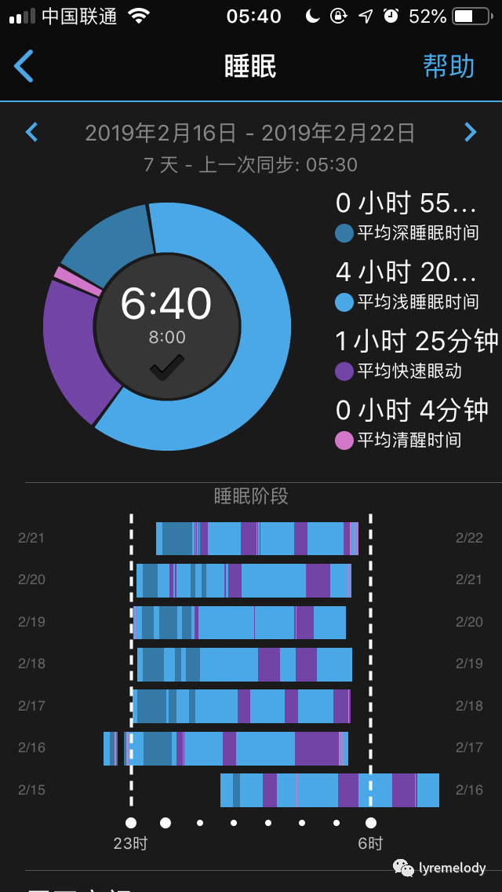
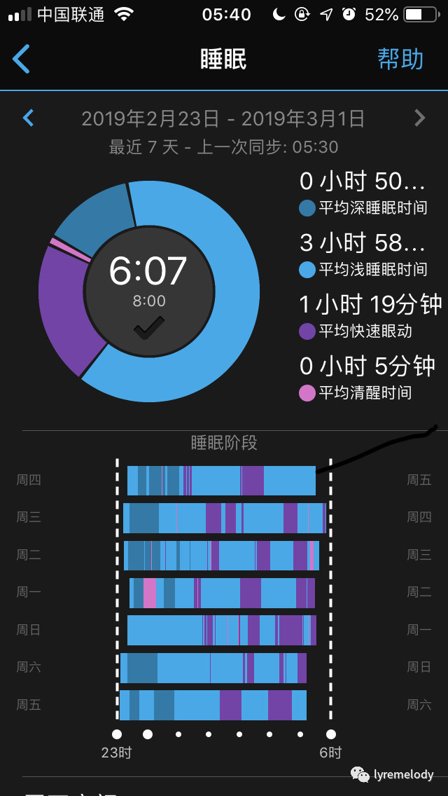

# 早起，其实并没有那么难

> 很久以前我还跟长跑没什么关系。
>
> 后来，看了一本书《习惯的力量》，然后养成了跑步的习惯，写了一篇文章[《如何有效地养成习惯》](how-to-form-a-habit.md)。
>
> 半年以后，我参加了个半程马拉松赛，拿个了纪念奖牌。
>
> 一年以后，我完成了另一个阶段目标，跑了个全程马拉松，写了一篇总结[《首马总结》](http://mp.weixin.qq.com/s?\_\_biz=MjM5MTM4NDE3Mg==\&mid=2247483867\&idx=1\&sn=b011a22d71b08fbb1a4a6aa1b02a5aab\&chksm=a6b716d891c09fce5577ba700f5d32d382f4bd70c4dec09706c559df8e187bac6f772b538ac1\&scene=21#wechat\_redirect)。

2018年初，在自律的路上，我立了个flag，“坚持6点早起300天”。

一年过去了，符合这个原则的日子屈指可数。

一开始坚持了两天，接着失败了几天，然后就一发不可收拾，后面就默默放弃了。

今年我没有再立flag。

其实，还是立了一个，那就是“完成过去的flag、持续的改进自己”。

当然，今天我来写这个文章，是因为我找到了实现这个目标的可行的方法，并且做了2周的验证，希望对其他人有帮助。

先看看结果：

要点有三个：

* 明确目标和制订容易执行的策略
* 使用能够帮助你达成目标的工具
* 赋予早起意义，并形成正向反馈

### **明确目标和制订容易执行的策略**

在此之前，我反思了一下之前失败的原因，其中有一点就是目标定义不“合理”。

其实看起来“坚持6点早起”没什么问题，然后还给了自己“例外”，只是300天，而不是365天。

最大的问题就是执行的难度。

5点59分和6点1分起床有差别吗？但是6点过了起床，可能就会感觉目标没有达成，有很大的挫败感。

这就造成了一个负面反馈，会削弱你的信心。

当有60天没有达成的时候，“例外”的退路都没有了，一次次的负面反馈，到这个时候基本就没啥信心了。

当你犹豫和自我怀疑的时候，这件事基本就黄了。

但我反思了一下，目标关注点真的应该是6点吗？不，其实应该是规律的生活作息，而6点只是一个时间点的选择。

从另一个角度来看，即便要求自己的6点起床，但是总是晚上到凌晨1点或者更晚睡，长期来看也是不可行的，身体受不了。这也就违背了初衷。不是为了早起而早起，而是为了作息规律，更好的掌控自己的人生。

所以我调整了一个目标：每天晚上睡觉时间在 22:00-6:00 就可以了，然后中午午睡半小时左右。

与其说这是一个目标，不如说这是一个策略。

过程中，我还做了调整：根据实际执行的情况，我发现当前23:00开始比较合适，我就改成了这个时间点；实际上我会在不到5点半就起来了，由于手表的报表划线只能整点，所以就把目标时间定为6:00，为了便于基于数据反馈。

策略在一定范围内，可以按实际情况调整；一个容易执行的策略，更有利于目标的达成。

### **寻求工具的帮助**

其实工具是挺关键的。

自从读大学开始，我就没有睡午觉的习惯了。

大学可以理解，自律太差，放飞了自我。

工作了也没有这个习惯，一是之前习惯的影响，二是觉得中午半个小时时间太短，我入睡也比较困难，感觉做不到。

重新养成午睡习惯，说起来也是一个无意中的机会。

去年在考虑提升学习效率和工作效率的过程中，了解了番茄工作法以及类似的管理方式，找了个工具“潮汐app”，我可以定每工作或者看书25分钟就强制提示我结束，休息一会，再继续。

在工作中实践了一段时间，这个对于我的工作的帮助倒是不大，因为经常会被人打断，这也跟工作性质有关系，沟通和协助处理问题比较多。

但是某天，发现这个app还有个“睡眠”功能，然后我就用了一下，尝试了一下午睡。

找个地方躺下，戴上耳机，使用app播放一些白噪声，比如我选择“雷雨”，它会播放下雨和打雷的声音。

神奇的事情就发生了，我很快就睡着了；到了25分钟，我被唤醒，感觉下午的精神好了很多。

这实在是对我帮助很大。从那以后，我就开始午睡了（只要没有特别的事情），但并没有上升到目标和作息规律层面。但种下了一颗种子，为我规律作息做了准备。

后来我把这个过程应用到了晚上的睡眠，只是晚上不会戴耳机。早上唤醒的操作也挺有意思，通过提前15分钟，播放自然的声音，比如鸟叫啥的，我选的那个主题是“普罗旺斯的夏天”，比定点闹钟让人更舒服。app中定义这个叫“轻唤醒”。

工具帮助我，使我能够在短时间内入睡和比较平滑的唤醒。当然，还有获取反馈的工具，比如睡眠记录和日程记录。

趁手的工具，能够降低执行的难度。

### **赋予早起意义和正向反馈**

为了早起而早起？为了显得自律？这些我认为都不是长久的。

我赋予早起的意义，那就是更好的掌控自己的人生，能够赋予人生更多的意义。

早起之后，在工作日，我可以多学习和思考一个半小时，7点喊女儿起床，给女儿做早餐，送去幼儿园；在周末，我可以跑步，锻炼下身体，同时也省下了晚上跑步的时间......

上面这些，每天完成之后，我都会详细记录到日历上。

每天回顾一下，都会给我很大的鼓励。

另外，我的运动手表会记录睡眠情况，时常看看和对比，规律的数据也会给我很大的正向刺激。刷数据也是一种乐趣。

这些，实际上是在习惯回路中，我对自己的精神奖励，这样习惯回路就增强了。

估计，久而久之，再要打破这种规律的作息也会变困难了。

自律最有力的武器就是习惯，当然最大的敌人也是习惯。

回顾一下三个要点：

* 明确目标和制订容易执行的策略
* 使用能够帮助你达成目标的工具
* 赋予早起意义，并形成正向反馈
