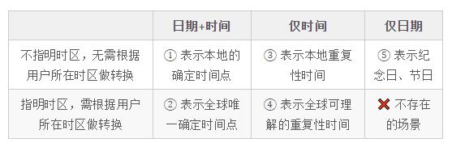
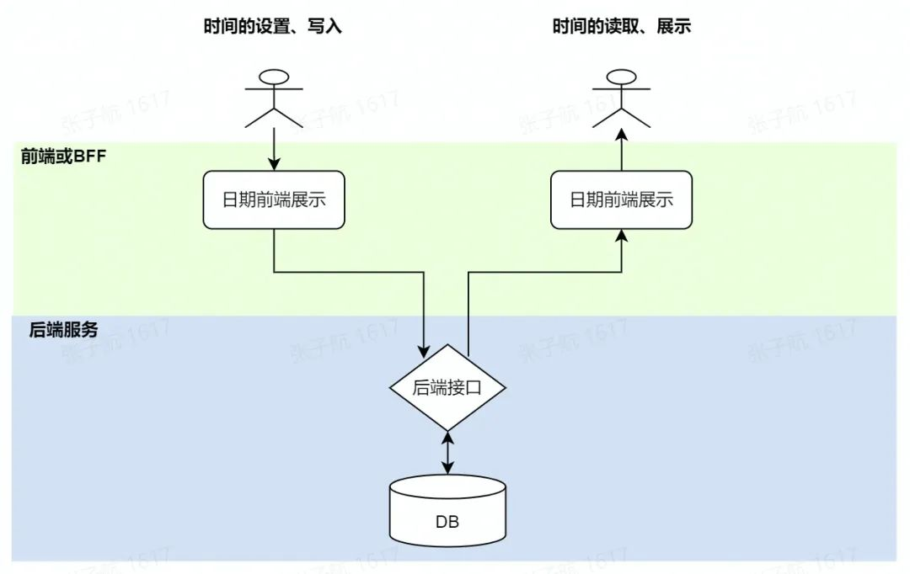

# 全球化系统中的日期时间处理问题
原文地址：https://www.51cto.com/article/707295.html

Too long; didn't read:
1. 大多数应用中，只需要用“绝对时间 DateTime”一种技术实现即可
2. 后端应统一用 UTC 时间(包括 DB 落盘、接口定义)，不应当受用户时区或服务器时区的影响
3. 前端输入、展示的时间，根据具体业务场景进行时区调整，以及精度调整
4. 面对不带时间的日期，要明确区分「纪念日」与「精度不高的绝对时间」两种用途，大部分时候你看到的日期是后者，它也应当用“确定时区的 DateTime”来实现

## 1. 重要性
日期时间的处理，一直是计算机系统中看似简单，实则经常爆雷的问题。

例如，每隔几年，都会爆出的「千年虫问题」的各种变种，通常因为系统在设计之初，没有设计好日期时间的数据存储方式，或者低估了产品设计的生命周期，导致最初选型的数据结构不够用了。

千年虫问题：

* 年纪大的程序员，都知道千年虫问题。在 2000 年之前，很多系统用 2 位数字表示年份，这样 99 年是它能表达的最大数值。因此 1999 年之后的一年，在这些系统中是没有定义的，甚至可能出现多种奇怪的情况，例如“1900”、“1:00”、“19:0”(为什么?感兴趣的读者可以自己推测)。
如果说，「千年虫」是在时间维度上缺乏前瞻性的设计导致的，那么另一种缺乏前瞻性的问题，是空间维度的，即产品全球化、跨时区带来的问题。

全球化的产品中，如果时间的处理没有遵循统一的标准，会让整个系统充斥着难以理解和维护的时间转换。各种接口的对接文档，都不得不明确说明「这个接口的时间是什么时区的?需要如何处理?」后端服务如果需要跨国部署在多个大洲的机房时，因为服务器的时区不同，需要做大量的改造。

遗憾的是，大多情况下，产品不会一开始就有「全球化」属性。所以在一开始，产研团队都不会重视全球化的设计问题，很容易留下缺乏前瞻性的设计问题。

通常情况下，我们都不鼓励「过度设计」。然而，日期时间的设计，是最不怕「过度」的。这时因为，在技术上实现一个前瞻的时间日期方案，成本并不高;但如果一开始的设计不够，后期的升级和数据迁移工作，却是伤筋动骨的。

## 2. 如何表达时间和日期?
### 2.1 时间日期的传递：用字符串
在微服务之间，以及在前后端之间，建议用字符串传递日期时间。字符串清晰易读，易于人工调试，带来的开销通常也完全可以接受。(带大量时间数据的接口，建议考虑用 Unix Timestamp。)

如果用字符串，格式就不要自己发明了。有个非常明确的国际标准：ISO 8601(wikipedia: https://en.wikipedia.org/wiki/ISO_8601)

下面举例是符合规范的常用格式：

* 仅日期：2022-02-09
* UTC 日期时间：2022-02-09T12:36:42Z
* 特定时区的日期时间：2022-02-09T20:36:42+08:00
* 精度更高的时间：2022-02-09T12:36:42.123456789Z
注意，MySQL 中使用的字符串格式(如 2022-02-09 12:36:42)并不符合规范，不建议使用。

### 2.2 时间日期的存储：关注 MySQL 中的 DateTime
不同数据库在时间日期相关对象的处理差异很大。这里单说 MySQL，因为坑不小。

MySQL 的 DateTime 数据在存储时并不包含时区信息，因此，在读取时也不会做任何时区的转换。

同时，每个 MySQL 连接会话，都有「会话时区」的概念，但这个概念只影响 MySQL 的 NOW() 等有关当前时间的函数的行为，对数据中已经保存的 DateTime 没有任何影响。

例如：
```
SET time_zone =  '+00:00' ;
UPDATE tab SET datetime_colume = '2020-01-01 00:00:00';
SET time_zone =  '+08:00' ;  -- 换一个会话时区
SELECT datetime_colume FROM tab;
-- 返回值仍然是 '2020-01-01 00:00:00'，和写入的数据一致，和会话时间无关

---------
SET time_zone =  '+00:00' ;
SELECT NOW();   -- 假设返回 '2022-01-01 00:00:00'
UPDATE tab SET datetime_colume = NOW();   -- 存入的是 '2022-01-01 00:00:00'
SET time_zone =  '+08:00' ;  -- 换一个会话时区
SELECT NOW();   -- '2022-01-01 08:00:00' 根据时区变化了
SELECT datetime_colume FROM tab;   -- '2022-01-01 00:00:00' 已经写入的不会变
```

### 2.3 时间日期的计算：语言原生的 DateTime 类型
各语言一般都提供了原生的 DateTime 数据类型，以表达绝对的日期时间，并且都支持上面 ISO 8601 规范的解析和格式化。

处理相对时区时，各种语言通常都是使用操作系统的时区数据库，来转化为绝对时区。时区数据库需要在联网情况下，由操作系统负责定时更新。

### 2.4 万能的 Unix Timestamp
Unix Timestamp 在存储、计算、传递环节都可以使用，可谓万能。它唯独不适合表达纪念日日期。

它通过一个数值表示了一个绝对时间与 Unix Epoch 时间(定义为 1970-01-01T00:00:00Z)的差值秒数。Unix Timestamp 本身已经表达了绝对时间，并不需要时区信息。

使用 Unix Timestamp 时，应特别注意选用合适的数值类型，它会影响时间表示的范围。稍不留神，你就可能种下一个新的千年虫。
* 用有符号int32，最多表示到 2038 年。MySQL 的 TIMESTAMP 类型也是它，一个千年虫变种
* 用有符号int64，并使用 9 位 10 进制定点小数位时，就是 Golang 的UnixNano()，可以表示 1678 年至 2262 年
* 一般不会用浮点数表示，因为浮点数的精度不固定

### 3. 产品视角的日期时间设计
本着不重不漏的原则，我们可以按如下表格划分产品中的所有日期时间对象：

<div align=center></div>

指明时区，需根据用户所在时区做转换 ② 表示全球唯一确定时间点 ④ 表示全球可理解的重复性时间 ❌ 不存在的场景

下面逐一解释这五种场景。

### 3.1 表示全球唯一确定时间点(表中的 ②)
信息量包含「年月日-时分秒-时区」。这样，就可以完全确定历史长河中的一个无歧义的时间点。这个时间点是完全客观的，和访问的用户地理位置无关，和服务器的地理位置无关，和什么都无关。

产品表现上，通常会根据查看者所在的时区来重新调整时间的显示。

用途举例：
* 单个事件发生的时间。如 2022 年冬奥会开幕式的时间：2022 年 2 月 4 日，20 点整，+0800 时区。一个英国人看电视转播预告时，会看到开幕式的转播时间是：2022 年 2 月 4 日中午 12 点整。这体现了根据查看者做时间的转换。
3.2 表示本地的确定时间点(表中的 ①)
包含「年月日-时分秒」，因为没有时区信息，所以它本身并不能确定一个精确的时间点，而是只在特定的情境下才有意义。

所谓特定的情境，是因为业务场景中蕴含了时区的信息，并且是大家公认的共识。因此，本质上它仍然表示了一个绝对时间。在产品表现上，因为对时区的共识，所以不需要根据查看者的时区来调整时间的展示。

用途举例：
* 在非国际化的产品中，明确知道用户所在的时区，那么去掉时区是最简单的处理方式，可以省去很多麻烦。
* 对于时区有其他约定俗成的理解。例如：飞机的起飞降落时间，酒店的入住离店时间，一定是按照飞机起落地、酒店坐落地当地时区来表达的。在所有订票网站上，都会按照这个规则显示时间，不论访问的用户身处哪个时区。

### 3.3 表示重复性时间(表中的 ③ 和 ④)
和前两类相比，去掉了「日期」这个信息，是为了描述重复性的日程。它可以是指明了时区的，也可以不指明时区，而基于人们对时区的共识去理解。

用途举例：

* 每周三 8:00+0800 开会，如果这可以是个跨国的会议，大家都能理解正确的时间。这时，产品表现上应该注意根据查看者来调整显示。
* 每周三 8:00 起飞的航班，航班起飞地的时区是蕴含的共识。产品表现中不必根据查看者的时区调整显示。

### 3.4 纪念日日期(表中的 ⑤)
日期对象几乎只有一个有意义的用途：表示纪念日/节日。它不会包含时区信息。

认为「日期」只能用于「纪念日」，有些绝对了。但我确实查阅了很多资料，也没有看到任何非「纪念日」用途的日期。

例如：
*  小吴的生日是 3 月 11 日，那么不管他在中国还是美国，都会在 3 月 11 日这一天过生日。
* 每年 12 月 25 日是西方的圣诞节，各个国家都在 12 月 25 日这一天庆祝，虽然它们并不在同一个时区。
产品体现上，不需要根据时区调整日期的显示。本质上，「纪念日」的逻辑，其实是人脑的不严谨导致的一种习惯，是不严谨、不客观的习惯。不包含时区信息，就是为了满足这种不严谨的习惯。

### 3.5 区分「纪念日日期」与「精度不高的绝对时间」
上面说过，日期对象不能包含时区。你可能会问，我需要表示“北京时间 2022 年 3 月 22 日”呢?答案是：这不是一个日期，而是一个「精度不高的绝对时间」。

很多情况下，当你想用日期时，其实很可能需要的是个「精度不高的绝对时间」。在飞书人力套件的业务中，经常会遇到这种场景。

例如，一个在美国的同学与一个在日本的同学，都在 2022 年 3 月 22 日这天从公司离职了，由同一个在北京的 HR 办理离职事项。

<div align=center></div>

可见，从我们用户视角理解的「一个事件发生的日期」，其实是我们忽略了时间的精度。在产品全球化之前，我们通过一些默认的简化，忽略了时间精度的问题(例如把时间都填成 00:00:00)。一旦面临产品的全球化，就需要补齐时间、提高精度。

而补齐时间、提高精度的方式，需要根据具体的产品形态具体考虑、明确定义。

例如，在上述离职场景下，就需要按照这个公司对离职的定义来补充，可以是当地时间当天的 23:59:59，也可以是当天下班时间，如 17:00:00。

又比如，对于跨团队的业务，例如一个同学的上级汇报线从一个美国 Leader 转到一个日本 Leader，那么为了避免歧义，通常会约定一个确定的生效时区，如统一按照公司的总部所在地的时间来计算。

<div align=center></div>

## 4. 日期时间的技术实现
### 4.1 确定时区的 DateTime
适用于上面的 ①②③④ 四种场景。

<div align=center></div>

所有后端暴露的接口中的时间对象，全部以 UTC 时间表示。

同时，所有后端在存储、计算、传输时间时，也统一使用 UTC 时间。由于 DB 存储时间时，时区信息会被丢掉，因此应保证丢掉的时区，是大家明确约定清楚的无歧义的，即 UTC。这样一来，DB 中的所有时间字段也都没有歧义。

接口内部产生的时间，例如 CreatedAt、UpdatedAt时间，都应该转换为 UTC 再落盘。如果直接使用了 MySQL 的NOW()函数，应确保 MySQL Session 的时区设置正确。

在前端或 BFF 负责处理用户输入的时间，以及展示给客户看到的时间。包括两个步骤：

**处理“精度不高的时间”问题**。 比如：员工异动的生效时间，用户只设置到“天”的精度。那么如果不跨国，可以补全用户会话时区的 00:00:00 为精确生效时间;如果跨国，那就看客户如何定义，以及产品给客户怎样的灵活性：例如，可以以客户公司总部所在地的时区的 00:00:00 为精确生效的时间。

**时区转换**。 注意，这里不一定是使用用户的会话时区来转换。如前面介绍的飞机火车宾馆的预定时间，就要以预定当地的时区来转换。

上述两点，是一定需要在产品设计中定义清晰的，切忌含糊不清。

不要较真儿抬杠的几点：
* 由于历史原因，DB 里已经采用北京时间保存了，那么我们可以约定+0800 时区是我们所有后端接口的时间。只要用一个确定的绝对时区，就不会有歧义，不必非要时 UTC。
* 也可以在后端接口的网关层处理时间转换。不要较真那算不算 BFF，我们需要的是，时区转换逻辑应严禁深入到后端的下层去。

### 4.2 不带时区的 Date
适用于上面的 ⑤，即纪念日场景。

<div align=center></div>

输入或展示时，都不对日期做任何处理。日期对象直接保存在 DB 中。
只有真正的纪念日有必要用这种方式，应当非常谨慎。例如保存一个联系人的生日时。

## 5. 关于时区的特殊处理
### 5.1 时区的不确定性
使用绝对的时差来表示时区，例如：“东 8 区”表示比世界协调时间(UTC)早 8 个小时的时区。这是个客观的时区。

很多时候，我们关注的是一个城市或地区的时区。例如：Asia/Shanghai 表示中国时间;三字母的缩写 EST 表示美国东部标准时间。注意，这些根据地理位置定义的时区的时差是会发生变化的，变化因素包括：可能受到当地政策的影响，或夏令时影响。

对于历史的时间，地理时区是可以确定客观时区的，因为没有人会重新定义已经过去的时间。

对于未来的时间，地理时区并不能确定客观时区。因此，如果一个未来的事件是按照非绝对时区约定的，那么它很可能变化。并且，我们的产品需要考虑到处理这种变化。

例如，中国员工发起一个“每天早 8 点”的跨国会议，那么在美国，由于夏令时的改变，冬天开会的时间和夏天是不一样的。反之，美国员工发起的一个“每天早 8 点”的跨国会议，由于美国夏令时的变化，对中国员工的时间也是夏天和冬天不一样的。

### 5.2 夏令时
某些国家在夏天，会把时间调快一小时(提前一小时)。这表现为，同一个地区，在冬天和夏天用不同的绝对时区。

这样做，是因为夏天白天很长，调整后会在白天的更早的时段上班，从而下班后有更长的天亮的时间。注意，并不是把 10 点上班调整到 9 点上班，而是全社会重新定义了 10 点提前了一小时。

一个具体的例子，在美国：
* 在 2021 年 3 月 14 日凌晨 1:59:59 后，下一秒就是凌晨 3:00:00。因此，美国的 2021 年 3 月 14 日凌晨 2:10:00 这个时间实际上不存在。为了兼容，根据 RFC5545，如果日程约在了这个不存在的时间，会认为是 3:10:00。
* 在 2021 年 11 月 7 日凌晨 1:59:59 后，下一秒是凌晨 1:00:00。因此，美国的 2021 年 11 月 7 日凌晨 1:10:00 这个时间实际上会出现两次。为了避免歧义，根据 RFC5545，看到这个时间时，会认为是靠前的时间点。因此，除非用别国的时区来约日程，否则，美国老板是不可能约你在重叠的第二个小时内开会的。

## 6. 阅读更多及参考文献
1. Wikipedia: ISO8601 - 用字符串表达各种时间对象的标准 ​​https://en.wikipedia.org/wiki/ISO_8601​​
2. RFC3339 - 互联网上关于时间和日期实现的通用建议 ​​https://www.rfc-editor.org/rfc/rfc3339​​
3. RFC5545 - iCalendar 互联网日历应用的规范 https://datatracker.ietf.org/doc/html/rfc5545​​
4. Stackoverflow: Daylight saving time and time zone best practices [closed] - 技术实现建议 https://stackoverflow.com/questions/2532729/daylight-saving-time-and-time-zone-best-practices 
5. Medium: How to Deal with Date and Time across Time Zones - 技术实现建议 https://medium.com/@vivekmadurai/how-to-deal-with-date-and-time-across-time-zones-39b1bd747f35
6. Microsoft365: Behavior and format options of the Date and Time field - 微软的时间和日期字段的文档 https://docs.microsoft.com/en-us/dynamics365/customerengagement/on-premises/customize/behavior-format-date-time-field?view=op-9-1
7. Time Change 2021 in the United States - 美国 2021 年夏令时的调整方式  ​https://www.timeanddate.com/time/change/usa?year=2021​
