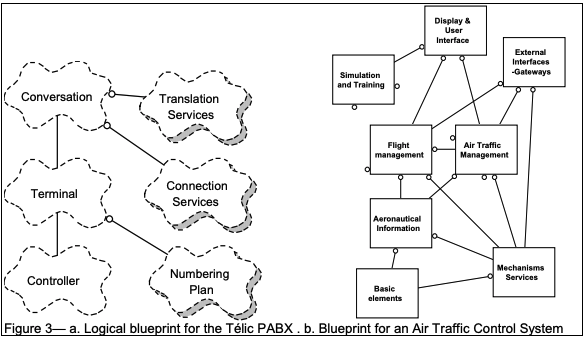
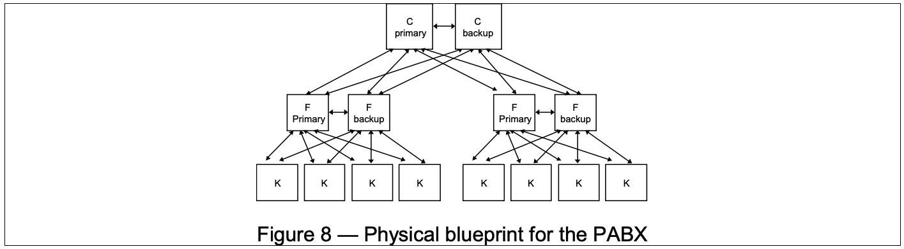
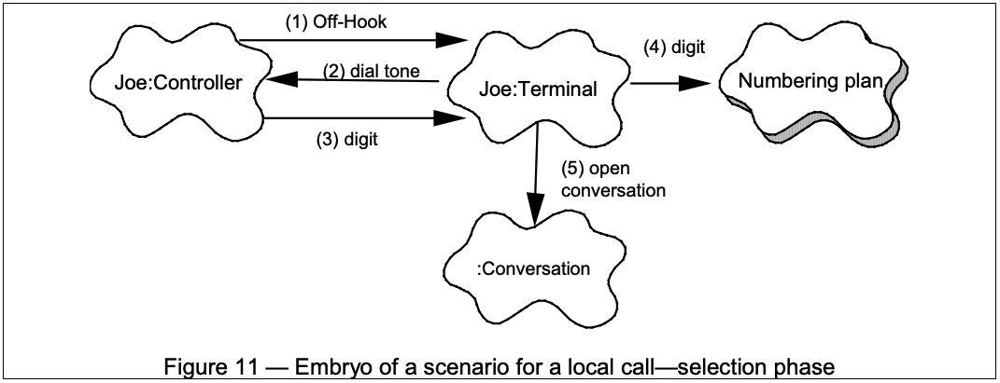

# “4+1”视图模型
- [“4+1”视图模型](#41视图模型)
  - [1 简介](#1-简介)
    - [1.1 “4+1”视图模型是什么？](#11-41视图模型是什么)
  - [2 逻辑架构](#2-逻辑架构)
    - [2.1 面向对象的分解](#21-面向对象的分解)
    - [2.2 逻辑视图的表示法](#22-逻辑视图的表示法)
      - [2.2.1 符号](#221-符号)
      - [2.2.2 例子](#222-例子)
  - [3 过程架构](#3-过程架构)
    - [3.1 过程分解](#31-过程分解)
    - [3.2 过程视图的表示法](#32-过程视图的表示法)
      - [3.2.1 符号](#321-符号)
      - [3.2.2 例子](#322-例子)
  - [4 开发架构](#4-开发架构)
    - [4.1 子系统分解](#41-子系统分解)
    - [4.2 开发视图的表示方法](#42-开发视图的表示方法)
      - [4.2.1 符号](#421-符号)
      - [4.2.2 例子](#422-例子)
  - [5 物理架构](#5-物理架构)
    - [5.1 软件至硬件的映射](#51-软件至硬件的映射)
    - [5.2 物理视图的表示法](#52-物理视图的表示法)
      - [5.2.1 符号](#521-符号)
      - [5.2.2 例子](#522-例子)
  - [6 场景](#6-场景)
    - [6.1 综合所有的视图](#61-综合所有的视图)
    - [6.2 场景的表示法](#62-场景的表示法)
      - [6.2.1 例子](#621-例子)
  - [7 参考资料](#7-参考资料)

## 1 简介
### 1.1 “4+1”视图模型是什么？
“4+1”视图是对逻辑架构进行描述，最早由 Philippe Kruchten 提出，他在1995年的《IEEE Software》上发表了题为[《The 4+1 View Model of Architecture》](https://www.cs.ubc.ca/~gregor/teaching/papers/4+1view-architecture.pdf) 的论文，引起了业界的极大关注，并最终被 RUP 采纳，现在已经成为架构设计的结构标准。

该模型五个主要的视图：
* 逻辑视图（Logical View），设计的对象模型（使用面向对象的设计方法时）。
* 过程视图（Process View），捕捉设计的并发和同步特征。
* 物理视图（Physical View），描述了软件到硬件的映射，反映了分布式特性。
* 开发视图（Development View），描述了在开发环境中软件的静态组织结构。
* 架构的描述，即所做的各种决定，可以围绕着这四个视图来组织，然后由一些用例 （use cases）或场景(scenarios)来说明，从而形成了第五个视图。

## 2 逻辑架构
### 2.1 面向对象的分解
**逻辑架构主要支持功能性需求，即系统应该为用户提供哪些服务**。系统分解为一系列的关键抽象，（大多数）来自于问题域，表现为对象或对象类的形式。它们采用抽象、封装和继承的原理。分解并不仅仅是为了功能分析，而且用来识别遍布系统各个部分的通用机制和设计元素。我们使用 Rational/Booch 方法来表示逻辑架构，借助于类图和类模板的手段。类图用来显示一个类的集合和它们的逻辑关系：关联、使用、组合、继承等等。相似的类可以划分成类集合。类模板关注于单个类，它们强调主要的类操作，并且识别关键的对象特征。如果需要定义对象的内部行为，则使用状态转换图或状态图来完成。公共机制或服务可以在类功能 （class utilities）中定义。对于数据驱动程度高的应用程序，可以使用其他形式的逻辑视图，例如 E-R 图，来代替面向对象的方法（OO approach）。

### 2.2 逻辑视图的表示法
逻辑视图的标记方法来自 Booch 标记法。当仅考虑具有架构意义的条目时，这种表示法相当简单。特别是在这种设计级别上，大量的修饰作用不大。我们使用 Rational Rose 来支持逻辑架构的设计。
#### 2.2.1 符号

#### 2.2.2 例子

## 3 过程架构
### 3.1 过程分解
**过程架构考虑一些非功能性的需求**，如性能和可用性。它解决并发性、分布性、系统完整性、容错性的问题，以及逻辑视图的主要抽象如何与过程结构相配合在一起－即在哪个控制线程上，对象的操作被实际执行。

过程架构可以在几种层次的抽象上进行描述，每个层次针对不同的问题。
* **在最高的层次上，过程架构可以视为一组独立执行的通信程序（叫作“processes”）的逻辑网络**，它们分布在整个一组硬件资源上，这些资源通过 LAN 或者 WAN 连接起来。多个逻辑网络可能同时并存，共享相同的物理资源。例如，独立的逻辑网络可能用于支持离线系统与在线系统的分离，或者支持软件的模拟版本和测试版本的共存。
* **过程是构成可执行单元任务的分组。过程代表了可以进行策略控制过程架构的层次**（即：开始、恢复、重新配置及关闭）。另外，过程可以就处理负载的分布式增强或可用性的提高而不断地被重复。
* 软件被划分为一系列**单独的任务**。任务是独立的控制线程，可以在处理节点上单独地被调度。接着，我们可以区别主要任务、次要任务。主要任务是可以唯一处理的架构元素；次要任务是由于实施原因而引入的局部附加任务（周期性活动、缓冲、暂停等等）。它们可以作为 Ada Task 或轻量线程来实施。主要任务的通讯途径是良好定义的交互任务通信机制：基于消息的同步或异步通信服务、远程过程调用、事件广播等。次要任务则以会见或共享内存来通信。在同一过程或处理节点上，主要任务不应对它们的分配做出任何假定。
* **消息流、过程负载**可以基于过程视图来进行评估，同样可以使用哑负载来实现“中空”的过程架构，并测量在目标系统上的性能。正如 Filarey et al. 在他的 Eurocontrol 实验中描述的那样。

### 3.2 过程视图的表示法
我们所使用的过程视图的表示方法是从Booch最初为 Ada 任务推荐的表示方法扩展而来。同样，用来所使用的表示法关注在架构上具有重要意义的元素。
#### 3.2.1 符号

#### 3.2.2 例子

## 4 开发架构
### 4.1 子系统分解
**开发架构关注软件开发环境下实际模块的组织**。软件打包成小的程序块（程序库或子系统），它们可以由一位或几位开发人员来开发。子系统可以组织成分层结构，每个层为上一层提供良好定义的接口。

系统的开发架构用模块和子系统图来表达，显示了“输出”和“输入”关系。完整的开发架构只有当所有软件元素被识别后才能加以描述。但是，可以列出控制开发架构的规则：分块、分组和可见性。

大部分情况下，开发架构考虑的内部需求与以下几项因素有关：开发难度、软件管理、重用性和通用性及由工具集、编程语言所带来的限制。开发架构视图是各种活动的基础，如：需求分配、团队工作的分配（或团队机构）、成本评估和计划、项目进度的监控、软件重用性、移植性和安全性。它是建立产品线的基础。

### 4.2 开发视图的表示方法
同样，使用 Booch 方法的变形，仅考虑具有架构意义的项。
#### 4.2.1 符号

#### 4.2.2 例子

## 5 物理架构
### 5.1 软件至硬件的映射
物理视图主要描述硬件配置。在UML中通常被称为部署视图，它主要考虑如何把软件映射到硬件上。通常需要考虑到解决系统拓扑结构、系统安装和通信等问题。我们希望使用不同的物理配置：一些用于开发和测试，另外一些则用于不同地点和不同客户的部署。因此软件至节点的映射需要高度的灵活性及对源代码产生最小的影响。

### 5.2 物理视图的表示法
大型系统中的物理视图会变得非常混乱，所以它们可以采用多种形式，有或者没有来自进程视图的映射均可。
#### 5.2.1 符号

#### 5.2.2 例子

## 6 场景
### 6.1 综合所有的视图
四种视图的元素通过数量比较少的一组重要场景（更常见的是用例）进行无缝协同工作，我们为场景描述相应的脚本（对象之间和过程之间的交互序列）。

在某种意义上场景是最重要的需求抽象，它们的设计使用对象场景图和对象交互图来表示。该视图是其他视图的冗余，但它起到了两个作用：
1. 作为一项驱动因素来发现架构设计过程中的架构元素。
2. 作为架构设计结束后的一项验证和说明功能，既以视图的角度来说明又作为架构原型测试的出发点。

### 6.2 场景的表示法
场景表示法与组件逻辑视图非常相似，但它使用过程视图的连接符来表示对象之间的交互，注意对象实例使用实线来表达。至于逻辑视图，我们使用 Rational Rose 来捕获并管理对象场景。
#### 6.2.1 例子

上图显示了小型 PABX 场景的片段，相应的过程如下：
1. Joe 的电话控制器检测并验证从挂机到摘机的转换并发送一个消息唤醒相应的终端对象。
2. 终端分配一些资源，并告诉控制器发出一些拨号音。
3. 控制器接收数字并将其传输到终端。
4. 终端使用编号方案分析号码流。
5. 输入有效的数字序列后，终端打开对话

## 7 参考资料
1. [百度百科-"4+1"视图](https://baike.baidu.com/item/%224%2B1%22%E8%A7%86%E5%9B%BE/15117595)
2. [《The 4+1 View Model of Architecture》](https://www.cs.ubc.ca/~gregor/teaching/papers/4+1view-architecture.pdf)