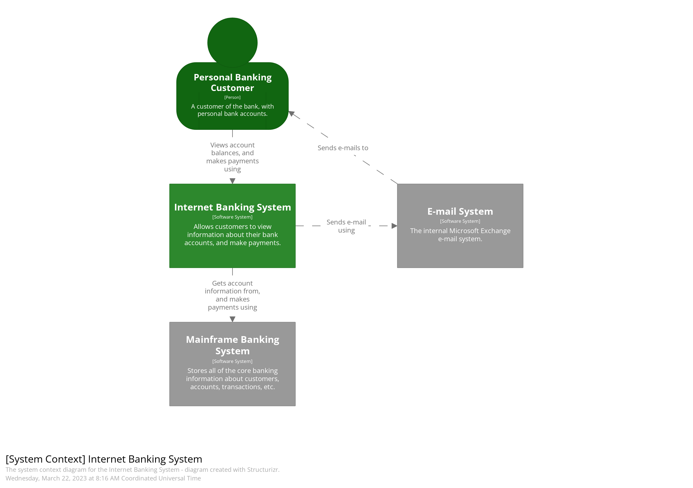
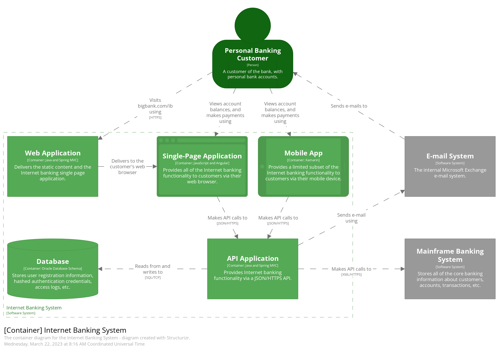
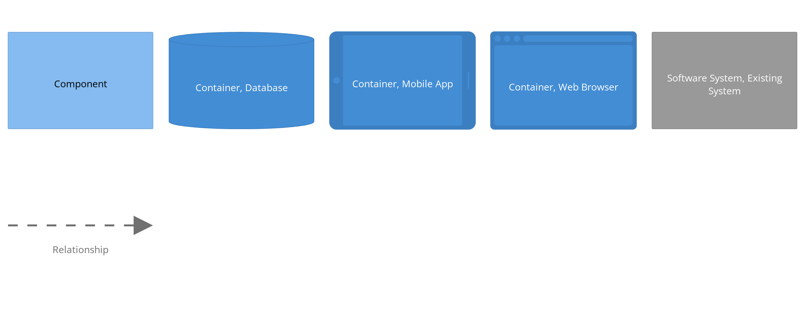
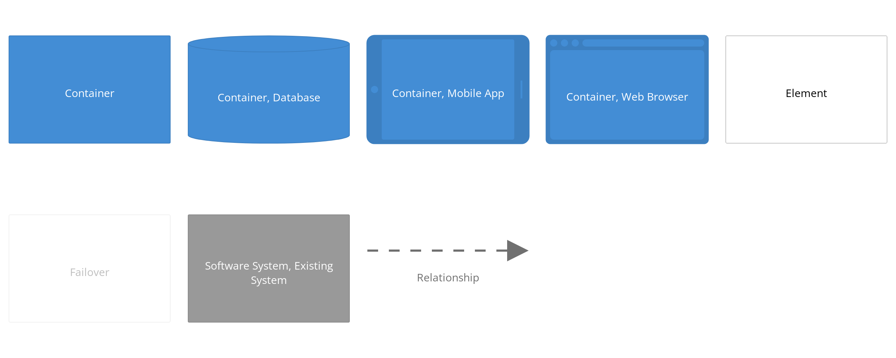

# C4模型

- [C4模型](#c4模型)
  - [1 简介](#1-简介)
    - [1.1 C4模型是什么？](#11-c4模型是什么)
    - [1.2 C4模型的核心思想](#12-c4模型的核心思想)
    - [1.3 C4模型的4个层次简介](#13-c4模型的4个层次简介)
    - [1.4 C4模型的优点](#14-c4模型的优点)
  - [2 基本概念](#2-基本概念)
    - [2.1 抽象(Abstractions)](#21-抽象abstractions)
      - [2.1.1 人(Person)](#211-人person)
      - [2.1.2 软件系统(Sofeware System)](#212-软件系统sofeware-system)
      - [2.1.3 容器(Container)](#213-容器container)
      - [2.1.4 组件(Component)](#214-组件component)
  - [3 视图](#3-视图)
    - [3.1 系统上下文图(System Context diagram)](#31-系统上下文图system-context-diagram)
    - [3.2 容器图(Container diagram)](#32-容器图container-diagram)
    - [3.3 组件图(Component diagram)](#33-组件图component-diagram)
    - [3.4 代码图(Code diagram)](#34-代码图code-diagram)
    - [3.5 补充图-系统全景图(System Landscape diagram)](#35-补充图-系统全景图system-landscape-diagram)
    - [3.6 补充图-动态图(Dynamic diagram)](#36-补充图-动态图dynamic-diagram)
    - [3.7 补充图-部署图(Delpoyment diagram)](#37-补充图-部署图delpoyment-diagram)
  - [4 符号](#4-符号)
    - [4.1 图例](#41-图例)
    - [4.2 符号建议](#42-符号建议)
      - [4.2.1 图表(Diagrams)](#421-图表diagrams)
      - [4.2.2 元素(Elements)](#422-元素elements)
      - [4.2.3 关系(Relationships)](#423-关系relationships)
  - [5 架构视图检查清单](#5-架构视图检查清单)
  - [6 工具](#6-工具)
  - [参考资料](#参考资料)

## 1 简介
### 1.1 C4模型是什么？
C4模型是一种绘制软件架构图的“抽象优先”方法，它基于反映软件架构师和开发人员如何思考和构建软件的抽象。C4模型的创建是为了帮助软件开发团队在前期设计会议期间和回顾性记录现有代码库时描述和交流软件架构。

C4模型是：
1. 一组分层抽象(软件系统、容器、组件和代码)
2. 一组层次图(系统上下文、容器、组件和代码)
3. 符号独立

### 1.2 C4模型的核心思想
C4模型是一种在不同的细节层次上创建代码地图的方法，即为代码建立一种可以放大和缩小的导览图，就像我们使用Google地图之类的东西来放大和缩小感兴趣的区域一样。不同层次的缩放可以用来向不同的观众讲述不同的故事。

它最关键的思想就是自顶向下对系统的静态结构进行逐级拆分，依次描述各层次对象的职责、关系和外部依赖。除了核心的层次化静态结构视图，它还可以包含动态视图、部署视图等补充视图。

### 1.3 C4模型的4个层次简介

    

        

             
            
        

        
层次 1: <b>系统上下文</b> 图提供了一个起点，显示范围内的软件系统如何适应周围的世界

    

    

        

             
            
        

        
层次 2: <b>容器</b> 图放大了软件系统的范围，显示了高级技术构建块

    

    

        

             
            
        

        
层次 3: <b>组件</b> 图放到单个容器，显示其中的组件

    

    

        

             
            
        

        
层次 4: <b>代码</b>(例如UML类) 图可用于放大单个组件，显示该组件是如何实现的

    

### 1.4 C4模型的优点
C4 模型是一种易于学习、对开发人员友好的软件架构图绘制方法。良好的软件架构图有助于软件开发/产品团队内部/外部的沟通、新员工的高效入职、架构审查/评估、风险识别(例如风险风暴)、威胁建模等。

## 2 基本概念
### 2.1 抽象(Abstractions)
为了创建代码的这些映射，我们首先需要一组通用的抽象来创建一种我们可以用来描述软件系统静态结构的通用语言。一个**软件系统**由一个或多个**容器**（应用程序和数据存储）组成，每个**容器**包含一个或多个**组件**，而这些**组件**又由一个或多个**代码元素**（类、接口、对象、函数等）实现。**人**们可能会使用我们构建的**软件系统**。

#### 2.1.1 人(Person)
一个**人**代表软件系统的人类用户之一（例如演员、角色、角色等）。

#### 2.1.2 软件系统(Sofeware System)
**软件系统**是最高级别的抽象，它描述了为其用户提供价值的东西，无论他们是否是人类。这包括我们正在建模的软件系统，以及我们的软件系统所依赖的其他软件系统（反之亦然）。在许多情况下，一个软件系统由一个软件开发团队“拥有”。

#### 2.1.3 容器(Container)
**不是Docker相关的概念！**

在C4模型中，一个**容器**代表一个应用程序或一个数据存储。容器是为了使整个软件系统工作而需要运行的东西。实际上，容器类似于：
* **服务器端网络应用程序**：运行在 Apache Tomcat 上的 Java EE 网络应用程序、运行在 Microsoft IIS 上的 ASP.NET MVC 应用程序、运行在 WEBrick 上的 Ruby on Rails 应用程序、Node.js 应用程序等。
* **客户端 Web 应用程序**：使用 Angular、Backbone.JS、jQuery 等在 Web 浏览器中运行的 JavaScript 应用程序。
* **客户端桌面应用程序**：使用WPF编写的Windows桌面应用程序、使用Objective-C编写的OS X桌面应用程序、使用JavaFX编写的跨平台桌面应用程序等。
* **移动应用程序**：Apple iOS 应用程序、Android 应用程序、Microsoft Windows Phone 应用程序等。
* **服务器端控制台应用程序**：独立（例如“public static void main”）应用程序、批处理等。
* **无服务器函数**：单个无服务器函数（例如 Amazon Lambda、Azure Function 等）。
* **数据库**：关系数据库管理系统、文档存储、图形数据库等中的模式或数据库，例如 MySQL、Microsoft SQL Server、Oracle 数据库、MongoDB、Riak、Cassandra、Neo4j 等。
* **Blob 或内容存储**：Blob 存储（例如 Amazon S3、Microsoft Azure Blob Storage 等）或内容分发网络（例如 Akamai、Amazon CloudFront 等）。
* **文件系统**：完整的本地文件系统或更大的网络文件系统（例如 SAN、NAS 等）的一部分。
* **Shell脚本**：用 Bash 等编写的单个 shell 脚本。
* 其他

**容器本质上是一个上下文或边界，在其中执行某些代码或存储某些数据**。每个容器都是一个单独的可部署/可运行的事物或运行时环境，通常（但不总是）在其自己的进程空间中运行。因此，容器之间的通信通常采用进程间通信的形式。

#### 2.1.4 组件(Component)
“组件”一词在软件开发行业中是一个非常重载的术语，但在这种情况下，**组件是封装在定义良好的接口后面的一组相关功能**。如果你使用的是 Java 或 C# 之类的语言，那么理解组件的最简单方法是将其视为接口后面的实现类的集合。诸如这些组件如何打包（例如，每个JAR文件、DLL、共享库等是一个组件还是多个组件）等方面是一个独立且正交的问题。

这里需要注意的重要一点是，容器内的所有组件通常都在同一进程空间中执行。
**在C4模型中，组件不是可单独部署的单元。**

## 3 视图
### 3.1 系统上下文图(System Context diagram)

系统上下文图是绘制和记录软件系统的良好起点，可让你退后一步并查看全局。绘制一个视图，将系统显示为中心的一个盒子，周围环绕着它的用户和与之交互的其他系统。
细节在这里并不重要，因为这是显示系统全景大图的缩小视图。重点应该放在人（演员、角色、角色等）和软件系统上，而不是技术、协议和其他低级细节上。
这是一种可以向非技术人员展示的视图。
* 适用范围：单个软件系统。
* 主要元素：范围内的软件系统。
* 支持元素：在范围内直接连接到软件系统的人员（例如用户、参与者、角色或角色）和软件系统（外部依赖项）。通常，这些其他软件系统位于您自己的软件系统的范围或边界之外，您对它们没有责任或所有权。
* 目标受众：软件开发团队内外的所有人，包括技术人员和非技术人员。
* 推荐给大多数团队：是的。

### 3.2 容器图(Container diagram)

一旦了解了系统如何适应整个IT环境，下一步真正有用的是使用容器图放大系统边界。
“容器”类似于服务器端 Web 应用程序、单页应用程序、桌面应用程序、移动应用程序、数据库模式、文件系统等。本质上，容器是一个可单独运行/可部署的单元(例如，一个单独的进程空间)执行代码或存储数据。
容器图显示了软件架构的高级形状以及职责是如何在其中分配的。它还展示了主要的技术选择以及容器如何相互通信。
这是一个简单的、以高级技术为中心的视图，对软件开发人员和支持/操作人员等都很有用。
* 适用范围：单个软件系统。
* 主要元素：范围内的软件系统内的容器。
* 支持元素：直接连接到容器的人员和软件系统。
* 目标受众：软件开发团队内外的技术人员，包括软件架构师、开发人员和运营/支持人员。
* 推荐给大多数团队：是的。

注意：此图未提及集群、负载平衡器、复制、故障转移等，因为它可能会因不同环境（例如生产、暂存、开发等）而异。通过一个或多个部署图可以更好地捕获此信息。

### 3.3 组件图(Component diagram)

接下来，可以进一步放大和分解每个容器，以确定主要的结构构建块及其交互。
组件图显示容器如何由多个“组件”组成，每个组件是什么、它们的职责以及技术/实现细节。
* 范围：单个容器。
* 主要元素：范围内容器内的组件。
* 支持元素：容器（在软件系统范围内）加上直接连接到组件的人员和软件系统。
* 目标受众：软件架构师和开发人员。
* 推荐给大多数团队：不，只有当你觉得它们增加价值时才创建组件图，并考虑自动创建长期文档。

### 3.4 代码图(Code diagram)

最后，可以放大每个组件以显示它是如何作为代码实现的；使用 UML 类图、实体关系图或类似图。
这是一个可选的详细程度，通常可以通过 IDE 等工具按需获得。理想情况下，该图将使用工具（例如 IDE 或 UML 建模工具）自动生成，并且应该考虑仅显示那些允许讲述且想讲述的故事的属性和方法。除了最重要或最复杂的组件外，不建议将此级别的详细信息用于任何内容。
* 范围：单个组件。
* 主要元素：范围内组件内的代码元素（例如类、接口、对象、函数、数据库表等）。
* 目标受众：软件架构师和开发人员。
* 推荐给大多数团队：不，对于长期存在的文档，大多数 IDE 都可以按需生成这种级别的详细信息。

### 3.5 补充图-系统全景图(System Landscape diagram)

C4 模型提供了单个软件系统的静态视图，但在现实世界中，软件系统永远不会孤立存在。出于这个原因，特别是如果您负责软件系统的集合/组合，了解所有这些软件系统如何在给定的企业、组织、部门等中组合在一起通常很有用。本质上，这是一张地图所选范围内的软件系统，对每个感兴趣的软件系统进行 C4 深入分析。

从实用的角度来看，系统景观图实际上只是一个系统上下文图，没有特别关注特定的软件系统。
* 适用范围：企业/组织/部门/等。
* 主要元素：与所选范围相关的人员和软件系统。
* 目标受众：软件开发团队内外的技术人员和非技术人员。

### 3.6 补充图-动态图(Dynamic diagram)

当想显示静态模型中的元素如何在运行时协作以实现用户故事、用例、功能等时，动态图会很有用。此动态图基于UML通信图（以前称为“ UML协作图”）。它类似于UML序列图 ，尽管它允许图表元素的自由形式排列以及带有编号的交互以指示顺序。
* 范围：特定功能、故事、用例等。
* 主要元素和支持元素：您的选择 - 您可以展示在运行时交互的软件系统、容器或组件。
* 目标受众：软件开发团队内外的技术人员和非技术人员。

注意：如果喜欢那种视觉风格，请随意使用UML序列图。

### 3.7 补充图-部署图(Delpoyment diagram)

部署图允许你说明静态模型中的软件系统、容器的实例如何部署到给定**部署环境**（ 例如生产、暂存、开发等）中的基础设施。它基于UML部署图。

**部署节点**表示软件系统/容器实例运行的位置，可能是：
* 物理基础设施（例如物理服务器或设备）
* 虚拟化基础设施（例如 IaaS、PaaS、虚拟机）
* 容器化基础设施（例如 Docker 容器）
* 执行环境（例如数据库服务器、Java EE Web/应用程序服务器、 Microsoft IIS)等。

部署节点可以嵌套。你可能还希望包括**基础设施节点**，例如 DNS 服务、负载平衡器、防火墙等。

随意使用 Amazon Web Services、Azure 等提供的图标来补充部署图……只需确保你使用的任何图标都包含在图表键/图例中。

* 范围：单个部署环境中的一个或多个软件系统（例如生产、暂存、开发等）。
* 主要元素：部署节点、软件系统实例和容器实例。
* 支持元素：用于部署软件系统的基础设施节点。
* 目标受众：软件开发团队内外的技术人员，包括软件架构师、开发人员、基础架构架构师和运营/支持人员。

## 4 符号
C4 模型是notation independent，并且没有规定任何特定的符号。不过作为起点，在白板、纸张、便利贴、索引卡和各种图表工具上运行良好的简单符号如下。然后，您可以使用颜色和形状来补充图表，以添加附加信息或只是使图表更美观。

### 4.1 图例
使用的任何符号都应该尽可能地自我描述，但所有视图都应该有一个键/图例来使符号明确。因为并不是每个人都知道所使用的符号。

### 4.2 符号建议
尽管 C4 模型是一种抽象优先的方法并且独立于符号，但仍然需要确保图表符号有意义，并且图表易于理解。思考这个问题的一个好方法是问问自己，每张图表是否可以独立存在，并且（大部分）无需叙述就能被理解。下面是一些与符号相关的建议。

#### 4.2.1 图表(Diagrams)
* 每个图都应该有一个描述图类型和范围的标题（例如“我的软件系统的系统环境图”）。
* 每个图表都应该有一个关键/图例来解释所使用的符号（例如形状、颜色、边框样式、线型、箭头等）。
* 首字母缩略词和缩写词（业务/领域或技术）应为所有受众所理解，或在图表键/图例中进行解释。

#### 4.2.2 元素(Elements)
* 应明确指定每个元素的类型（例如，人员、软件系统、容器或组件）。
* 每个元素都应该有一个简短的描述，以提供关键职责的“一目了然”的视图。
* 每个容器和组件都应该有明确指定的技术。

#### 4.2.3 关系(Relationships)
* 每条线都应该代表一个单向关系。
* 每一行都应该被标记，标记与关系的方向和意图一致（例如依赖或数据流）。尝试尽可能具体地使用标签，最好避免使用“使用”等单个词。
* 容器之间的关系（通常代表进程间通信）应该有明确标记的技术/协议。

## 5 架构视图检查清单
**常规**：
* 视图有标题吗？
* 你明白视图的类型是什么吗？
* 你明白视图的范围是什么吗？
* 视图是否有图例？

**元素**：
* 每个元素都有名字吗？
* 你了解每个元素的类型吗？（即抽象级别；例如软件系统、容器等）
* 你了解每个元素的作用吗？
* 在适用的情况下，你是否了解与每个元素相关的技术选择？
* 你是否理解所有使用的首字母缩写词和缩写词的含义？
* 你了解所有使用颜色的含义吗？
* 你了解所使用的所有形状的含义吗？
* 你了解所有使用的图标的含义吗？
* 你了解使用的所有边框样式的含义吗？（例如实线、虚线等）
* 你了解所有使用的单元尺寸的含义吗？（例如小盒子和大盒子）

**关系**：
* 每行都有一个标签来描述这种关系的意图吗？
* 在适用的情况下，你是否了解与每种关系相关的技术选择？（例如进程间通信的协议）
* 你是否理解所有使用的首字母缩写词和缩写词的含义？
* 你了解所有使用颜色的含义吗？
* 你了解所有使用的箭头的含义吗？
* 你了解使用的所有线型的含义吗？（例如实线、虚线等）

## 6 工具
可以使用 [plantuml](https://plantuml.com/zh/) 来使用代码定义视图。

## 参考资料
1. [《The C4 model for visualising software architecture》](https://c4model.com/)
2. [《Notation, notation, notation - A software architecture diagram review checklist》](https://c4model.com/review/)