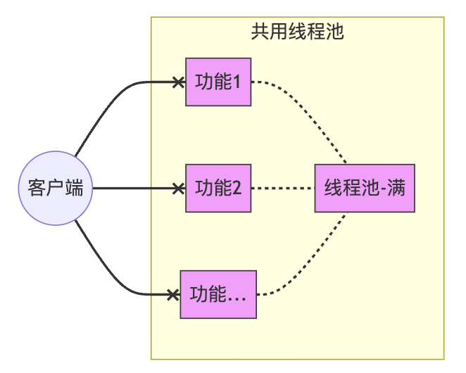
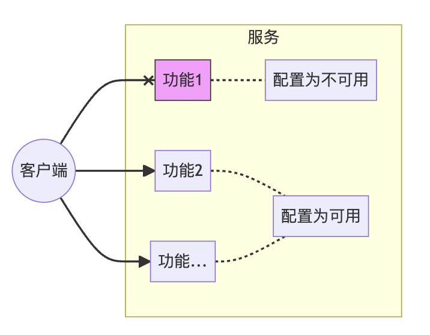
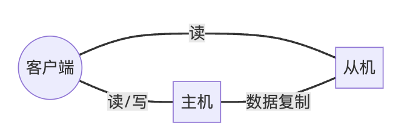
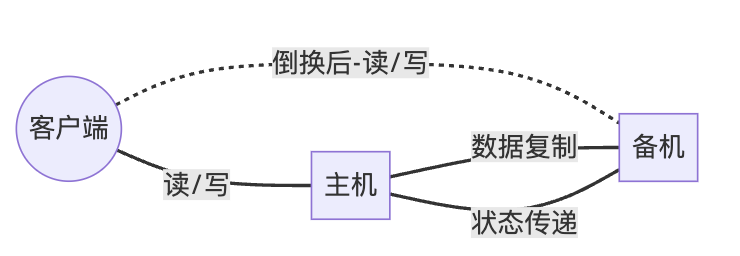
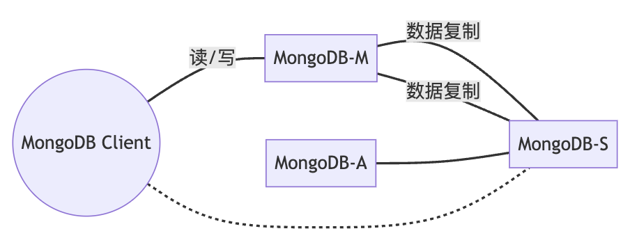
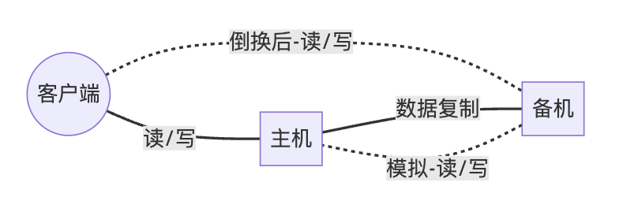
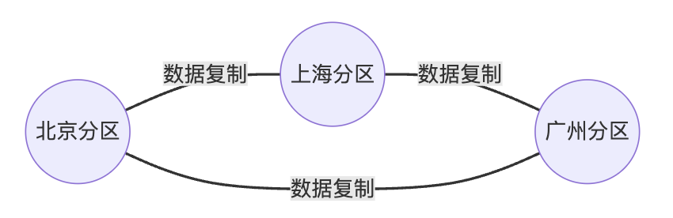
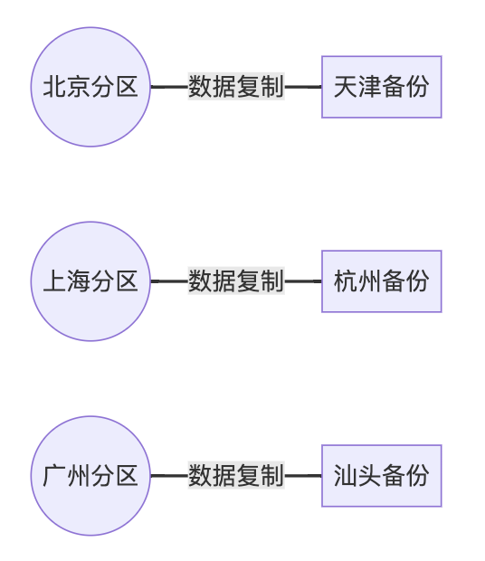
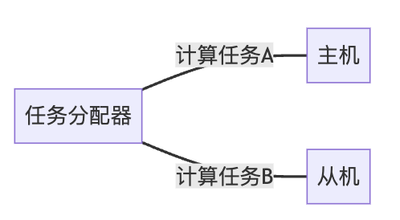
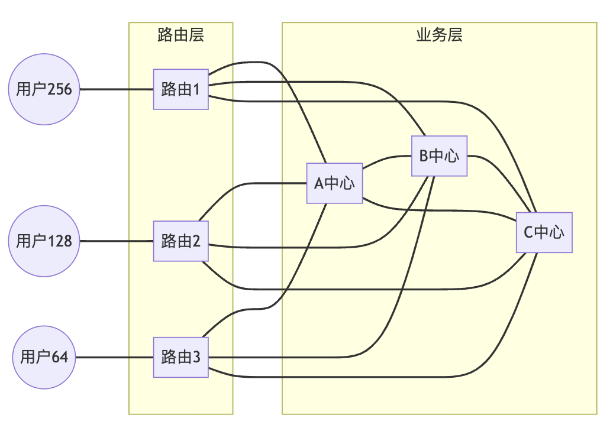

# 高可用架构设计

<strong><font color="red">最后修改于2023-09-05</font></strong>

> **要实现高可用的系统，不仅仅是在技术层面，还需要一套严谨科学的工程管理**。
> 其中包括但不限于：
> * 软件的设计、编码、测试、上线和软件配置管理的水平
> * 工程师的人员技能水平
> * 运维的管理和技术水平
> * 数据中心的运营管理水平
> * 依赖于第三方服务的管理水平
> 
> 更深层的东西则是 - 对工程这门科学的尊重：
> * 对待技术的态度
> * 一个公司的工程文化
> * 领导者对工程的尊重
> 

- [高可用架构设计](#高可用架构设计)
  - [1 什么是可用性？](#1-什么是可用性)
  - [2 什么会导致了低可用性(不可用)？](#2-什么会导致了低可用性不可用)
  - [3 系统不可用的影响](#3-系统不可用的影响)
  - [4 如何度量可用性？](#4-如何度量可用性)
  - [5 高可用技术架构](#5-高可用技术架构)
    - [5.1 如何梳理可用性需求或者说可用性目标？](#51-如何梳理可用性需求或者说可用性目标)
    - [5.2 高可用技术架构目标](#52-高可用技术架构目标)
    - [5.3 高可用架构实现机制](#53-高可用架构实现机制)
    - [5.4 高可用方案总览](#54-高可用方案总览)
      - [5.4.1 服务容错](#541-服务容错)
      - [5.4.2 计算高可用](#542-计算高可用)
      - [5.4.3 存储高可用](#543-存储高可用)
      - [5.4.4 业务高可用](#544-业务高可用)
      - [5.4.5 总结](#545-总结)
    - [5.5 服务级高可用设计](#55-服务级高可用设计)
      - [5.5.1 方案一：应对内部故障-隔离](#551-方案一应对内部故障-隔离)
      - [5.5.2 方案二：应对内部故障-限流](#552-方案二应对内部故障-限流)
      - [5.5.3 方案三：应对内部故障-降级](#553-方案三应对内部故障-降级)
      - [5.5.4 方案四：应对内部故障-超时](#554-方案四应对内部故障-超时)
      - [5.5.5 方案五：应对外部故障-超时](#555-方案五应对外部故障-超时)
      - [5.5.6 方案六：应对外部故障-熔断](#556-方案六应对外部故障-熔断)
      - [5.5.7 方案七：应对性能问题-排队](#557-方案七应对性能问题-排队)
      - [5.5.8 服务级高可用设计实践原则](#558-服务级高可用设计实践原则)
      - [5.5.9 服务级高可用实践 - 设计服务提供容错能力](#559-服务级高可用实践---设计服务提供容错能力)
    - [5.6 存储高可用设计](#56-存储高可用设计)
      - [5.6.1 主备复制](#561-主备复制)
      - [5.6.2 主从复制](#562-主从复制)
      - [5.6.3 主备倒换与主从倒换](#563-主备倒换与主从倒换)
        - [5.6.3.1 设计关键](#5631-设计关键)
        - [5.6.3.2 常见架构-互连式](#5632-常见架构-互连式)
        - [5.6.3.3 常见架构-中介式](#5633-常见架构-中介式)
        - [5.6.3.4 常见架构-模拟式](#5634-常见架构-模拟式)
      - [5.6.4 主主复制](#564-主主复制)
      - [5.6.5 数据集群](#565-数据集群)
        - [5.6.5.1 数据集中集群](#5651-数据集中集群)
        - [5.6.5.2 数据分散集群](#5652-数据分散集群)
      - [5.6.6 数据分区](#566-数据分区)
        - [5.6.6.1 数据分区复制规则-集中式](#5661-数据分区复制规则-集中式)
        - [5.6.6.2 数据分区复制规则-互备式](#5662-数据分区复制规则-互备式)
        - [5.6.6.3 数据分区复制规则-独立式](#5663-数据分区复制规则-独立式)
    - [5.7 计算高可用设计](#57-计算高可用设计)
      - [5.7.1 主备架构](#571-主备架构)
        - [5.7.1.1 冷备架构](#5711-冷备架构)
        - [5.7.1.2 温备架构](#5712-温备架构)
      - [5.7.2 主从架构](#572-主从架构)
      - [5.7.3 对称集群](#573-对称集群)
      - [5.7.4 非对称集群](#574-非对称集群)
    - [5.8 业务高可用设计](#58-业务高可用设计)
      - [5.8.1 异地多活概览](#581-异地多活概览)
        - [5.8.1.1 同城异区](#5811-同城异区)
        - [5.8.1.2 跨城异地](#5812-跨城异地)
        - [5.8.1.3 跨国异地](#5813-跨国异地)
      - [5.8.2 异地多活设计技巧](#582-异地多活设计技巧)
        - [5.8.2.1 技巧一：保证核心业务的异地多活](#5821-技巧一保证核心业务的异地多活)
        - [5.8.2.2 技巧二：核心数据最终一致性](#5822-技巧二核心数据最终一致性)
        - [5.8.2.3 技巧三：采用多种手段同步数据](#5823-技巧三采用多种手段同步数据)
        - [5.8.2.4 技巧四：只保证绝大部分用户的异地多活](#5824-技巧四只保证绝大部分用户的异地多活)
      - [5.8.3 异地多活设计步骤](#583-异地多活设计步骤)
        - [5.8.3.1 第一步：业务分级](#5831-第一步业务分级)
        - [5.8.3.2 第二步：数据分类](#5832-第二步数据分类)
        - [5.8.3.3 第三步：数据同步](#5833-第三步数据同步)
        - [5.8.3.4 第四步：异常处理](#5834-第四步异常处理)
  - [6 常见组件的高可用方案](#6-常见组件的高可用方案)
    - [6.1 Kubernetes](#61-kubernetes)
    - [6.2 MySQL](#62-mysql)
    - [6.3 MariaDB](#63-mariadb)
    - [6.4 MongoDB](#64-mongodb)
    - [6.5 Redis](#65-redis)
    - [6.6 Elasticsearch](#66-elasticsearch)
    - [6.7 Kafka](#67-kafka)
  - [7 通过提升可观测性来预防不可用问题](#7-通过提升可观测性来预防不可用问题)
  - [8 通过提升性能来提升可用性](#8-通过提升性能来提升可用性)
  - [9 故障分析方法：FMEA](#9-故障分析方法fmea)
  - [参考资料](#参考资料)

## 1 什么是可用性？
详细内容见 [Concepts-availability](../../../../concepts/availability.md)

总结下来，系统可用性就是，系统能正常使用的程度，即收到的请求能够正常响应的程度。在不同领域，有的通过时间来评估，有的通过结果来评估。

可用性包括了：
* 成熟性
* 易恢复性
* 容错性
  * 区域级容错
  * 系统级容错
  * 服务级(接口级)容错
  * ...
* ...

## 2 什么会导致了低可用性(不可用)？
详细内容见 [Concepts-availability - 什么会导致了低可用性(不可用)？](../../../../concepts/availability.md#21-什么会导致了低可用性不可用)

**总结一下，从服务的整个生命周期来看，影响服务不可用的因素**：
1. **计划内的(符合预期的不可用)**：
   * 常规维护操作：备份、容量规划、用户和安全管理、后台批处理应用(降低性能)
   * 周期性运维：数据库维护、应用维护、中间件维护、操作系统维护、网络维护
   * 升级：数据库、应用、中间件、操作系统、网络、包括硬件升级
2. **计划外的(不符合预期的不可用)**：
   * **性能场景(性能问题会导致故障表现)**：
     * 资源不足(资源耗尽)导致的性能问题
       * 系统层面：CPU、内存、磁盘IO、存储空间、网络IO的资源不足
       * 应用层面：处理线程/进程/处理队列不足
     * (设计目标)预期之外的系统压力变化
   * **故障场景**：
     * 人工误操作
     * 外部依赖故障问题
       * 网络问题
       * 服务集群内部的硬件问题
       * 服务依赖的第三方服务故障(或者第三方服务性能不足)
     * 技术债：
       * Bug
         * 服务不响应(某些场景触发bug，导致业务逻辑处理故障、服务卡死)
         * 服务不可靠(给出错误结果导致整体业务受影响)
       * 不合适的方案
       * 工程管理问题

## 3 系统不可用的影响
可用性问题会增加经营成本，增加用户的成本，降低用户的信任度和忠诚度。
系统不可用导致业务中断、或者数据丢失，对企业会造成经济损失。

## 4 如何度量可用性？
详细内容见 [Concepts-availability - 如何度量可用性？](../../../../concepts/availability.md#23-如何度量可用性)

总结下来，不同类型的系统、面向不同的人群，适合的评估(描述)方法不同：
* 服务终端用户的系统，面向用户，适合基于时间的度量、基于系统正常运行时间的比率**描述**，即 **可用性 = 系统正常运行时间 / (系统正常运行时间 + 停机时间)，形如99.95%**
* 服务终端用户的系统，面向设计/开发，适合基于时间的RTO**度量**，即 **是单一影响可用性事件允许的目标最大恢复时间，形如<1s**
* 面向非服务性的系统，如后端引擎或者内部提供API的服务，适合基于请求成功率**度量**，即 **可用性 = 成功请求数 / 总的请求数**

## 5 高可用技术架构
### 5.1 如何梳理可用性需求或者说可用性目标？
从上面我们看到了影响服务可用性的关键因素，主要是在维护、升级、资源(性能问题)、外部依赖故障、Bug这些维度。

那么我们在做考虑一个系统的可用性需求或者说可用性目标的时候，可以从这几个方面来考虑：
1. 服务的业务场景是什么？
2. 服务的可用性目标梳理，拆解到以下三个维度来明确：
   * 明确服务关键场景的性能目标 (由 [《性能优化》](./architecting-for-high-performance.md) 来提供能力支撑)
   * 明确不同场景的可用性要求(可以按照时间度量法描述)，实际上是需要对业务进行重要性分级
   * 明确需要容忍的(资源)故障场景

### 5.2 高可用技术架构目标
**高可用架构是一种采用了高可用设计思想的架构，目标是保证服务器硬件故障时依然可用，数据依然可以正确保存并能被访问。**

**从上面分析可以看到，影响高可用的主要是故障和性能。这篇主要聚焦在故障场景的应对，[《性能优化》](./architecting-for-high-performance.md) 聚焦在性能问题的应对**。

### 5.3 高可用架构实现机制
**本质**：通过冗余应对故障来实现高可用。

**设计原则**：
1. 多可用区设计：尽最大可能避免架构中的单点故障。
2. 自我修复设计：内建容错及检查能力，应用能够在部分组件失效时自我修复继续工作。
3. 假定失效设计：假定任何环节都会出问题，然后推倒设计。
4. 自动扩展设计：不进行设计调整，就能满足业务量增长。
5. 松耦合设计：耦合度越小，扩展性越好，容错能力越强。

**从影响范围来考虑**：
* 服务级高可用设计(容错方案)
  * 服务实现超时、隔离、限流、熔断、降级
* 系统级高可用设计(系统级容错)
  * 故障失效转移机制(failover)
  * 负载均衡
  * 分布式技术
* 地理区域级高可用设计(区域级容错)
  * 异地多活、容灾、备份恢复

**从系统组成的角度来考虑(高可用模型和技术)**：
* 服务高可用
  * 隔离、限流、降级、超时、熔断、排队
* 存储高可用
  * 主备复制
  * 主从复制
  * 主备倒换与主从倒换
  * 主主复制
  * 数据集群
  * 数据分区
* 计算高可用
  * 主备
  * 主从
  * 对称集群
  * 非对称集群
* 业务高可用
  * 异地多活
    * 同城异区
    * 跨城异地
    * 跨国异地
  * 接口级故障应对方案
    * 降级
    * 熔断
    * 限流
    * 排队

下面我们从影响范围来考虑高可用设计和方案，在设计过程中融合相关高可用模型和技术。

### 5.4 高可用方案总览

#### 5.4.1 服务容错

| 类别     | 方案 | 适用场景                                               | 优点 | 缺点 | 案例  |
| -------- | ---- | ------------------------------------------------------ | ---- | ---- | ----- |
| 服务容错 | 隔离 | 应对服务内部故障                                       | ---  | --   | ---   |
| 服务容错 | 限流 | 应对服务内部故障。从用户访问压力大角度考虑应对故障。   | ---  | --   | ---   |
| 服务容错 | 降级 | 应对服务内部故障。从系统功能优先级的角度考虑应对故障。 | ---  | --   | ---   |
| 服务容错 | 超时 | 应对服务内部故障                                       | ---  | --   | ---   |
| 服务容错 | 超时 | 应对服务外部依赖故障                                   | ---  | --   | ---   |
| 服务容错 | 熔断 | 应对服务外部依赖故障                                   | ---  | --   | ---   |
| 服务容错 | 排队 | 应对服务内部故障                                       | ---  | --   | 12306 |

#### 5.4.2 计算高可用

| 类别       | 方案                   | 适用场景                                                                                                     | 优点                                                         | 缺点                                                                           | 案例                |
| ---------- | ---------------------- | ------------------------------------------------------------------------------------------------------------ | ------------------------------------------------------------ | ------------------------------------------------------------------------------ | ------------------- |
| 计算高可用 | (主备)冷备架构         | 应对硬件故障。适合于内部管理系统、后台管理系统这类**使用人数不多，使用频率不高的业务**，不太适合在线的业务。 | 简单                                                         | 人工操作不可控，过程容易出错，可维护性差。(相比于温备)冷备可以节省一定的能源   | ---                 |
| 计算高可用 | (主备)温备架构         | 应对硬件故障。适合于内部管理系统、后台管理系统这类**使用人数不多，使用频率不高的业务**，不太适合在线的业务。 | 简单                                                         | 人工操作不可控，过程容易出错，可维护性差。(相比于温备)能够大大减少手工操作时间 | ---                 |
| 计算高可用 | 主从架构               | 应对硬件故障。                                                                                               | (相比主备架构)主从架构的从机也执行任务，发挥了从机的硬件性能 | (相比主备架构)主从架构需要将任务分类，任务分配器会复杂一些                     | ---                 |
| 计算高可用 | 非对称集群             | 应对硬件故障。                                                                                               | -                                                            | (相比负载均衡集群)任务分配策略和角色分配策略更加复杂                           | Hadoop Master-Slave |
| 计算高可用 | 对称集群(负载均衡集群) | 应对硬件故障。适合应对地理级别的区域故障                                                                     | -                                                            | -                                                                              | Nginx+在线页面      |

#### 5.4.3 存储高可用

| 类别       | 方案                 | 适用场景                                                                                                                     | 优点                                                   | 缺点                                                         | 案例                  |
| ---------- | -------------------- | ---------------------------------------------------------------------------------------------------------------------------- | ------------------------------------------------------ | ------------------------------------------------------------ | --------------------- |
| 存储高可用 | 主备复制             | 应对硬件故障。适合**数据变更频率很低**，**对于数据可靠性要求不高**的后台系统(即使在某些场景下丢失，也可以通过人工的方式补全) | 简单                                                   | 备机只为备份，硬件成本有浪费；主机故障后，不可写；需人工恢复 | MySQL、Redis          |
| 存储高可用 | 主从复制             | 应对硬件故障。适合**写少读多**的业务                                                                                         | (相比主备复制)从机发挥了硬件的性能                     | 主机故障后，不可写；需人工恢复；比主备复制复杂               | MySQL                 |
| 存储高可用 | 互连式主备(主从)倒换 | 应对硬件故障。同主备复制或主从复制对应场景。                                                                                 | (相比主备/主从复制)自动化倒换                          | 状态传递通道故障，难以从根本解决                             | ---                   |
| 存储高可用 | 中介式主备(主从)倒换 | 应对硬件故障。同主备复制或主从复制对应场景。                                                                                 | (相比互连式)连接管理和状态决策实现更简单               | 引入第三方分布式仲裁服务                                     | MongoDB Replica Set   |
| 存储高可用 | 模拟式主备(主从)倒换 | 应对硬件故障。同主备复制或主从复制对应场景。                                                                                 | (相比互连式)省去了状态传递通道的建立和管理，实现更简单 | (相比互连式)基于有限的状态做状态决策，结果可能出现偏差       | ---                   |
| 存储高可用 | 主主复制             | 应对硬件故障。**对数据的设计有严格的要求，一般适合于那些临时性、可丢失、可覆盖的数据场景**                                   | 不存在倒换；客户端无须区分不同角色的主机               | 额外的复杂性和限制：必须保证数据能够双向复制                 | ---                   |
| 存储高可用 | 数据集中集群         | 应对硬件故障。适合**数量不大**，集群**机器数量不多**的场景                                                                   | ---                                                    | ---                                                          | ZooKeeper             |
| 存储高可用 | 数据分散集群         | 应对硬件故障。适合**业务数据量巨大**，集群**机器数量庞大**的业务场景                                                         | ---                                                    | ---                                                          | Hadoop、Elasticsearch |
| 存储高可用 | 集中式数据分区集群   | 适合应对地理级别的区域故障                                                                                                   | (分区集群方案中)设计简单、扩展容易                     | (分区集群方案中)成本较高                                     | ---                   |
| 存储高可用 | 互备式数据分区集群   | 适合应对地理级别的区域故障                                                                                                   | (分区集群方案中)成本低                                 | (分区集群方案中)设计复杂、扩展麻烦                           | ---                   |
| 存储高可用 | 独立式数据分区集群   | 适合应对地理级别的区域故障                                                                                                   | (分区集群方案中)设计简单、扩展容易                     | (分区集群方案中)成本最高                                     | ---                   |

#### 5.4.4 业务高可用

| 类别       | 方案             | 适用场景                               | 优点 | 缺点               | 案例 |
| ---------- | ---------------- | -------------------------------------- | ---- | ------------------ | ---- |
| 业务高可用 | 同城异区多活架构 | 适合应对地理级别的**机房级**区域故障   | ---  | --                 | ---  |
| 业务高可用 | 跨城异地多活架构 | 适合应对地理级别的**城市级**区域故障   | ---  | 做不到数据强一致性 | ---  |
| 业务高可用 | 跨国异地架构     | 为不同地区用户提供服务、只读类业务多活 | ---  |

#### 5.4.5 总结
**上面列出和对比了很多方案，但在我看来，在云原生时代，很多方案已经逐渐在退出历史舞台**。

**在云原生时代，作为应用开发**：
* **服务容错，在逐渐被服务网格等提供能力支持覆盖，但作为工程师还是需要知根究底**；
* **存储高可用，被云基础设施保障**；
* **计算高可用，云基础设施提供了容器、负载均衡等能力支持**；
* **业务高可用(区域级故障)，云厂商提供了高可用服务，面向特定场景支持**；
* **应用需要做好无状态化和基础设施下沉，基于对称集群实现应用的高可用，基于云基础设施保障业务高可用**。

### 5.5 服务级高可用设计
#### 5.5.1 方案一：应对内部故障-隔离
将系统按照一定的规则划分成若干服务模块(接口集)或者说微服务，各个模块之间相对独立。当故障发生时，能将问题和影响隔离在某个模块内部，而不扩散风险，不涉及其他模块。
* 例如1：线程池隔离，设计服务对每个功能(服务的调用)提供一个线程池。
* 例如2：拆分微服务，将在不同领域的业务拆分成多个服务。

<div align=center></div>

```
mermaid code
graph LR
    A((客户端)) --x B[功能1]
    A --x C[功能2]
    A --x D[功能...]
    style B fill:#f9f,stroke:#333,stroke-width:1px
    style C fill:#f9f,stroke:#333,stroke-width:1px
    style D fill:#f9f,stroke:#333,stroke-width:1px
    style E fill:#f9f,stroke:#333,stroke-width:1px
    subgraph "共用线程池"
      B -.- E[线程池-满]
      C -.- E
      D -.- E
    end
```

<div align=center></div>

```
mermaid code
graph LR
    A((客户端)) --> B[功能1]
    A --x C[功能2]
    A --> D[功能...]
    style C fill:#f9f,stroke:#333,stroke-width:1px
    style E2 fill:#f9f,stroke:#333,stroke-width:1px
    subgraph "线程池隔离"
      B -.- E1[线程池1]
      C -.-x E2[线程池2]
      D -.- E3[线程池...]
    end
```

#### 5.5.2 方案二：应对内部故障-限流
从用户访问压力角度考虑应对故障：对服务的输入和输出进行限制，以达到保护系统的目的。基于请求限流/基于资源限流：一旦达到限制的阈值，就需要限制流量并采取少量措施以完成限制流量的目的。
* 例如：对某服务设置线程数 10 个，满了就拒绝请求而不是阻塞或者设置90%CPU，超过就不接收请求

<div align=center></div>

```
mermaid code
graph LR
    A((客户端)) --10个并发可用--> B[服务-只提供10个并发]
    A((客户端)) --第11个并发请求拒绝--x B
```

#### 5.5.3 方案三：应对内部故障-降级
从功能优先级的角度考虑应对故障：将某些业务或接口的功能降低，只提供部分功能。
* 例如1：人工配置某服务直接返回认证失败，不提供第三方认证
* 例如2：实现服务功能管理，配置化管理sharemgnt当前提供的服务能力

<div align=center></div>

```
mermaid code
graph LR
    A((客户端)) --x B[功能1]
    A --> C[功能2]
    A --> D[功能...]
    style B fill:#f9f,stroke:#333,stroke-width:1px
    subgraph "服务"
      B -.- C1[配置为不可用]
      C -.- C2[配置为可用]
      D -.- C2
    end
```

#### 5.5.4 方案四：应对内部故障-超时
外部服务访问自身：在被上游服务调用时，对外部已断开连接或中断请求，应丢弃对应请求。
* 例如：设计服务进行业务处理前，对连接和请求状态进行检查。

#### 5.5.5 方案五：应对外部故障-超时
访问外部服务：在调用下游服务时，设置一个最大响应时间，如果超过了这个时间，下游未作出反应，就断开请求释放掉线程。
* 例如：设计服务每个请求设置超时时间 5 秒。

#### 5.5.6 方案六：应对外部故障-熔断
为了保护系统整体可用性应对外部系统故障：当下游服务因为访问压力过大而响应变慢或失败时，可以暂时切断对下游服务的调用。
* 例如：设计服务统计访问第三方某个接口的结果，超过10次失败，就30s内直接返回503

<div align=center></div>

```
mermaid code
graph LR
    A((客户端)) --x B[业务逻辑]
    style B fill:#f9f,stroke:#333,stroke-width:1px
    style C fill:#f9f,stroke:#333,stroke-width:1px
    subgraph "服务"
      B
    end
    B --x C[第三方系统]
```

```
mermaid code
graph LR
    A((客户端)) --> B[业务逻辑]
    style C fill:#f9f,stroke:#333,stroke-width:1px
    subgraph "服务"
      B
    end
    B -- 失败多次之后不再访问第三方系统接口 --x C[第三方系统]
    B -. 跳过第三方系统接口默认返回失败 .-> B
```

#### 5.5.7 方案七：应对性能问题-排队
排队实际上是限流的一个变种，限流是直接拒绝用户，排队是让用户等待很长时间。排队虽然没有直接拒绝用户，但用户等了很长时间后进入系统，体验并不一定比限流好。

#### 5.5.8 服务级高可用设计实践原则
**原则1**：服务对于网络接口的调用必须提供超时机制，并且超时参数可配置。

**原则2**：服务需要提供线程池隔离能力。不同功能模块需要使用不同的线程池，并且线程池参数可配置。

**原则3**：服务需要实现限流机制。需要提供资源配置(如最大连接数/CPU/内存等)，资源(如连接数)超了需要立即拒绝请求，并且限流参数可配置。

**原则4**：服务需要提供熔断机制。当下游服务能力不足时(可以通过监测下游接口失败次数)，能够切断对于下游服务的调用，直接基于下游服务错误进行处理，并且熔断参数可配置。

#### 5.5.9 服务级高可用实践 - 设计服务提供容错能力
1. **实现超时机制**：
   * 实现超时策略配置化；
   * HTTP Requests 加超时参数；
   * RPC Requests 加超时参数。
2. **实现隔离机制**：
   * 实现线程池策略配置化；
   * 每个服务进程开多个线程池，每个模块一个(如果对于业务全景做了分析和建模，可以考虑基于功能拆分服务) 。
3. **实现限流机制**：
   * 实现限流策略配置化；
   * 设置连接池，超过连接池，直接返回 503 拒绝；
   * 设置资源标准，超过资源使用，直接返回 503 拒绝。
4. **实现熔断机制**：
   * 实现熔断策略配置化；
   * 对每个接口的调用实现一个计数器，失败+1，成功清零；
   * 当计数器超过配置参数，所有调用直接返回 503，定时一段时间清空计算器。

### 5.6 存储高可用设计
**存储高可用方案的本质都是通过将数据复制到多个存储设备，通过数据冗余的方式来实现高可用，其复杂性主要体现在如何应对复制延迟和中断导致的数据不一致问题**。

因此，对任何一个高可用存储方案，我们需要从一下几个方面去进行思考和分析：
1. 数据如何复制；
2. 各个节点的职责是什么；
3. 如何应对复制延迟
4. 如何应对复制中断。

#### 5.6.1 主备复制
主备复制是最常见也是最简单的一种存储高可用方案，几乎所有的存储系统都提供了主备复制的功能。例如，MySQL、Redis、MongoDB。

基本架构如下：
<div align=center></div>

```
mermaid code
graph LR
    A((客户端)) -- 读/写 --> B[主机]
    A -. 人工恢复后-读/写 .-> C[备机]
    B -- 数据复制 --> C[备机]
```

**主备复制方案**：
1. 主机存储数据，通过复制通道将数据复制到备机；
2. 正常情况下，客户端无论读写操作，都发送给主机，备机不对外提供任何读写服务；
3. 主机故障情况下(如主机宕机)，客户端不会自动将请求发给备机，此时整个系统处于不可用状态，不能读写数据，但数据并没有全部丢失，因为备机上有数据。
4. 如果主机能够恢复(不管是人工恢复还是自动恢复)，客户端继续访问主机，主机继续将数据复制给备机；
5. 如果主机不能恢复(例如，机器硬盘损坏，短时间内无法恢复)，则需要人工操作，将备机升为主机，然后让客户端访问新的主机(即原来的备机)；同时，为了继续保持主备架构，需要人工增加新的机器作为备机；
6. 主机不能恢复的情况下，成功写入了主机但还没有复制到备机的数据会丢失，需要人工进行排查和恢复，也许有的数据就永远丢失了，业务上需要考虑如何应对此类风险；
7. 如果主备间数据复制延迟，由于备机并不对外提供读写操作，因此对业务没有影响；但如果延迟较多，恰好此时主机又宕机了，则可能丢失较多数据，因此对于复制延迟也不能掉以轻心。一般的做法是做复制延迟的监控措施，当延迟的数据量较大时及时告警，由人工干预处理。

**优点**就是简单，具体表现：
1. 对于客户端来说，不需要感知备机的存在，即使灾难恢复后，原来的备机被人工修改为主机后，对于客户端来说，只是认为主机的地址换了而已，无须知道是原来的备机升级为主机了；
2. 对于主机和备机来说，双方只需要进行数据复制即可，无须进行状态判断和主备倒换这类复杂的操作。

**缺点**：
1. 备机仅仅只为备份，并没有提供读写操作，硬件成本上有浪费；
2. 故障后需要人工干预，无法自动恢复。

**适用场景**：
* 内部的后台管理系统使用主备架构的情况会比较多，如学生管理系统、员工管理系统等。因为**这类系统的数据变更频率很低，即使在某些场景下丢失，也可以通过人工的方式补全**。

#### 5.6.2 主从复制

<div align=center></div>

```
mermaid code
graph LR
    A((客户端)) -- 读/写 --> B[主机]
    A -- 读 --> C[从机]
    B -- 数据复制 --> C[从机]
```

**主从复制方案**：
1. 主机存储数据，通过复制通道将数据复制到从机；
2. 正常情况下，客户端写操作发送给主机，读操作可发送给主机也可以发送给从机，具体如何选择，可以根据业务的特点选择，可以随机读、可以轮询读、也可以只读主机等；
3. 主机故障情况下(如主机宕机)，客户端无法进行写操作，但可以将读操作发送给从机，从机继续响应读操作，此时和写操作相关的业务不可用(如论坛发帖)，但和读操作相关的操作不受影响(如论坛看帖)；
4. 如果主机能够恢复(不管是人工恢复还是自动恢复)，客户端继续将写操作请求发送给主机，主机继续将数据复制给从机；
5. 如果主机不能恢复(如机器硬盘损坏，短时间内无法恢复)，则需要人工操作，将备机升为主机，然后让客户端访问新的主机(即原来的从机)；同时，为了继续保持主从架构，需要人工增加新的机器作为从机；
6. 主机不能恢复的情况下，成功写入了主机但还没有复制到从机的数据会丢失，需要人工进行排查和恢复，也许有的数据就永远丢失了，业务上需要考虑如果应对此类危险；
7. 如果主从间数据复制延迟，则会出现主从读取的数据不一致的问题。例如，用户刚发了一个新帖，此时数据还没有从主机复制到从机，用户刷新了页面，这个读操作请求发送到了从机，从机上并没有用户最新发表的帖子，这时用户就看不到刚才发的帖子了，会以为帖子丢了；如果再刷新一次，可能又展现出来了，因为第二次刷新的读请求发给了主机；
8. 如果主从间延迟较多，恰好此时主机又宕机了，则可能丢失较多的数据，因此对于复制延迟也不能掉以轻心。一般的做法是做复制延迟的监控措施，当延迟的数据量较大时及时告警，由人工干预处理。

主从复制与主备复制相比，有以下不同的优点：
1. 主从复制在主机故障时，读操作相关的业务不受影响；
2. 主从复制架构的从机提供读操作，发挥了硬件的性能。

**缺点**：
1. 主从复制要比主备复制复杂更多，主要体现在客户端需要感知主从关系，并将不同的操作发送给不同的机器进行处理；
2. 故障后需要人工干预，无法自动恢复。

**适用场景**：
* 一般情况下，写少读多的业务使用主从复制的存储架构比较多。例如，论坛、BBS、新闻网站这类业务，此类业务的读操作时写操作数量的10倍甚至100倍以上。

#### 5.6.3 主备倒换与主从倒换
主备复制和主从复制方案存在两个共性的问题：
1. 主机故障后，无法进行写操作；
2. 如果主机无法恢复，需要人工指定新的主机角色。

**主备倒换和主从倒换方案就是为了解决上述两个问题而产生的。简单来说，这个方案就是在原有方案的基础上增加“倒换”功能，即系统自动决定主机角色，并完成角色切换。**

##### 5.6.3.1 设计关键
要实现一个完善的倒换方案，必须考虑如下几个关键的设计点：
1. **主备间状态判断**。主要包括两个方面，状态传递的渠道和状态检测的内容：
   * **状态传递的渠道**，是相互间互相连接，还是第三方仲裁？
   * **状态检测的内容**，例如，机器是否掉电，进程是否存在，响应是否缓慢等等。
2. **倒换策略**。主要包含几个方面，倒换时机、倒换策略、自动程度：
   * **倒换时机**。什么情况下备机(从机)应该升级为主机？时机器掉电后备机才升级，还是主机上的进程不存在就升级，还是主机响应时间超过2s就升级，还是3分钟内主机连续重启3次就升级等等。
   * **倒换策略**。原来的主机故障恢复后，要再次倒换，确保原来的主机继续做主机，还是原来的主机故障恢复后自动成为新的备机(从机)。
   * **自动程度**。倒换时完全自动的，还是半自动的？例如，系统判断当前需要倒换，但需要人工做最终的确认操作(例如，单机一下“倒换”按钮)。
3. **数据冲突解决**。当原有故障的主机恢复后，新旧主机之间可能存在数据冲突。例如，用户在旧主机上新增了一条ID为100的数据，这个数据还没有复制到旧的备机(从机)，此时发生了倒换，旧的备机升级为新的主机，用户又在新的主机是那个新增了一条ID为100的数据，当旧的故障主机恢复后，这两条ID都为100的数据，应该如何处理？

**以上设计点并没有放之四海而皆准的答案，不同的业务要求不一样，所以倒换方案比复制方案不只是多了一个倒换功能那么简单，而是复杂度上升了一个量级**。形象点来说，如果复制方案的代码是1000航，那么倒换方案的代码可能就是10000行，多出来的那9000行就是用于实现上述三个设计点的。

**根据状态传递渠道的不同，常见的主备倒换架构有三种形式**：
1. 互连式
2. 中介式
3. 模拟式

##### 5.6.3.2 常见架构-互连式
互连式就是指主备机直接建立状态传递的渠道，架构如下：

<div align=center></div>

```
mermaid code
graph LR
    A((客户端)) -- 读/写 --> B[主机]
    A -. 倒换后-读/写 .-> C[备机]
    B -- 数据复制 --> C
    B -- 状态传递 --> C
```

在主备复制的架构基础上，主机和备机多了一个“状态传递”的通道，这个通道就是用来传递状态信息的。**这个通道的具体实现可以有很多方式**：
1. 可以是网络连接(如各开一个端口)，也可以是非网络连接(用串口线连接)；
2. 可以是主机发送状态给备机，也可以式备机到主机来获取状态信息；
3. 可以和数据复制通道共用，也可以独立一条通道；
4. 状态传递通道可以是一条，也可以是多条，还可以是不同类型的通道混合(如网络+串口)；

为了充分利用主备自动倒换方案能够自动决定主机这个优势，**客户端这里也会有一些相应的改变，常见的方式有如下两种**：
1. 为了倒换后不影响客户端的访问，主机和备机(从机)之间共享一个对客户端来说唯一的地址。例如，虚拟IP，主机需要绑定这个虚拟的IP；
2. 客户端同时记录主备(从)机的地址，哪个能访问就访问哪个；备机虽然能收到客户端的操作请求，但是会直接拒绝，拒绝的原因就是“备机不对外提供服务”。

**缺点**：
* 如果状态传递的通道本身有故障(例如，网线被人不小心踢掉了)，那么备机也会认为主机故障了从而将自己升级为主机，而此时主机并没有故障，最终就可能出现两个主机。虽然可以通过增加多个通道来增强状态传递的可靠性，但这样做只是降低了通道故障概率而已，不能从根本上解决这个缺点。而且通道越多，后续的状态决策会更加复杂，因为对备机来说，可能从不同的通道收到了不同甚至矛盾的状态信息。

##### 5.6.3.3 常见架构-中介式

中介式就是指主备机两者之外引入第三方中介，主备机之间不直接连接，而都去连接中介，并且通过中介来传递状态信息，架构如下：

<div align=center></div>

```
mermaid code
graph LR
    A((客户端)) -- 读/写 --> B[主机]
    A -. 倒换后-读/写 .-> C[备机]
    B -- 数据复制 --> C
    C -- 状态上报 --> D[中介]
    B -- 状态上报 --> D
```

**中介式架构在状态传递和决策上比上面的连接式更简单**，原因如下：
1. **连接管理更简单**。主备机无须再建立和管理多种类型的状态传递连接通道，只要连接到中介即可，实际上是降低了主备机的连接管理复杂度。例如，互连式要求主机开一个监听端口，备机来获取状态信息；或者要求备机开一个监听端口，主机推送状态信息到备机；如果还采用了串口连接，则需要增加串口连接管理和数据读取。采用中介式后，主备机都只需要把状态信息发送给中介，或者从中介获取对方的状态信息。无论发送、还是获取，主备机都是作为中介的客户端去操作，复杂度会降低很多。
2. **状态决策更简单**。主备机的状态决策简单了，无须考虑多种类型的连接通道获取的状态信息如何决策的问题，只需要按照如下简单的算法即可完成状态决策。
   * 无论主机，还是备机，初始状态都是备机，并且只要与中介断开连接，就将自己降级为备机，因此可能出现双备机的情况。
   * 主机与中介断开后，中介能够立刻告知备机，备机将自己升级为主机。
   * 如果是网络终端导致主机与中介断连，主机自己会降级为备机，网络恢复后，旧的主机以新的备机身份向中介上报自己的状态。
   * 如果是掉电重启或进程重启，旧的主机初始状态为备机，与中介恢复连接后，发现已经有主机了，保持自己的备机状态不变。
   * 主备机与中介连接都正常的情况下，按照实际的状态决定是否进行倒换。例如，主机响应时间超过3s就进行倒换，主机降级为备机，备机升级为主机即可。

**附加的代价**：
* **关键代价在于如何实现中介本身的高可用**。如果中介宕机，整个系统就进入了双备的状态，写操作相关的业务就不可用了。幸运的是，开业方案已经有很成熟的解决方案，比如ZooKeeper。

MongoDB 的 Replica Set 采取的就是这种方式，基本架构如下：

<div align=center></div>

```
mermaid code
graph LR
    A((MongoDB Client)) -- 读/写 --> B[MongoDB-M]
    A -.-> C[MongoDB-S]
    B -- 数据复制 --> C
    C -- 数据复制 --> B
    D[MongoDB-A] --> C
```

* MongoDB-M 表示主节点
* MongoDB-S 表示备节点
* MongoDB-A 表示仲裁节点
* 主备节点存储数据，仲裁节点不存储数据。客户端同时连接主节点和备节点，不连接仲裁节点
* 默认设置下，主节点提供所有增删查改服务，备节点不提供任何服务，但是可以通过设置使备节点提供查询服务，这样就可以减少主节点的压力。当客户端进行数据查询时，请求自动转到备节点上。这个设置叫做 Read Preference Modes，同时 Java 客户端提供了简单的配置方式，不必直接对数据库进行操作。
* 仲裁节点是一种特殊的节点，它本身并不存储数据，主要的作用是决定哪一个备节点在主节点挂掉之后提升为主节点，所以客户端不需要连接此节点。这里虽然只要一个备节点，但是仍需要一个仲裁节点来提升备节点级别。

##### 5.6.3.4 常见架构-模拟式
模拟式就是指主备机之间并不传递任何状态数据，而是备机模拟成一个客户端，向主机发起模拟的读写操作，根据读写操作的响应情况来判断主机的状态，架构如下：

<div align=center></div>

```
mermaid code
graph LR
    A((客户端)) -- 读/写 --> B[主机]
    A -. 倒换后-读/写 .-> C[备机]
    B -- 数据复制 --> C
    C -. 模拟-读/写 .-> B
```

对比互连式倒换架构，模拟式倒换架构的主备机之间只有数据复制通道，而没有状态传递通道，备机通过模拟的读写操作来探测主机的状态，然后根据读写操作的响应情况来进行状态决策。

模拟式倒换架构与互连式倒换架构相比，有如下优点：
* 实现更加简单，因为省去了状态传递通道的建立和管理工作

模拟式倒换架构与互连式倒换架构相比，有如下缺点：
* 模拟式读写操作获取的状态只有响应信息(例如，HTTP 404、超时、响应时间超过3s等)，没有互连式那样多样(除了响应信息，还可以包含CPU负载、I/O负载、吞吐量、响应时间等)，基于有限的状态来做状态决策，可能出现偏差。

#### 5.6.4 主主复制
主主复制指的是两台机器都是主机，互相将数据复制给对方，客户端可以任意挑选其中一台机器进行读写操作，基本架构如下：

<div align=center></div>

```
mermaid code
graph LR
    C((客户端)) -- 读/写 --> A[主机A]
    C -- 读/写 --> B[主机B]
    A -- 数据复制 --> B
    B -- 数据复制 --> A
```

**主主复制方案**：
1. 两台主机都存储数据，通过复制通道将数据复制到另外一台主机；
2. 正常情况下，客户端可以将读写操作发送给任意一台主机；
3. 一台主机故障情况下，例如主机A宕机，客户端只需要将读写操作发送给主机B即可，反之亦然；
4. 如果故障的主机A能够恢复(不管是人工恢复还是自动恢复)，则客户端继续访问两台主机，两台主机间继续相互复制对方数据；
5. 如果故障的主机A不能恢复(如机器硬盘损坏，短时间内无法恢复)，则需要人工操作，增加一台新的机器作为主机；
6. 原有故障主机A不能恢复的情况下，成功写入了原有故障主机但还没有复制到正常主机B的数据会丢失，需要人工进行排查和恢复，也许有的数据就永远丢失了，业务上需要考虑如何应对此类风险；
7. 如果两台主机间复制延迟，则可能出现客户端刚写入了数据到主机A，然后到主机B去读取，此时读取不到刚刚写入的数据。

相比主备倒换架构，主主复制架构具有如下特点：
* 两台都是主机，不存在倒换的概念；
* 客户端无须区分不同角色的主机，随便将读写操作发送给哪台主机都可以。

**额外的复杂性和限制：如果采取主主复制架构，必须保证数据能够双向复制，而有很多数据是不能双向复制的**。例如：
* 用户注册后生成的用户ID，如果按照数字增长，那就不能双向复制，否则就会出现X用户在主机A注册，分配的用户ID是100，同时Y用户在主机B注册，分配的用户ID也是100，这就出现了冲突；
* 库存不能双向复制。例如，一件商品库存100件，主机A上减了1变成99，主机B上减了2件变成98，然后主机A将库存99复制到主机B，主机B原有的库存98被覆盖，变成了99，而实际上此时真正的库存是97。类似的还有余额数据。

**适用场景**：
* 主主复制架构对数据的设计有严格的要求，一般适合于那些临时性、可丢失、可覆盖的数据场景。例如用户登录产生的 session 数据(可以重新登录生成)，用户行为的日志数据(可以丢失)，论坛的草稿数据(可以丢失)等。

#### 5.6.5 数据集群
**主备、主从、主主架构本质上都有一个隐含的假设：主机能够存储所有数据。但主机本身的存储和处理能力肯定是有极限的。**

当数据量到了单台服务器无法存储和处理的时候，我们必须使用多台服务器来存储如此大量的数据，这就是数据集群架构。

简单来说，**数据集群架构就是多台机器组合在一起形成一个统一的系统，这里的多台数量上至少是3台**，相比而言，主备、主从都是2台机器。

**根据集群中机器承担的不同角色来划分，集群可以分为两类**：
* 数据集中集群
* 数据分散集群

##### 5.6.5.1 数据集中集群
数据集中集群与主备、主从这类架构相似，我们也可以称数据集中集群为一主多备或一主多从。无论是一主一备、一主一从、一主多备、一主多从，数据都只能往主机中写，而读操作可以参考主备、主从架构进行灵活多变。下图是读写全部到主机的一种架构：

<div align=center></div>

```
mermaid code
graph LR
    A((客户端)) -- 读/写 --> B[主机]
    subgraph "数据集中式集群"
      B -- 数据复制 --> C[备机1]
      B -- 数据复制 --> D[备机2]
      B -- 数据复制 --> E[备机3]
    end
```

数据集中集群相较于主从、主备，整体复杂度更高一些：
1. 主机如何将数据复制给备机
   * 数据集中集群架构中，存在多条复制通道，会增大主机复制的压力。某些场景下我们需要考虑如何降低主机复制压力，或者降低主机复制给正常读写带来的压力。
   * 多条复制通道可能会导致多个备机之间数据不一致，某些场景下我们需要对备机之间的数据一致性进行检查和修正。例如，ZooKeeper在重新选举Leader后会进入恢复阶段。
2. 备机如何检测主机状态
   * 主备和主从架构中，只有一台备机需要进行主机状态判断。数据集中集群架构中，多台备机都需要对主机状态进行判断，而不同的备机判断的结果可能是不同的，如何处理不同备机对主机状态的不同判断，是一个复杂的问题。 
3. 主机故障后，如何决定新的主机
   * 主从架构中，如果主机故障，将备机升级为主机即可；而数据集中的集群架构中，有多台备机都可以升级为主机，但实际上只能允许一台备机升级为主机，那么究竟选择哪一台备机作为心的主机，备机之间如何协调，这也是一个复杂的问题。

目前开源的数据集中式集群以 ZooKeeper 为典型，ZooKeeper 通过 ZAB 协议来解决上述提到的几个问题，但 ZAB 协议比较复杂(类似Paxos算法)，如果我们需要自己去实现 ZAB 协议，那么复杂度同样会非常高。

**适用场景**：见“数据分散集群-适用场景”。

##### 5.6.5.2 数据分散集群
**数据分散集群指多个服务器组成一个集群，每台服务器都会负责存储一部分数据；同时，为了提升硬件利用率，每台服务器又会备份一部分数据。**

**数据分散集群的复杂点在于如何将数据分配到不同的服务器上，算法需要考虑如下设计点**：
1. **均衡性**。算法需要保证服务器上的数据分区基本是均衡的，不能存在某台服务器上的分区数量是另外一台服务器的几倍的情况。
2. **容错性**。当出现部分服务器故障时，算法需要将原来分配给故障服务器的数据分区分配给其他服务器。
3. **可伸缩性**。当集群容量不够，扩充新的服务器后，算法能够自动将部分数据分区迁移到新服务器，并保证扩容后所有服务器的均衡性。

**数据分散集群和数据集中集群的不同点**：在于数据分散集群中的每台服务器都可以处理读写请求，因此不存在数据集中集群中负责写的主机那样的角色。但在数据分区集群中，必须有一个角色来负责执行数据分配算法，这个角色可以是独立的一台服务器，也可以是集群自己选举出的一台服务器。如果是集群服务器选举出来一台机器承担数据分区分配的职责，则这台服务器一般也会叫做主机，但我们需要知道这里的“主机”和数据集中集群中的主机，其职责是有差异的。

数据分散集群的实现案例有，Hadoop、Elasticsearch等。

**适用场景**：
* 数据集中集群架构中，客户端只能将数据写到主机；数据分散集群架构中，客户端可以向任意服务器中读写数据。正是因为这个关键的差异，决定了两种集群的应用场景不同。
* 一般来说，**数据集中式集群适合数量不大，集群机器数量不多的场景**。
  * 例如 ZooKeeper 集群，一般推荐5台机器左右，数据量是单台服务器就能够支撑。
* 而**数据分散式集群，由于其良好的可伸缩性，适合业务数据量巨大，集群机器数量庞大的业务场景**。
  * 例如，Hadoop集群、HBase集群，大规模的集群可以达到上百台甚至上千台服务器。

#### 5.6.6 数据分区
前面的存储高可用架构都是基于硬件故障场景考虑和设计的，主要考虑当部分硬件可能损坏的情况下系统应该如何处理，但对于一些影响非常大的灾难或事故来说，有可能所有硬件全部故障。例如，水灾、地震等这些极端灾害或事故，可能会导致一个城市甚至一个地区的所有基础设施瘫痪，这种情况下基于硬件故障而设计高可用架构不再适用，我们需要**给予地理级别的故障来设计高可用架构，这就是数据分区架构产生的背景**。

**数据分区指将数据按照一定的规则进行分区，不同分区分不在不同的地理位置上，每个分区存储一部分数据，通过这种方式来规避地理级别的故障所造成的巨大影响**。采用了数据分区的架构后，即使某个地区发生严重的自然灾害或事故，受影响的也只是一部分数据，而不是全部数据都不可用：当故障恢复后，其他地区备份的数据也可以帮助故障地区快速恢复业务。

**数据分区架构需要考虑多个方面**：
1. **数据量。数据量的大小直接决定了分区的规则复杂性**。例如，适用MySQL来存储数据，假设一台MySQL存储能力是500GB，那么2TB的数据就至少需要4台MySQL服务器，而如果数据是200TB，并不是增加到800台的MySQL服务器那么简单。如果按照4台服务器那样去平行管理800台服务器，**复杂度会发生本质的变化**，具体表现为：
   * 800台服务器里面可能每周都有一两台服务器故障，从800台里面定位出2台服务器故障，很多情况下并不是一件容易的事情，**运维复杂度高**。
   * 增加新的服务器，分区相关的配置甚至规则需要修改，而每次修改理论上都有可能影响已有的800台服务器的运行，**不小心改错配置的情况**在实践中太常见了。
   * 如此大量的数据，地理位置上全部集中于某个城市，风险很大，遇到火灾、地震这种故障时，数据可能全部丢失，因此**分区规则需要考虑地理容灾**。 
2. **分区规则**。数据量越大，分区规则会越复杂，考虑的情况也越多。地理位置有近有远，因此可以得到不同的分区规则，包括洲际分区、国家分区、城市分区。具体采取哪种或哪几种规则，需要综合考虑业务范围、成本等因素。通常情况下：
   * **洲际分区**主要用于面向不同大洲提供服务，由于跨洲通信的网络延迟已经大到不适合提供在线服务了，因此洲际间的数据中心可以不互通或仅作为备份；
   * **国家分区**主要用于面向不同国家的用户提供服务，不同国家有不同的语言、法律、业务等，国家间的分区一般也仅作为备份；
   * **城市分区**由于都在同一个国家或地区内，网络延迟较低，业务相似，分区同时对外提供服务，可以满足业务多活之类的需求。 
3. **复制规则**。数据分区将数据分散在多个地区，在某些异常或灾难情况下，虽然部分数据受影响，但整体数据并没有全部被影响，本身就相当于一个高可用方案了。但仅仅做到这点还不够，因为每个分区本身的数据量虽然只是整体数据的一部分，但还是很大，这部分数据如果损坏或丢失，损失同样难以接受。因此即使是分区架构，同样需要考虑复制方案。常见的分区复制规则有三种：
   * 集中式
   * 互备式
   * 独立式

##### 5.6.6.1 数据分区复制规则-集中式
**集中式备份指存在一个总的备份中心，所有的分区都将数据备份到备份中心**，基本架构如下：

<div align=center></div>

```
mermaid code
graph LR
    A((北京分区)) -- 数据复制 --> D[西安备份中心]
    B((上海分区)) -- 数据复制 --> D[西安备份中心]
    C((广州分区)) -- 数据复制 --> D[西安备份中心]
```

集中式备份架构**优点**：
* **设计简单**，各分区之间并无直接联系，可以做到互不影响；
* **扩展容易**，如果要增加第四个分区(例如，武汉分区)，只需要将武汉分区的数据复制到西安备份中心即可，其他分区不受影响。

集中式备份架构**缺点**：
* **成本较高**，需要建设一个独立的备份中心。

##### 5.6.6.2 数据分区复制规则-互备式
互备式备份指每个分区备份另外一个分区的数据，基本架构如下：

<div align=center></div>

```
mermaid code
graph LR
    A((北京分区)) -- 数据复制 --> B((上海分区))
    B((上海分区)) -- 数据复制 --> C((广州分区))
    C((广州分区)) -- 数据复制 --> A((北京分区))
```

互备式备份架构的**优点**：
* **成本低**，直接利用已有的设备。

互备式备份架构的**缺点**：
* **设计比较复杂**，各个分区除了要承担业务数据存储，还需要承担备份功能，相互之间互相关联和影响；
* **扩展麻烦**，如果增加一个武汉分区，则需要修改广州分区的复制指向武汉分区，然后将武汉分区的复制指向北京分区。而原有北京分区已经备份了的广州分区的数据怎么处理也是个难题，不管是做数据迁移，还是广州分区历史数据保留在北京分区，新数据备份到武汉分区，无论哪种方式都很麻烦。

##### 5.6.6.3 数据分区复制规则-独立式
独立式备份指每个分区自己有独立的备份中心，基本架构如下：

<div align=center></div>

```
mermaid code
graph LR
    A((北京分区)) -- 数据复制 --> D[天津备份]
    B((上海分区)) -- 数据复制 --> E[杭州备份]
    C((广州分区)) -- 数据复制 --> F[汕头备份]
```

独立式备份架构的**优点**：
* **设计简单**，各分区互不影响；
* **扩展容易**，新增加的分区只需要搭建自己的备份中心即可。

独立式备份架构的**缺点**：
* **成本高**，每个分区需要独立的备份中心，这个成本比集中式备份都要高很多，因为备份中心的场地成本式主要成本。

### 5.7 计算高可用设计
**计算高可用的主要设计目标是当出现部分硬件损坏时，计算任务能够继续正常运行。因此，计算高可用的本质是通过冗余来规避部分故障的风险。所以，计算高可用的设计思想很简单：通过增加更多服务器来达到计算高可用**。

**计算高可用架构的设计复杂度主要体现在任务管理方面，即当任务在某台服务器上执行失败后，如何将任务重新分配到新的服务器进行执行。因此，计算高可用架构设计的关键点有如下两点**：
1. 哪些服务器可以执行任务
   * 第一种方式，每个服务器都可以执行任务
   * 第二种方式，只有特定服务器(通常叫“主机”)可以执行任务。当执行任务的节点故障后，系统需要挑选新的服务器来执行任务。例如，ZooKeeper的Leader才能处理写操作请求。 
2. 任务如何重新执行
   * 第一种策略是，对于已经分配的任务即使执行失败也不做任何处理，系统只需要保证心的任务能够分配到其他非故障服务器上执行即可。
   * 第二种策略是，设计一个任务分配器来管理需要执行的计算任务，服务器执行完任务后，需要向任务分配器反馈任务执行结果，任务分配器根据任务执行结果来决定是否需要将任务重新分配到另外的服务器上执行。注：“任务分配器”是一个逻辑的概念。

#### 5.7.1 主备架构
主备架构是计算高可用最简单的架构，和存储高可用的主备复制架构类似，但是要更简单一些，因为计算高可用的主备架构无须数据复制，基本架构如下：

<div align=center></div>

```
mermaid code
graph LR
    A[任务分配器] -- 计算任务 --> B[主机]
    A -. 人工切换-计算任务 .-> C[备机]
```

**主备方案**：
1. 主机执行所有计算任务。例如，读写数据、执行操作等。
2. 当主机故障(如主机宕机)时，任务分配器不会自动将计算任务发送给备机，此时系统处于不可用状态。
3. 如果主机能够恢复(不管是人工恢复还是自动恢复)，任务分配器继续将任务发送给主机。
4. 如果主机不能恢复(如，机器硬盘损坏，短时间内无法恢复)，则需要人工操作，将备机升为主机，然后让任务分配器将任务发送给新的主机(即原来的备机)；同时，为了继续保持主备架构，需要人工增加新的机器作为备机。

主备架构的**优点**：
* 简单。主备机之间不需要进行交互，状态判断和倒换操作由人工执行，系统实现很简单。

**缺点**：
* 人工操作不可控，过程容易出错，可维护性差

**适用场景**：
* 适合于内部管理系统、后台管理系统这类使用人数不多，使用频率不高的业务，不太适合在线的业务。

**根据备机状态的不同，主备架构又可以细分为冷备架构和温备架构**。

##### 5.7.1.1 冷备架构
备机上的程序包和配置文件都准备好，但备机上的业务系统没有启动(注意：备机的服务器是启动的)，主机故障后，需要人工手工将备机的业务系统启动，并将任务分配器的任务请求切换为发送给备机。

##### 5.7.1.2 温备架构
备机上的业务系统已经启动，只是不对外提供服务，主机故障后，人工只需要将任务分配器的任务请求切换为发送到备机即可。冷备可以节省一定的能源，但温备能够大大减少手工操作时间，因此一般情况下推荐用温备的方式。

#### 5.7.2 主从架构
和存储高可用中的主从复制架构类似，计算高可用的主从架构中的从机也是要执行任务的。任务分配器需要将任务进行分类，确定哪些任务可以发送给主机执行，哪些任务可以发送给备机执行。基本架构如下：

<div align=center></div>

```
mermaid code
graph LR
    T[任务分配器] -- 计算任务A --> A[主机]
    T -- 计算任务B --> B[从机]
```

**主从方案**：
1. 正常情况下，主机执行部分计算任务(如上图中的“计算任务A”)，备机执行部分计算任务(如上图中的“计算任务B”)；
2. 当主机故障(如主机宕机)时，任务分配器不会自动将原本发送给主机的任务发送给从机，而是继续发送给主机，不管这些任务执行是否成功；
3. 如果主机能够恢复(不管是人工恢复还是自动恢复)，任务分配器继续按照原有的设计策略分配任务，即计算任务A发送给主机，计算任务B发送给从机；
4. 如果主机不能恢复(例如，机器硬盘损坏，短时间内无法恢复)，则需要人工操作，将原来的从机升级为主机(一般只是修改配置即可)，增加新的机器作为从机，新的从机准备就绪后，任务分配器继续按照原有的设计策略分配任务。

**主从架构与主备架构相比，优缺点如下**：
* 优点：主从架构的从机也执行任务，发挥了从机的硬件性能；
* 缺点：主从架构需要将任务分类，任务分配器会复杂一些。

#### 5.7.3 对称集群
主备架构和主从架构通过冗余一台服务器来提升可用性，且需要人工来切换主备或主从。这样的架构虽然简单，但存在一个主要的问题：人工操作效率低、容易出错、不能及时处理故障。因此**在可用性要求更加严格的场景中，我们需要系统能够自动完成切换操作，这就是高可用集群方案**。

**高可用计算的集群根据集群中服务器节点角色的不同，可以分为两类**：
1. **对称集群**，即集群中每个服务器的角色都是一样的，都可以执行所有任务；
2. **非对称集群**，即集群中的服务器分为多个不同的角色，不同的角色执行不同的任务。例如，最常见的Master-Slave角色。

**对称集群更通俗的叫法是负载均衡集群**，基本架构如下：

<div align=center></div>

```
mermaid code
graph LR
    T[任务分配器] -- 计算任务 --> A[服务器1]
    T -- 计算任务 --> B[服务器2]
    T -- 计算任务 --> C[...]
    T -- 计算任务 --> N[服务器n]
```

**对称集群(负载均衡集群)方案**：
1. 正常情况下，任务分配器采取某种策略(随机、轮询等)将计算任务分配给集群中的不同服务器；
2. 当集群中的某台服务器故障后，任务分配器不再将任务分配给它，而是将任务分配给其他服务器执行；
3. 当故障的服务器恢复后，任务分配器重新将任务分配给它执行。

**负载均衡集群的设计关键点**：
1. **任务分配器需要检测服务器状态**。既要检测服务器的状态，例如，服务器是否宕机、网络是否正常等；同时还要检测任务的执行状态，例如，
2. **任务分配器需要选取分配策略**。任务分配策略比较简单，轮询和随机基本就够了。

#### 5.7.4 非对称集群
**非对称集群中不同服务器的角色是不同的，不同角色的服务器承担不同的职责**。以Master-Slave为例，部分任务是Master服务器才能执行，部分任务是Slave服务器才能执行。**基本架构如下**：

<div align=center></div>

```
mermaid code
graph LR
    T[任务分配器] -- 计算任务A --> A[Master]
    T -- 计算任务B --> B[Slave]
    T -- 计算任务B --> C[...]
    T -- 计算任务B --> N[Slave]
```

**非对称集群方案**：
1. 集群会通过某种方式来区分不同服务器的角色。例如通过Paxos算法选举，或者简单地取当前存活服务器中节点ID最小的服务器作为Master服务器。
2. 任务分配器将不同任务发送给不同服务器。例如，上图中的计算任务A发送给Master服务器；计算任务B发送给Slave服务器。
3. 当指定类型的服务器故障时，需要重新分配橘色。例如，Master服务器故障后，需要将剩余的Slave服务器中的一个重新指定为Master服务器了；如果是Slave服务器故障，则并不需要重新分配角色，只需要将故障服务器从集群剔除即可。

**非对称集群相比负载均衡集群，设计复杂度主要体现在两个方面**：
1. 任务分配策略更加复杂：需要将任务划分为不同类型并分配给不同角色的集群节点；
2. 角色分配策略实现比较复杂。例如，可能需要使用Paxos这类复杂的算法来实现Leader的选举。

如果非对称集群只有两台机器，看起来和存储高可用中的主从倒换方案类似。但在计算高可用非堆成集群中，我们并不把这种方案独立出来，因为2台服务器的非对称集群和3台或100台服务器的集群并没有设计上的本质差异。

### 5.8 业务高可用设计
#### 5.8.1 异地多活概览
无论高可用计算架构，还是高可用存储架构，其本质的设计目的都是为了解决部分服务器故障的场景下，如何保证系统能够继续提供服务。但在一些极端场景下，有可能出现所有服务器都出现故障。例如，典型的机房断电、机房火灾、城市地震、水灾......这些极端情况会导致某个系统所有服务器都故障，或者整体业务瘫痪，而且即使有其他地区的备份，把备份业务系统全部恢复到能够正常提供服务，花费的时间也比较长，可能是半小时，有可能是12小时。因为备份系统平时不对外提供服务，可能会存在很多隐藏的问题没有发现。如果业务期望达到即使在此类灾难性故障的情况下，业务也不受影响，或者在几分钟内就能快速恢复，那么就需要设计异地多活架构。

**异地多活架构的关键点就是异地、多活。**

**判断一个系统是否符合异地多活，需要满足一下两个标准**：
1. 正常情况下，用户无论访问哪一个地点的业务系统，都能够得到正确的业务服务；
2. 某地系统异常情况下，用户访问到其他地方正常的业务系统，也能够得到正确的业务服务。

**异地多活架构的代价**：
1. 系统复杂度会发生质的变化，需要设计复杂的异地多活架构；
2. 成本会上升，毕竟要多在一个或多个机房搭建独立的一套业务系统。

**适用场景**：
* 业务中断后对用户影响很大的系统。

**没有必要的场景**：
* 新闻网站、企业内部的IT系统、博客站点等，这些业务系统即使中断，对用户的影响并不会很大，只需要做异地备份即可。

根据地理位置上的距离来划分，异地多活架构可以分为同城异区、跨城异地、跨国异地。

##### 5.8.1.1 同城异区
**同城异区是将业务部署在同一个城市不同区的多个机房**。例如，在北京部署两个机房，一个在海淀区，一个在通州区，然后将两个机房用专用的高速网络连接在一起。

同城的两个机房，距离上一般大约就是几十千米，通过搭建高速的网络，同城异区的两个机房能够实现和同一个机房内几乎一样的网络传输速度。这就意味着虽然是两个不同地理位置上的机房，但逻辑上我们可以将它们看作同一个机房，这样的设计大大降低了复杂度，减少了异地多活的设计和实现复杂度及成本。

**结合复杂度、成本、故障发生概率来综合考虑，同城异区是应对机房级故障的最优架构，能够应对机房火灾、机房停电、机房空调故障等**。

**同城异区架构的关键在于**，搭建高速网络将两个机房连接起来，达到近似一个本地机房的效果。架构设计上可以将两个机房当作本地机房来设计，无须额外考虑。

##### 5.8.1.2 跨城异地
**跨城异地是将业务部署在不同城市的多个机房，而且距离最好要远一些**。例如，将业务部署在北京和广州两个机房，而不是将业务部署在广州和深圳的两个机房。

**为何跨城异地要强调距离要远呢**？同城异区架构不能解决地震、水灾等这些问题，而两个城市离得太近又无法应对美加大停电这种问题，跨城异地其实就是要解决这两类问题的。因此，需要在距离上比较远，才能有效应对这类极端灾难事件。

**跨城异地适用场景**：
* 应对城市级灾难，如地震、水灾、大停电等。

**跨城异地由于距离比较远，会引起架构设计难度产生质的变化的问题**：
1. 网络传输延迟。距离增加带来的最主要原因是两个机房的网络传输速度会降低，这不是以人的意志为转移的，而是由无力定律决定的，即光速真空传播时每秒30万千米，在光纤中传输的速度大约时每秒20万千米，再加上传输中的各种网络设备的处理，实际还远远达不到光速的速度。例如，广州机房到北京机房，正常情况下RTT大约是50ms左右，遇到网络波动之类的情况，RTT可能飙升到500ms甚至1s，更不用说经常发生的线路丢包问题，那延迟可能就是几秒几十秒了。
2. 传输不可控因素。挖掘机把光纤挖断，这些线路很多是第三方维护，我们根本无能为力也无法预知。

**跨城异地距离较远带来的网络传输延迟问题，给业务多活架构设计带来了复杂性**，如果要做到真正意义上的多活，业务系统需要考虑部署在不同地点的两个机房，在数据短时间不一致的情况下，还能够正常提供业务。这就引入了一个看似矛盾的地方：数据不一致业务肯定不会正常，但跨城异地肯定会导致数据不一致。要解决这个问题，**重点还是在“数据”上，即根据数据的特性来做不同的架构**：
* **强一致的数据(如银行存款余额等)，实际上是无法做到跨城异地多活的**，只能采用同城异区多活架构。
* 对数据一致性要求不高、或者数据不怎么改变、或者即使数据丢失影响也不大的业务，跨城异地多活就能够派上用场了。例如，用户登录(数据不一致时用户重新登录即可)、新闻类网站(一天哪的新闻数据变化较少)、微博类网站(丢失用户发布的微博或评论，影响不大)。

**跨城异地架构的关键在于**，数据不一致的情况下，业务不受影响或影响很小，这从逻辑的角度上来说其实是矛盾的，架构设计的主要目的就是为了解决这个矛盾。

##### 5.8.1.3 跨国异地
**跨国异地是将业务部署在不同国家的多个机房**。

相比跨城异地，跨国异地的距离更加远了，因此数据同步的延时会更长，正常情况下可能就有几秒钟了。这种程度的延迟已经无法满足异地多活标准的第一条“正常情况下，用户无论访问哪一个地点的业务系统，都能够得到正确的业务服务”。例如有一个微博类网站，分别在中国的上海和美国的纽约都剪了机房，用户A在上海机房发了一条微博，此时如果他的一个关注者B用户访问到美国的机房，很可能无法看到用户A刚刚发表的微博。虽然跨城异地也会有此类同步延时问题，但正常情况下几十毫秒的延时对用户来说基本无感知的；而延时达到几秒钟就感觉比较明显了。

**跨国异地多活的主要应用场景**一般有如下几种情况：
1. **为不同地区用户提供服务**。例如，亚马逊中国是为中国用户服务的，而亚马逊美国是为美国用户服务的，亚马逊中国的用户如果访问美国亚马逊，是无法用亚马逊中国的账号登录美国亚马逊的。
2. **只读类业务做多活**。例如，谷歌的搜索业务，由于用户搜索资料时，这些资料都已经存在于谷歌的搜索引擎上面，无论访问英国谷歌，还是访问美国谷歌，搜索结果基本相同，并且对于用户来说，也不需要搜索到最新的实时资料，跨国异地的几秒钟网络延迟，对搜索结果是没有什么影响的。

**跨国异地架构的关键在于**，主要是面向不同地区用户提供业务，或者提供只读业务，对架构设计要求不高。

#### 5.8.2 异地多活设计技巧
##### 5.8.2.1 技巧一：保证核心业务的异地多活
“异地多活”是为了保证业务的高可用，但在考虑这个“业务”时，**不是要保证所有业务的“异地多活”**。

假设我们需要做一个“用户子系统”，这个子系统负责“注册”、“登录”和“用户信息”三个业务。为了支持海量用户，我们设计了一个“用户分区”的架构，即正常情况下用户属于某个主分区，每个分区都有其他数据的备份，用户用邮箱或手机号注册，路由层拿到邮箱或手机号后，通过Hash计算属于那个中心，然后请求到对应的业务中心。基本架构如下：

<div align=center></div>

```
mermaid code
graph LR
    U1((用户256))--> R1[路由1]
    U2((用户128)) --> R2[路由2]
    U3((用户64))--> R3[路由3]
    subgraph "路由层"
      R1
      R2
      R3
    end
    subgraph "业务层"
      R1 --> A[A中心]
      R1 --> B[B中心]
      R1 --> C[C中心]
      R2 --> A
      R2 --> B
      R2 --> C
      R3 --> A
      R3 --> B
      R3 --> C
    end
    A o--o B
    B o--o C
    C o--o A
```

这样一个系统，如果3个业务都要同时异地多活，就会有如下一些难以解决的问题：
1. **注册**。
   * A中心注册了用户，数据还未同步到B中心，此时A中心宕机，为了支持注册业务多活，我们可以挑选B中心让用户去重新注册。看起来很容易就支持多活了，但仔细思考一下会发现这样做会有问题：**一个手机号只能注册一个账号，A中心的数据没有同步过来，B中心无法判断这个手机号是否重复，如果B中心让用户注册，后来A中心恢复了，发现数据有冲突，怎么解决？实际上是无法解决的**。因为注册账号不能说挑选最后一个生效；而如果B中心不支持本来属于A中心的业务进行注册，注册业务的双活就成了空谈。
   * 如果我们修改业务规则，允许一个手机号注册多个账号不就可以了吗？这样做是不可行的，类似一个手机号只能注册一个账号这种规则，是核心业务规则，**修改核心业务规则的代价非常大，几乎所有的业务都要重新设计，为了架构设计去改变业务规则是得不偿失的**。
2. **用户信息**。
   * 用户信息的修改和注册有类似的问题，即A、B两个中心在异常的情况下都修改了用户信息，如何处理冲突？由于用户信息并没有账号那么关键，一种简单的处理方式时按照时间合并，即最后修改的生效。业务逻辑上没问题，但实际操作也有一个很关键的“坑”：怎么保证多个中心所有机器时间绝对一致？在异地多中心的网络下，这个时无法保证的。即使有时间同步也无法完全保证，只要两个中心的时间误差超过1s，数据就可能出现混乱，即先修改的反而生效。还有一种方式时生成全局唯一递增ID，这个方案的成本很高，因为这个全局唯一递增ID的系统本身又要考虑异地多活，同样涉及数据一致性和冲突问题。

从上面看，如果“注册”、“登录”和“用户信息”全部都要支持异地多活，实际上是挺难的，有的问题甚至是无解的。所以，应该优先实现核心业务的异地多活架构。

对于上面这个案例来说，“登录”才是最核心的业务，“注册”和“用户信息”虽然也是主要业务，但并不一定要实现异地多活，**主要原因在于业务影响不同**。对于一个日活1000万的业务来说，每天注册用户可能是几万，修改用户信息的可能还不到1万，但登录用户是1000万，很明显应该保证“登录”的异地多活。另外，对于新用户来说，注册不了的影响并不明显，因为他还没有真正开始使用业务。用户信息修改也是类似，用户暂时修改不了用户信息，对于其业务不会有很大影响。而如果几百万用户登录不了，就相当于几百万用户无法使用业务，对业务的影响就非常大了；公司的客服热线很快就被打爆了，微博、微信上到处都在传业务宕机，那就是互联网大事件了。

而登录实现异地多活恰恰是最简单的，因为每个中心都有所有用户的账号和密码信息，用户在哪个中心都可以登录。用户在A中心登录，A中心宕机后，用户到B中心重新登录即可。

##### 5.8.2.2 技巧二：核心数据最终一致性
**异地多活本质上是通过异地的数据冗余，来保证在极端异常的情况下业务也能够正常提供给用户，因此数据同步是异地多活架构的设计核心**。但，**不是所有数据都要实时同步**。

数据冗余就要将数据从A地同步到B地，从业务的角度来看是越快越好，最好和本地机房一样的速度最好。但**关键问题在这里：异地多活理论上就不可能很快，因为这是物理定律决定的**。因此，**异地多活架构面临一个无法彻底解决的矛盾：业务上要求数据快速同步，物理上正好做不到数据快速同步，因此所有数据都实时同步是一个无法达到的目标**。

既然无法彻底解决的矛盾，那就只能想办法尽量减少影响。有几种方法可以参考：
1. **尽量减少异地多活机房的距离，搭建高速网络**。但搭建跨城异地的高速网络成本远远超过同城异区的高速网络，成本巨大。
2. **尽量减少数据同步，只同步核心业务相关的数据**。以前面的“用户子系统”为例，用户登录所产生的token或session信息，数据量很大，但其实并不需要同步到其他业务中心，因为这些数据丢失后重新登录就可以再次获取了。但有人会想，“这些数据丢失后要求用户重新登录，影响用户体验！”。确实如此，毕竟需要用户重新输入账户和密码，或者至少要弹出登录框让用户点击一次。但相比为了同步所有数据带来的代价，这个影响完全是可以接受的。
3. **保证最终一致性，不保证实时一致性**。即业务不依赖数据同步的实时性，只要数据最终能一致即可。例如，A机房注册了一个用户，业务上不要求能够在50ms内就同步到所有机房，正常情况下要求5分钟同步到所有机房即可，异常情况下甚至可以允许1小时或1天后能够一致。最终一致性在具体实现时，还需要根据不同的数据特征，进行差异化的处理，以满足业务需要。例如，对“账号”信息来说，如果在A机房新注册的用户5分钟内正好跑到B机房区了，此时B机房还没有这个用户的信息，为了保证业务的正确，B机房就需要根据路由规则到A机房请求数据。

##### 5.8.2.3 技巧三：采用多种手段同步数据
**数据同步是异地多活架构设计的核心，幸运的是基本上存储系统本身都会有同步的功能**。例如，MySQL的主备复制、Redis的Cluster功能、Elasticsearch的集群功能。这些系统本身的同步功能已经比较强大了，能够直接拿来就用，但这也无形中将我们引入了**一个思维误区：只使用存储系统的同步功能**。因为存储系统本身自带的同步功能，在某些场景下无法满足业务需要。尤其是异地多机房这种部署，各种各样的异常情况都可能出现，当我们只考虑存储系统本身的同步功能时，就会发现无法做到真正的异地多活。

**解决的方案就是拓展思路，避免只使用存储系统的同步功能，可以将多种手段配合存储系统的同步来使用，甚至可以不采用存储系统的同步方案，改用自己的同步方案**。例如，以前面的“用户子系统”为例，我们可以采用如下几种方式同步数据：
1. **消息队列方式**。对于账号数据，由于账号只会创建，不会修改和删除(假设我们不提供删除功能)，我们可以将账号数据通过消息队列同步到其他业务中心。
2. **二次读取方式**。某些情况下可能出现消息队列同步也延迟了，用户在A中心注册，然后访问B中心的业务，此时B中心本地拿不到用户的账号数据。为了解决这个问题，B中心在读取本地数据失败时，可以根据路由规则，再去A中心访问一次(这就是所谓的二次读取，第一次读取本地，本地失败后第二次读取对端)，这样就能够解决异常情况下同步延迟的问题。
3. **存储系统同步方式**。对于密码数据，由于用户改密码频率较低，而且用户不可能在1s内连续改多次密码，所以通过数据库的同步机制将数据复制到其他业务中心即可，用户信息数据和密码类似。
4. **回源读取方式**。对于登录的session数据，由于数据量很大，我们可以不同步数据；但当用户在A中心登录后，然后又在B中心登录，B中心拿到用户上传的session id后，根据路由判断session属于A中心，直接去A中心请求session数据即可，反之亦然，A中心也可以到B中心去获取session数据。
5. **重新生成数据方式**。对于第4种场景，如果异常情况下，A中心宕机了，B中心请求session数据失败，此时就只能登录失败，让用户重新在B中心登录，生成新的session数据。

上面讲到的整体同步方式如下图：

<div align=center></div>

```
mermaid code
graph LR
    subgraph "中心A"
        A[服务] --> DB1[("数据库")]
        A --重新生成session--> A
    end
    subgraph "中心B"
        B[服务] --> DB2[("数据库")]
        B --重新生成session--> B
    end
    A --回源读取session--> B[服务]
    A --二次读取账号--> B
    subgraph MQ ["消息队列-新建账号"]
     C[" "]
     D[" "]
     E[" "]
    end
    A --> MQ
    MQ --> B
    DB1 --数据库同步密码/用户信息--> DB2
    DB2 --数据库同步密码/用户信息--> DB1
```

##### 5.8.2.4 技巧四：只保证绝大部分用户的异地多活
**在某些场景下，我们无法保证100%的业务可用性，总是会有一定的损失**。例如，密码不同步导致无法登录，用户信息不同步导致用户看到旧的用户信息等，这个问题怎么解决呢？

其实这个问题涉及异地多活设计架构中一个**典型的思维误区：要保证业务100%可用**。但极端情况下就是会丢一部分数据，就是会有一部分数据不能同步，有没有什么巧妙的办法能做到呢？很遗憾，答案是没有！异地多活也无法保证100%的业务可用，这是由物理规律决定的，光速和网速的传播速度、硬盘的读写速度、极端异常情况下的不可控等，都是无法100%解决的。所以**针对这个思维误区，我们只能忍受这一小部分用户或业务上的损失**，否则本来想为了保证最后的0.01%的用户的可用性，做一个完美方案，结果却发现99.99%的用户都保证不了了。

虽然我们无法做到100%的可用性，但并不意味着我们什么都不能做，为了让永固心里更好受一些，我们可以采取一些措施进行安抚或补偿，例如：
* **挂公告**。说明现在有问题和基本的问题原因。
* **事后对用户进行补偿**。例如，送一些业务上可用的代金券、小礼包等，减少用户的抱怨。
* **补充体验**。对于为了做异地多活而带来的体验损失，可以想一些方法减少或规避。以“转账申请”为例，为了让用户不用确认转账申请是否成功，我们可以在转账成功或失败后直接给用户发个短信，告诉他转账结果，这样用户就不用时不时地登录系统来确认转账是否成功了。

**异地多活设计的理念：采用多种手段，保证绝大部分用户的核心业务异地多活。**

#### 5.8.3 异地多活设计步骤
##### 5.8.3.1 第一步：业务分级
按照一定的标准将业务进行分级，挑选出核心业务，只为核心业务设计异地多活，降低方案整体复杂度和实现成本。

常见的分级标准有如下几种：
* **访问量大的业务**。以用户管理系统为例，业务包括登录、注册、用户信息管理，其中登录的访问量肯定是最大的。
* **核心业务**。以QQ为例，QQ的主场景是聊天，QQ空间虽然也是重要业务，但和聊天相比，重要性就会低一些，如果从聊天和QQ空间两个业务里挑选一个做异地多活，那明显聊天要更重要(当然，腾讯这类公司，应该是两个都实现了异地多活)。
* **产生大量收入的业务**。 同样以QQ为例，聊天可能很难为腾讯带来收益，因为聊天没法插入广告，而QQ空间反而可能带来更多收益，因为QQ空间可以插入很多广告，因此如果从收入的角度来看，QQ空间做异地多活的优先级反而高于QQ聊天了。

##### 5.8.3.2 第二步：数据分类
挑选出核心业务后，需要对核心业务相关的数据进行进一步分析，目的在于识别所有的数据及数据特征，这些数据特征会影响后面的方案设计。

常见的数据特征分析维度：
* **数据量**。这里的数据量包括总的数据量和新增、修改、删除的量。对异地多活架构来说，新增、修改、删除的数据就是可能要同步的数据，数据量越大，同步延迟的概率越高，同步方案需要考虑相应的解决方案。
* **唯一性**。唯一性指数据是否要求多个异地机房产生的同类数据必须保证唯一。例如，用户ID，如果两个机房的两个不同用户注册后生成量一样的用户ID，这样业务上就出错了。数据的唯一性影响业务的多活设计，如果数据不需要唯一，那就说明两个地方都产生同类数据是可能的；如果数据要求必须唯一，那么只能一个中心点产生数据，要么需要设计一个数据唯一生成的算法。
* **实时性**。实时性指如果A机房修改了数据，要求多长时间必须同步到B机房，实时性要求越高，对同步到要求越高，方案越复杂。
* **可丢失性**。可丢失性指数据是否可以丢失。例如，写入A机房的数据还没有同步到B机房，此时A机房机器宕机会导致数据丢失，那这部分丢失的数据是否对业务会产生重大影响。例如登录过程中产生的session数据就是可丢失的，因为用户只要重新登录就可以生成新的session；而用户ID数据是不可丢失的，丢失后用户就会失去所有和用户ID相关的数据，例如，用户的好友、用户的钱等。
* **可恢复性**。可恢复性指数据丢失后，是否可以通过某种手段进行恢复，如果数据可以恢复，至少说明对业务的影响不会那么大，这样可以相应地降低异地多活架构设计的复杂度。例如，用户的微博丢失后，用户重新发一篇一模一样的微博，这个就是可恢复的；或者用户密码丢失，用户可以通过找回密码来重新设置一个新密码，这也算是可以恢复的；而用户账号如果丢失，用户无法登录系统，系统也无法通过其他途径来恢复这个账号，这就是不可恢复的数据。

以用户管理系统的登录业务为例，简单分析如下表：

| 数据        | 数据量              | 唯一性   | 实时性   | 可丢失性 | 可恢复性       |
| ----------- | ------------------- | -------- | -------- | -------- | -------------- |
| 用户ID      | 每天新增1万注册用户 | 全局唯一 | 5s内同步 | 不可丢失 | 不可恢复       |
| 用户密码    | 每天1千用户修改密码 | 用户唯一 | 5s内同步 | 可丢失   | 可重置密码恢复 |
| 登录session | 每天1000万          | 全局唯一 | 无须同步 | 可丢失   | 可重复生成     |

##### 5.8.3.3 第三步：数据同步
确定数据特点后，我们可以根据不同的数据设计不同的同步方案。

常见的数据同步方案如下：
* 存储系统同步。
* 消息队列同步。
* 重复生成。

以用户管理系统的登录业务为例，针对不同数据特点设计不同的同步方案，如下表：

| 数据        | 数据量              | 唯一性   | 实时性   | 可丢失性 | 可恢复性       | 同步方案     |
| ----------- | ------------------- | -------- | -------- | -------- | -------------- | ------------ |
| 用户ID      | 每天新增1万注册用户 | 全局唯一 | 5s内同步 | 不可丢失 | 不可恢复       | 消息队列同步 |
| 用户密码    | 每天1千用户修改密码 | 用户唯一 | 5s内同步 | 可丢失   | 可重置密码恢复 | MySQL同步    |
| 登录session | 每天1000万          | 全局唯一 | 无须同步 | 可丢失   | 可重复生成     | 重复生成     |

##### 5.8.3.4 第四步：异常处理
无论数据同步方案如何设计，一旦出现极端异常的情况，总是会有部分数据出现异常的。例如，同步延迟、数据丢失、数据不一致等。异常处理就是假设在出现这些问题时，系统将采取什么措施来应对。

异常处理主要有以下几个目的：
* 问题发生时，避免少量数据异常导致整体业务不可用。
* 问题恢复后，将异常等数据进行修正。
* 对用户进行安抚，弥补用户损失。

常见的异常处理措施有如下几类：
1. 多通道同步。
2. 同步和访问结合。
3. 日志记录。
4. 用户补偿。

## 6 常见组件的高可用方案
### 6.1 Kubernetes
### 6.2 MySQL
### 6.3 MariaDB
### 6.4 MongoDB
### 6.5 Redis
### 6.6 Elasticsearch
### 6.7 Kafka
## 7 通过提升可观测性来预防不可用问题
## 8 通过提升性能来提升可用性
详见[《性能优化》](./architecting-for-high-performance.md)。
## 9 故障分析方法：FMEA


## 参考资料
1. [《可伸缩架构-云环境下的高可用与风险管理》](https://book.douban.com/subject/35178755/)
2. [酷壳-关于高可用的系统](https://coolshell.cn/articles/17459.html)
3. [Oracle: High Availability Concepts and Best Practices](https://docs.oracle.com/cd/A91202_01/901_doc/rac.901/a89867/pshavdtl.htm)
4. [5分钟搞懂 Availability/Durability/MTTR/MTBF/RTO/RPO](https://zhuanlan.zhihu.com/p/569502612)
5. [《SRE Google 运维解密》](https://book.douban.com/subject/26875239/)
6. [《从零开始学架构》](https://book.douban.com/subject/30335935/)
7. 《阿里云云计算架构师ACE认证培训课程》
