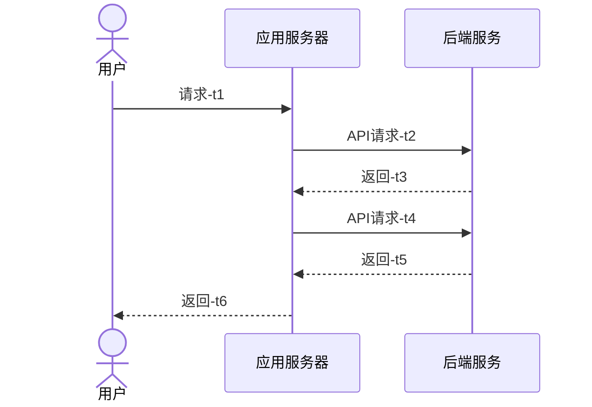

# 性能优化

<strong>最后修改于2023-06-08</strong>

- [性能优化](#性能优化)
  - [1 什么是性能？](#1-什么是性能)
    - [1.1 从用户视角看性能](#11-从用户视角看性能)
    - [1.2 从技术视角看性能](#12-从技术视角看性能)
      - [1.2.1 用户响应时间](#121-用户响应时间)
    - [1.3 性能的衡量指标](#13-性能的衡量指标)
      - [1.3.1 吞吐量的计算](#131-吞吐量的计算)
  - [2 性能优化](#2-性能优化)
    - [2.1 高性能架构解决的问题](#21-高性能架构解决的问题)
    - [2.2 高性能架构带来的复杂性](#22-高性能架构带来的复杂性)
    - [2.3 性能优化的基本步骤](#23-性能优化的基本步骤)
    - [2.4 基础设施层的性能优化](#24-基础设施层的性能优化)
    - [2.5 网络层的性能优化](#25-网络层的性能优化)
    - [2.6 应用层的性能优化](#26-应用层的性能优化)
    - [2.7 结构化数据的性能优化](#27-结构化数据的性能优化)
    - [2.8 非结构化数据的性能优化](#28-非结构化数据的性能优化)
  - [3 性能分析与压力测试](#3-性能分析与压力测试)
  - [参考资料](#参考资料)

## 1 什么是性能？
性能的定义：
* 狭义的性能指运行速度的快慢
* 广义的性能涉及很多内容，如功耗、利用率、性能价格比、速度等
* 性能事非功能性需求
* 性能描述了系统传递服务的实时性

### 1.1 从用户视角看性能
**8秒定律**：
* 8秒定律是互联网领域存在的一个定律，即指用户访问一个网站时，如果等待网页打开的时间超过8秒，会有超过70%的用户放弃等待；
* 据资料显示，估计每年由于网络问题(缓慢甚至不通)导致的损失高达44亿美元。

### 1.2 从技术视角看性能
#### 1.2.1 用户响应时间
用户响应时间是指应用系统为用户返回请求结果所消耗的时间。一个典型的用户请求的处理时序图如下，包含了用户和应用系统的网络延迟、应用的处理时间、应用和后端服务(如数据库)的交互时的网络延迟和后端服务的服务时间等。用户响应时间受到请求链路上各个子系统的影响，比如网络延迟和带宽、系统并发用户数和请求类型、服务器 CPU 和 IO 资源使用率等。要对整个系统进行有效的优化，你需要先定位用户响应时间的瓶颈。

你可以通过以下公式计算指定时间范围 (ΔT) 内总的用户响应时间：
> ΔT 时间内总的用户响应时间 = 平均 TPS (Transactions Per Second) x 用户平均响应时间 x ΔT。

典型的用户请求的处理时序图如下：

从上图来看，**用户响应时间** = t1 + 等待时间 + t2 + 等待时间 + t3 + 等待时间 + t4 + 等待时间 + t5 + 等待时间 + t6 。

**用户响应时间包含完成用户请求的服务时间、排队时间和并发等待时间**，即：
> User Response time = Service time + Queuing delay + Coherency delay

* Service Time（完成用户请求的服务时间）：系统处理请求时需要消耗某种资源的时间，比如数据库完成一次 SQL 请求需要消耗的 CPU 时间。
* Queuing delay（排队延迟时间）：系统处理请求时为了等待某种资源的服务，在队列中等待调度的时间。
* Coherency delay（并发等待延迟）：系统处理请求时为了访问共享资源，需要和其他并发的任务进行通信和协作的时间。

### 1.3 性能的衡量指标
* **响应时间**：是对请求作出响应所需要的时间；**响应时间(RT)是一个系统最重要的指标之一，它的数值大小直接反映了系统的快慢**。
* 吞吐量：是系统单位时间内能处理多少事物/请求；吞吐量体现系统处理请求的能力。
  * QPS(每秒查询数)、TPS(每秒事务数)是吞吐量的常用量化指标。
* 并发用户数：用来度量服务器并发容量和同步协调能力

#### 1.3.1 吞吐量的计算

## 2 性能优化
### 2.1 高性能架构解决的问题
### 2.2 高性能架构带来的复杂性
### 2.3 性能优化的基本步骤
### 2.4 基础设施层的性能优化
### 2.5 网络层的性能优化
### 2.6 应用层的性能优化
### 2.7 结构化数据的性能优化
### 2.8 非结构化数据的性能优化
## 3 性能分析与压力测试

## 参考资料
1. 《阿里云云计算架构师ACE认证培训课程》
2. [TiDB 性能优化概述](https://docs.pingcap.com/zh/tidb/stable/performance-tuning-overview)