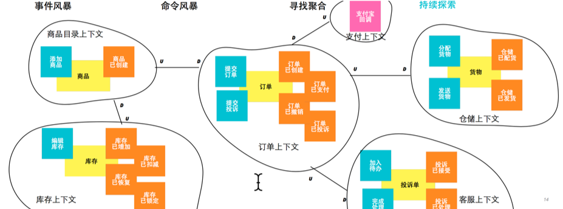

# 方法：事件风暴(Event Storming)

<strong>最后修改于2023-06-08</strong>

- [方法：事件风暴(Event Storming)](#方法事件风暴event-storming)
  - [1 简介](#1-简介)
    - [1.1 事件风暴是什么？](#11-事件风暴是什么)
      - [1.1.1 业务模型样例](#111-业务模型样例)
      - [1.1.2 领域模型样例](#112-领域模型样例)
    - [1.2 领域驱动设计中的建模范式](#12-领域驱动设计中的建模范式)
    - [1.3 事件风暴的底层逻辑](#13-事件风暴的底层逻辑)
      - [1.3.1 类比新闻与事件](#131-类比新闻与事件)
    - [1.4 事件风暴的两个层次](#14-事件风暴的两个层次)
      - [1.4.1 探索业务模型](#141-探索业务模型)
      - [1.4.2 领域分析建模](#142-领域分析建模)
    - [1.5 事件风暴的关键概念](#15-事件风暴的关键概念)
  - [2 如何实践事件风暴？](#2-如何实践事件风暴)
  - [参考资料](#参考资料)

## 1 简介
### 1.1 事件风暴是什么？
**事件风暴**是一种以工作坊形式对复杂业务领域进行探索的高效协作方法。由 Alberto Brandolini 提出。
* 通过事件风暴来梳理业务流程，在墙上通过便签把结果呈现出来
* 基本思想是让软件开发和领域专家互相学习

**事件风暴活动的产出结果**：
* 业务模型(业务全景)
* 领域模型

#### 1.1.1 业务模型样例

#### 1.1.2 领域模型样例

### 1.2 领域驱动设计中的建模范式
* 函数建模范式
  * 重视领域逻辑中的名词概念
  * 将领域行为封装到对象中
* 对象建模范式
  * 重视领域逻辑中的领域行为
  * 将领域行为视为类型的转换操作
  * 主张将领域行为定义为无副作用的纯虚函数
* 事件建模范式
  * 关注领域行为引起的领域概念状态的变化
  * 事件引起的是领域对象状态的迁移
  * 分析与设计的驱动力是事件、建模的核心是事件

**事件建模范式**影响的是建模者观察真实世界的态度，而这种以事件为模型核心元素的范式又会影响到整个软件的体系架构、模型设计和代码实现。
**事件驱动模型常用的建模方法就是事件风暴**。与之相关的模式为事件溯源模式，以及事件驱动架构风格。

### 1.3 事件风暴的底层逻辑
**事件风暴之所以以事件为驱动力，源于事件意味着一种因果关系**。
* 在识别和理解事件时，可以考虑为什么要产生这一事件，以及为什么要响应这一事件，进而思考响应事件的后续动作，驱动着设计者的“心流”不断思考下去，犹如搅起了一场激烈的风暴。
* 事件的因与果体现为事件的发布与订阅，它们形成了因果关系的不断传递。

不同的团队角色在思考事件时，看到的可能是事物的不同面：
* 事件对于业务人员：事件前后的业务动作是什么，产生了什么样的业务流程？
* 事件对于管理人员：事件导致的重要结果是什么，会否影响到管理和运营？
* 事件对于技术人员：是什么触发了事件消息，当事件消息发布时，谁来负责订阅和处理事件？

虽然关注点不同，但事件却能够让这些不同的团队角色“团结”到一个业务场景下，体会到统一语言的存在。

#### 1.3.1 类比新闻与事件

| 场景要素 | 新闻                       | 事件                               |
| -------- | -------------------------- | ---------------------------------- |
| What     | 报道的新闻                 | 发布的事件                         |
| When     | 新闻事件的发生时间         | 何时发布事件                       |
| Where    | 新闻事件的发生地点         | 在哪个限界上下文的哪个聚合         |
| Why      | 为何会发生这样一起新闻事件 | 发布事件的原因以及事件结果的重要性 |
| Who      | 新闻事件的牵涉群体         | 谁发布了事件，谁订阅了事件         |
| hoW      | 新闻事件的发生经过         | 事件如何沿着时间轴流动             |

### 1.4 事件风暴的两个层次
事件风暴包含两个层次：探索业务模型和领域分析建模。

#### 1.4.1 探索业务模型
**宏观级别的事件风暴，主要精力用于寻找业务流程中产生的领域事件，目的是探索业务全景 (big picture exploration)**。

在识别出全景事件流之后，就可以标记时间轴的关键时间点作为划分领域边界和限界上下文的依据，同时也可以基于事件表达的业务概念对领域进行划分，最终确定候选的字领域和限界上下文。

事件是业务服务的一种体现，对事件表达的业务概念进行划分，就是利用语义相关性和功能相关性对业务知识进行归类，进而获得候选的限界上下文。

#### 1.4.2 领域分析建模
**设计级别的领域分析建模方法，目的是围绕事件获得领域分析模型**。

这个模型包含事件、角色、决策命令、写模型和读模型。
事件风暴的领域分析建模方法通常会将业务全景探索的结果作为领域分析建模的基础。

### 1.5 事件风暴的关键概念

**探索业务模型相关的概念**：
* **事件(Event)**：在业务流程中发生的事件。用过去时描述
* **事件的角色(参与者)**：在事件风暴中，事件作为果，必然有将其触发的起因，这些起因统称为「事件的角色」
  * **用户(user)**：用户执行一个业务活动，触发一个事件，如用户将商品加入购物车，触发 ProductAddedToCart 事件。
  * **策略(policy)**：一个定时条件形成一条业务规则，当定时条件满足时会触发一个事件，例如提交订单后超过规定时间未支付，触发 OrderCancelled 事件。
  * **伴生系统**：由目标系统之外的外部系统触发一个事件，如外部的支付系统向电商平台返回交易凭证，触发 PaymentCompleted 事件。
  * **前置条件**：一个事件成为另一个事件的因，如提交订单触发的 OrderPlaced 事件，又作为起因触发 InventoryLocked 事件。
* **热点(hot spot)**：标记存在疑问或者需要提醒业务人员或技术人员特别注意。如「考虑支付失败」

**领域分析建模相关的概念**：
* **命令(command)：也称「决策命令(decision command)」**。
  * 代表系统中用户的意图、动作和决定。
  * 用户、策略、伴生系统和前置条件等角色都需要执行一个命令来触发事件，命令才是直接导致事件发生的“因”。
  * 一般用动词短语组成，例如提交订单(place order)、发送邀请(send invitation)。
* **写模型(write model)**：就是状态发生了变化的目标对象，正是写模型状态的变更才导致了事件的触发
  * 写模型状态的变化分为3种形式：
  * 从无到有创建了新的写模型对象
  * 修改了写模型对象的属性
  * 从有到无删除了已有的写模型对象
* **读模型(read model)**：业务场景为角色提供的信息在事件风暴中被称为读模型。
  * 在代码层面，读模型就是执行决策命令领域行为所需的输入参数

## 2 如何实践事件风暴？

## 参考资料
1. [EventStorming.com](https://www.eventstorming.com/)