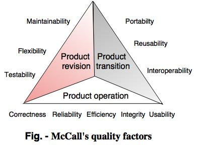

# 软件质量

<strong>最后修改于2023-06-08</strong>

- [软件质量](#软件质量)
  - [1.什么是软件质量？](#1什么是软件质量)
  - [2.质量因素](#2质量因素)
    - [2.1 质量模型一：McCall](#21-质量模型一mccall)
    - [2.2 质量模型二：ISO 25010质量标准](#22-质量模型二iso-25010质量标准)
      - [2.2.1 使用质量模型](#221-使用质量模型)
      - [2.2.2 产品质量模型](#222-产品质量模型)
  - [3.定性质量评估](#3定性质量评估)
  - [4.定量质量评估](#4定量质量评估)
  - [参考资料](#参考资料)

## 1.什么是软件质量？

在最一般的意义上，软件质量可以这样定义：**在一定程度上应用有效的软件过程，创造有用的产品，为生产者和使用者提供明显的价值**。

这个定义强调了三个重要的方面：
1. **有效的软件过程**为生产高质量的软件产品奠定了基础。过程的管理方面所做的工作是检验和平衡，以避免项目混乱(低质量的关键因素)。软件工程实践允许开发人员分析问题、设计可靠的解决方案，这些都是生产高质量软件的关键所在。最后，诸如变更管理和技术评审等普适性活动与其他部分的软件工程活动密切相关。
2. **有用的产品**是指交付最终用户要求的内容、功能和特征，但最重要的是，以可靠、无误的方式交付这些东西。有用的产品总是满足利益相关者明确提出的那些需求，另外，也要满足一些高质量软件应有的隐性需求(例如可用性)。
3. 通过**为软件产品的生产者和使用者增值**，高质量软件为软件组织和最终用户群体带来了收益。软件组织获益是因为高质量的软件在维护、改错及客户支持方面的工作量都降低了，从而使软件工程师减少了返工，将更多的时间花费在开发新的应用上，软件组织因此而获得增值。用户群体也得到增值，因为应用所提供的有用的能力在某种程度上加快了一些业务流程。最后的结果是：
   * 软件产品的收入增加
   * 当应用可支持业务流程时，收益更好
   * 提高了信息可获得性，这对商业来讲是至关重要的

## 2.质量因素
David Garvin[Gar84]写道，质量是一个要从多方面考虑的现象，需要使用多个视角来评估。

### 2.1 质量模型一：McCall
McCall和Walters[McC77]提出了一种思考和组织影响软件质量因素的有用方法。
这些软件质量因素侧重于软件产品的3个重要方面：操作特性、承受变更的能力以及对新环境的适应能力。

McCall的质量因素为处理软件提供了一个基础，通过关注软件产品所提供的整体用户体验来提供高水平的用户满意度。除非开发人员确保需求规范是正确的，并且在软件开发过程的早期消除了缺陷[Max16]，否则这是不可能实现的。

### 2.2 质量模型二：ISO 25010质量标准
ISO 25010 质量标准是最新的标准(2011年制定，2017年修订)。
这个标准定义了两个质量模型：
1. **使用质量模型**描述了考虑在特定语境中使用产品时(例如，由人在特定平台上使用产品)适用的5个特征。
2. **产品质量模型**描述了8个特性，它们关注计算机系统的静态和动态特性。

在使用模型中加入质量有助于强调客户满意度在软件质量评估中的重要性。产品质量模型指出了评估软件产品功能性和非功能性需求的重要性[Max16]。

#### 2.2.1 使用质量模型
* 有效性：用户实现目标的准确性和完整性。
* 效率。为了完全达到用户目标和预期的准确性而花费的资源。
* 满意度：有用、信任、快乐、舒适。
* 远离风险：缓解经济、健康、安全和环境风险。
* 语境覆盖：完整性、灵活性。

#### 2.2.2 产品质量模型
* 功能适应性：完整、正确、适当。
* 性能效率：时间、资源利用、容量。
* 兼容性：共存、互操作性。
* 可用性：适当性、易学性、可操作性、错误保护、美观性、可访问性。
* 可靠性：成熟度、可用性、容错性、可恢复性。
* 安全性：保密性、完整性、可审核性、真实性。
* 可维护性：模块化、可复用性、可修改性、可测试性。
* 可移植性：适应性、可安装性、可替换性。

## 3.定性质量评估

## 4.定量质量评估

## 参考资料
* 《软件工程 - 实践者的研究方法》