# 高可用架构设计

> **要实现高可用的系统，不仅仅是在技术层面，还需要一套严谨科学的工程管理**。
> 其中包括但不限于：
> * 软件的设计、编码、测试、上线和软件配置管理的水平
> * 工程师的人员技能水平
> * 运维的管理和技术水平
> * 数据中心的运营管理水平
> * 依赖于第三方服务的管理水平
> 
> 更深层的东西则是 - 对工程这门科学的尊重：
> * 对待技术的态度
> * 一个公司的工程文化
> * 领导者对工程的尊重
> 

- [高可用架构设计](#高可用架构设计)
  - [1 什么是可用性？](#1-什么是可用性)
  - [2 什么会导致了低可用性？](#2-什么会导致了低可用性)
    - [2.1 影响服务不可用的因素分析](#21-影响服务不可用的因素分析)
      - [2.1.1 业界总结的服务不用的因素](#211-业界总结的服务不用的因素)
      - [2.1.2 总结影响服务不可用的因素](#212-总结影响服务不可用的因素)
    - [2.2 业界的故障分级](#22-业界的故障分级)
  - [3 低可用性问题的影响](#3-低可用性问题的影响)
  - [4 如何度量可用性？](#4-如何度量可用性)
    - [4.1 基于时间度量](#41-基于时间度量)
      - [4.1.1 从MTTF、MTTR、MTBF评估](#411-从mttfmttrmtbf评估)
      - [4.1.2 从RTO、RPO评估](#412-从rtorpo评估)
    - [4.2 基于请求成功率度量](#42-基于请求成功率度量)
    - [4.3 总结](#43-总结)
  - [5 高可用技术架构](#5-高可用技术架构)
    - [5.1 高可用技术架构目标](#51-高可用技术架构目标)
    - [5.2 高可用架构实现机制](#52-高可用架构实现机制)
    - [5.3 服务级高可用设计](#53-服务级高可用设计)
      - [5.3.1 方案一：应对内部故障-隔离](#531-方案一应对内部故障-隔离)
      - [5.3.2 方案二：应对内部故障-限流](#532-方案二应对内部故障-限流)
      - [5.3.3 方案三：应对内部故障-降级](#533-方案三应对内部故障-降级)
      - [5.3.4 方案四：应对内部故障-超时](#534-方案四应对内部故障-超时)
      - [5.3.5 方案五：应对外部故障-超时](#535-方案五应对外部故障-超时)
      - [5.3.6 方案六：应对外部故障-熔断](#536-方案六应对外部故障-熔断)
      - [5.3.7 方案七：应对性能问题-排队](#537-方案七应对性能问题-排队)
      - [5.3.8 服务级高可用设计实践原则](#538-服务级高可用设计实践原则)
      - [5.3.9 服务级高可用实践 - 设计服务提供容错能力](#539-服务级高可用实践---设计服务提供容错能力)
    - [5.4 系统级高可用设计](#54-系统级高可用设计)
      - [5.4.1 存储高可用](#541-存储高可用)
        - [5.4.1.1 主备复制](#5411-主备复制)
        - [5.4.1.2 主从复制](#5412-主从复制)
        - [5.4.1.3 主备倒换与主从倒换](#5413-主备倒换与主从倒换)
          - [5.4.1.3.1 设计关键](#54131-设计关键)
          - [5.4.1.3.2 常见架构-互连式](#54132-常见架构-互连式)
          - [5.4.1.3.3 常见架构-中介式](#54133-常见架构-中介式)
          - [5.4.1.3.4 常见架构-模拟式](#54134-常见架构-模拟式)
        - [5.4.1.4 主主复制](#5414-主主复制)
        - [5.4.1.5 数据集群](#5415-数据集群)
          - [5.4.1.5.1 数据集中集群](#54151-数据集中集群)
          - [5.4.1.5.2 数据分散集群](#54152-数据分散集群)
        - [5.4.1.6 数据分区](#5416-数据分区)
          - [5.4.1.6.1 数据分区复制规则-集中式](#54161-数据分区复制规则-集中式)
          - [5.4.1.6.2 数据分区复制规则-互备式](#54162-数据分区复制规则-互备式)
          - [5.4.1.6.3 数据分区复制规则-独立式](#54163-数据分区复制规则-独立式)
        - [5.4.1.7 存储高可用方案总结](#5417-存储高可用方案总结)
      - [5.4.2 计算高可用](#542-计算高可用)
        - [5.4.2.1 主备](#5421-主备)
        - [5.4.2.2 主从](#5422-主从)
        - [5.4.2.3 对称集群](#5423-对称集群)
        - [5.4.2.4 非对称集群](#5424-非对称集群)
      - [5.4.3 常见组件的高可用方案](#543-常见组件的高可用方案)
        - [5.4.3.1 Kubernetes](#5431-kubernetes)
        - [5.4.3.2 MySQL](#5432-mysql)
        - [5.4.3.3 MariaDB](#5433-mariadb)
        - [5.4.3.4 MongoDB](#5434-mongodb)
        - [5.4.3.5 Redis](#5435-redis)
        - [5.4.3.6 Elasticsearch](#5436-elasticsearch)
        - [5.4.3.7 Kafka](#5437-kafka)
    - [5.5 区域级高可用设计](#55-区域级高可用设计)
      - [5.5.1 备份恢复](#551-备份恢复)
      - [5.5.2 异地多活](#552-异地多活)
  - [6 通过提升性能来提升可用性](#6-通过提升性能来提升可用性)
  - [7 通过提升伸缩性来提升可用性](#7-通过提升伸缩性来提升可用性)
  - [8 通过提升可观测性来预防不可用问题](#8-通过提升可观测性来预防不可用问题)
  - [参考资料](#参考资料)

## 1 什么是可用性？
详细内容见 [Concepts-availability](../concepts/availability.md)。
总结下来，系统可用性就是，系统能正常使用的程度，即收到的请求能够正常响应的程度。在不同领域，有的通过时间来评估，有的通过结果来评估。

可用性包括了：
* 成熟性
* 易恢复性
* 容错性
  * 区域级容错
  * 系统级容错
  * 服务级(接口级)容错
  * ...
* ...

## 2 什么会导致了低可用性？
### 2.1 影响服务不可用的因素分析
通常有这些原因导致之前运行正常的系统，慢慢变得不可用了：
1. **资源不足(资源耗尽)**：访问用户数量的增加(或者黑客攻击)会导致系统使用的数据量增加，从而可能导致系统资源耗尽，服务处理不过来、运行越来越慢并最终无法响应。
   * 网络带宽不足
   * 计算资源不足
   * 内存资源不足
   * 存储空间不足
   * 磁盘IO不足
   * 处理进程/线程不足
2. **外部依赖问题**：应用程序依赖的外部资源，如基础设施或者第三方依赖服务，这些资源问题越多，导致的可用性问题就会越多。
   * 如果应用程序构建在一个单一的机房，当机房网络故障(网络交换机失效)、断电等、或者自然灾害导致机房损坏，都有可能导致系统可用性问题；
   * 应用程序的服务器宕机、硬盘损坏、网卡损坏，都可能会导致系统可用性问题
   * 如果应用程序构建在某个公有云的某个可用区，当这些云服务故障(也许概率很小)，可能会导致系统可用性问题；
   * 如果应用程序依赖第三方认证系统，当第三方认证系统性能不足或者不可用，会导致当前系统无法进行认证，从而导致系统可用性问题；
   * 如果应用程序依赖第三方数据库/存储，当第三方数据库/存储性能不足或者不可用，会导致应用程序数据无法正常存取，从而导致系统可用性问题；
   * CDN服务挂掉
   * DNS被劫持
   * ...
3. **系统变更(流动行为的增加)**：如新功能发布、新版本发布导致的系统升级和数据升级。当应用程序高速发展时，通常需要更多的开发人员、设计师、测试人员和其他人来开发并维护它。大量的个体共同协作会产生大量的流动行为，包括新功能、变更功能，或者只是一般的维护工作。开发和维护应用程序的人员越多，就会产生越多的流动行为，从而增加了相互之间产生负面作用的可能。
4. **技术债务**：随着应用程序复杂性的增加，通常会导致技术债务(例如，随着应用程序逐渐发展和成熟，对软件未实现的修改和未修复的bug也会逐渐积累)。技术债务会增加可用性问题出现的可能。
   * 服务Bug
   * 系统宕机、系统故障
   * 内存溢出
5. **预期之外的系统压力变化**：随着应用程序被越来越多的人使用，超出了之前系统设计的目标。比如之前的系统设计目标(或者说实际设计能支持的能力)在一万用户访问范围的能力，当应对百万用户访问就可能会产生系统可用性问题。**可能需要对架构、代码和应用程序进行修改以支撑不断增加的压力**。这些改动通常都是在最后一刻被草草实现，缺乏足够的考虑或计划，因此也增加了问题出现的可能性。

#### 2.1.1 业界总结的服务不用的因素
在业界中，会把服务不可用的因素分成两种：一种是有计划的，一种是无计划的。前面列出来的这些基本上属于“无计划的”。

**无计划的**：
* 系统级的故障 –  包括主机、操作系统、中间件、数据库、网络、电源以及外围设备
* 数据和中介的故障 – 包括人员误操作、硬盘故障、数据乱了
* 还有：自然灾害、人为破坏、以及供电问题。

**有计划的**：
* 日常任务：备份，容量规划，用户和安全管理，后台批处理应用
* 运维相关：数据库维护、应用维护、中间件维护、操作系统维护、网络维护
* 升级相关：数据库、应用、中间件、操作系统、网络、包括硬件升级

#### 2.1.2 总结影响服务不可用的因素
**总结一下，从服务的整个生命周期来看，影响服务不可用的因素**：
1. **计划内的(符合预期的不可用)**：
   * 常规维护操作：备份、容量规划、用户和安全管理、后台批处理应用(降低性能)
   * 周期性运维：数据库维护、应用维护、中间件维护、操作系统维护、网络维护
   * 升级：数据库、应用、中间件、操作系统、网络、包括硬件升级
2. **计划外的(不符合预期的不可用)**：
   * 人工误操作
   * 资源不足(资源耗尽)导致的性能问题
   * 外部依赖问题
     * 网络问题
     * 硬件问题
   * 技术债：Bug、不合适的方案、工程管理问题
   * (设计目标)预期之外的系统压力变化

### 2.2 业界的故障分级
亚马逊一般将故障分为4级：
* 1级是全站不可用
* 2级是某功能不可用，且无替代方案
* 3级是某功能不可用，但有替代方案
* 4级是非功能性故障，或者用户不关心的故障

阿里的可用性考核，把故障分为4级：
* 事故级：严重故障，网站整体不可用。权重100。
* A类：网站访问不顺畅或核心功能不可用。权重20。
* B类：非核心功能不可用，或核心功能只有少数客户不可用。权重5。
* C类：其他故障。权重1。

## 3 低可用性问题的影响
可用性问题会增加经营成本，增加用户的成本，降低用户的信任度和忠诚度。

## 4 如何度量可用性？
通过一个客观的指标来体现一个待优化的系统属性，通过设立这样一个目标，我们可以客观地评价目前的系统表现以及跟踪一段时间内的改进和进步。对于服务风险而言，讲所有的潜在因素缩减未一个单一的性能指标，可不是一件能够立刻解决的事情。服务故障可能会有很多潜在的影响，包括用户的不满、伤害，或丧失信任；直接或间接的收入损失；品牌以及口碑上的影响；不良的新闻报道等。很明显，这些因素中的一部分很难被合理地度量。为了使这个问题在我们运行的各种类型的系统中易于处理，并且保持一致，我们选择主要关注**计划外停机**这个指标。

### 4.1 基于时间度量
对于大多数服务而言，最直接的能够代表风险承受能力的指标就是对于计划外停机时间的可接受水平。计划外停机时间是由服务预期的可用性水平所体现的，通常我们愿意用提供的“9”系列的数字来体现，比如可用性为99.9%、99.99%或99.999%。每个额外的“9”都对应一个向100%可用性的数量级上的提高。

对于服务系统而言，这个指标通常是基于系统正常运行时间比例的计算得出的：
> 可用性 = 系统正常运行时间 / (系统正常运行时间 + 停机时间)

使用这个公式，我们可以计算出一年内可接受的停机时间，从而可以使可用性达到预期目标。例如，一个可用性目标为99.99%的系统最多在一年中停机52.56分钟，就可以达到预计的可用性目标。

#### 4.1.1 从MTTF、MTTR、MTBF评估
业界一般使用 MTTF、MTTR、MTBF 这3个指标来计算系统可用性：
* MTTF：全称 Mean Time To Failure，即平均无故障时间。
* MTTR：全称 Mean Time To Repair，即平均修复时间。
* MTBF：全称 Mean Time Between Failure，即平均故障间隔时间。

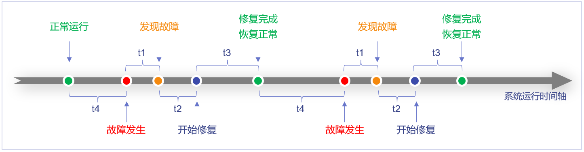

各时间段说明：
* t1时间段，出现问题到发现问题
* t2时间段，分析、诊断问题
* t3时间段，修复问题(修改、验证、上线)
* t4时间段，系统正常运行

定义 n 表示故障数。上图发生了两次故障，n=2
> MTTF = (∑t4) / n
> MTTR = (∑(t1+t1+t3))/ n
> MTBF = MTTF + MTTR
> 
> 可用性 = MTTF / MTBF * 100%

但是，并不是“可用性”的值越高，系统可用性就越高，举个例子：
* A系统，MTBF=2h，MTTR=5s，即可以稳定运行2小时，然后挂掉，5秒钟之后又恢复了，通过公式计算Availability=0.9999768，约等于5个9。
* B系统，MTBF=30day，MTTR=1h，即可以稳定运行30天，然后挂掉，1小时之后恢复，通过公式计算Availability=0.9986130，约等于4个9。

虽然A系统计算出来的可用性高于B系统，但是A系统发生故障的频率远远高于B系统（即A系统的MTTF远远低于B系统），用户体验非常差，故可用性除了要关注 Availability 的值，还需要关注 MTTF。

故系统可用性评价标准：
* MTTF：越大越好
* 可用性：越高越好

#### 4.1.2 从RTO、RPO评估
**RPO(Recovery Point Objective)** 即数据恢复点目标，主要指的是业务系统所能容忍的数据丢失量。
**RTO(Recovery Time Objective)** 即恢复时间目标，主要指的是所能容忍的业务停止服务的最长时间，也就是从灾难发生到业务系统恢复服务功能所需要的最短时间周期。

详见 [RPO & RTO](./concepts/RPO-RTO.md) 。

### 4.2 基于请求成功率度量
在Google，基于时间的可用性通常毫无意义。因为Google需要着眼全球范围内的分布式服务。Google所采用的故障隔离手段能够保证在任何时候、任何地方对于一个给定的服务，总是可以处理一定的用户流量(也就是说，随时都可以是部分“在线”的)。

因此，Google通过**请求成功率**来定义服务可用性。
> 可用性 = 成功请求数 / 总的请求数

上面这个公式，体现了这个基于产量的指标是怎样通过滚动窗口计算出来的(比如，一天内成功请求的比率)。例如，一个每天可用性目标为99.99%的系统，一天要接受2.5M个请求，它每天出现少于250个错误即可达到预计的可用性目标。

在一个典型的应用中，不是所有的请求都是平等的：一个新的用户注册请求失败和一个后台调用的新邮件的轮询请求失败是不同的。然而在许多情况下，从终端用户的角度来看，通过计算全部请求成功率是一个对于计划外停机时间的合理估计。

使用请求成功率指标量化计划外停机时间使得这种指标更适合在不直接服务终端用户的系统中使用。大多数非服务性的系统(比如，批处理、流水线、存储服务以及交易系统等等)对成功和非成功的工作单元有明确的定义。

### 4.3 总结
基于时间度量和基于请求成功率度量可用性有不同的适用场景：
* 基于时间度量更适合直接服务终端用户的系统
* 基于请求成功率度量更适合非服务性的系统(见上一节)

在基于时间度量的方案中，RTO 和 MTTR 非常相似，都是描述系统的恢复时间。
主要区别在于：
* MTTR 是一段时间内，多个影响可用性事件恢复时间的平均值；
* RTO 則是单一影响可用性事件允许的目标最大恢复时间。
 
**对于系统设计者来说，MTTR 作为一个多次平均值，不好验证，甚至无法验证。单次最大值 RTO 更适合作为明确的目标。**

## 5 高可用技术架构
### 5.1 高可用技术架构目标
**高可用架构是一种采用了高可用设计思想的架构，目标是保证服务器硬件故障时依然可用，数据依然可以正确保存并能被访问。**

### 5.2 高可用架构实现机制
**本质**：通过冗余来实现高可用。

**设计原则**：
1. 多可用区设计：尽最大可能避免架构中的单点故障。
2. 自我修复设计：内建容错及检查能力，应用能够在部分组件失效时自我修复继续工作。
3. 假定失效设计：假定任何环节都会出问题，然后推倒设计。
4. 自动扩展设计：不进行设计调整，就能满足业务量增长。
5. 松耦合设计：耦合度越小，扩展性越好，容错能力越强。

**从影响范围来考虑**：
* 服务级高可用设计(容错方案)
  * 服务实现超时、隔离、限流、熔断、降级
* 系统级高可用设计(系统级容错)
  * 故障失效转移机制(failover)
  * 负载均衡
  * 分布式技术
* 地理区域级高可用设计(区域级容错)
  * 异地多活、容灾、备份恢复

**从系统组成的角度来考虑(高可用模型和技术)**：
* 存储高可用
  * 主备复制
  * 主从复制
  * 主备倒换与主从倒换
  * 主主复制
  * 数据集群
  * 数据分区
* 计算高可用
  * 主备
  * 主从
  * 对称集群
  * 非对称集群
* 业务高可用
  * 异地多活
  * 接口级故障应对方案
    * 降级
    * 熔断
    * 限流
    * 排队

下面我们从影响范围来考虑高可用设计和方案，在设计过程中融合相关高可用模型和技术。

### 5.3 服务级高可用设计
#### 5.3.1 方案一：应对内部故障-隔离
将系统按照一定的规则划分成若干服务模块(接口集)或者说微服务，各个模块之间相对独立。当故障发生时，能将问题和影响隔离在某个模块内部，而不扩散风险，不涉及其他模块。
* 例如1：线程池隔离，设计服务对每个功能(服务的调用)提供一个线程池。
* 例如2：拆分微服务，将在不同领域的业务拆分成多个服务。

TODO：图

#### 5.3.2 方案二：应对内部故障-限流
从用户访问压力角度考虑应对故障：对服务的输入和输出进行限制，以达到保护系统的目的。基于请求限流/基于资源限流：一旦达到限制的阈值，就需要限制流量并采取少量措施以完成限制流量的目的。
* 例如：对某服务设置线程数 10 个，满了就拒绝请求而不是阻塞或者设置90%CPU，超过就不接收请求

TODO：图

#### 5.3.3 方案三：应对内部故障-降级
从功能优先级的角度考虑应对故障：将某些业务或接口的功能降低，只提供部分功能。
* 例如1：人工配置某服务直接返回认证失败，不提供第三方认证
* 例如2：实现服务功能管理，配置化管理sharemgnt当前提供的服务能力

TODO：图

#### 5.3.4 方案四：应对内部故障-超时
外部服务访问自身：在被上游服务调用时，对外部已断开连接或中断请求，应丢弃对应请求。
* 例如：设计服务进行业务处理前，对连接和请求状态进行检查。

TODO：图

#### 5.3.5 方案五：应对外部故障-超时
访问外部服务：在调用下游服务时，设置一个最大响应时间，如果超过了这个时间，下游未作出反应，就断开请求释放掉线程。
* 例如：设计服务每个请求设置超时时间 5 秒。

TODO：图

#### 5.3.6 方案六：应对外部故障-熔断
为了保护系统整体可用性应对外部系统故障：当下游服务因为访问压力过大而响应变慢或失败时，可以暂时切断对下游服务的调用。
* 例如：设计服务统计访问第三方某个接口的结果，超过10次失败，就30s内直接返回503

TODO：图

#### 5.3.7 方案七：应对性能问题-排队

#### 5.3.8 服务级高可用设计实践原则
**原则1**：服务对于网络接口的调用必须提供超时机制，并且超时参数可配置。

**原则2**：服务需要提供线程池隔离能力。不同功能模块需要使用不同的线程池，并且线程池参数可配置。

**原则3**：服务需要实现限流机制。需要提供资源配置(如最大连接数/CPU/内存等)，资源(如连接数)超了需要立即拒绝请求，并且限流参数可配置。

**原则4**：服务需要提供熔断机制。当下游服务能力不足时(可以通过监测下游接口失败次数)，能够切断对于下游服务的调用，直接基于下游服务错误进行处理，并且熔断参数可配置。

#### 5.3.9 服务级高可用实践 - 设计服务提供容错能力
1. **实现超时机制**：
   * 实现超时策略配置化；
   * HTTP Requests 加超时参数；
   * RPC Requests 加超时参数。
2. **实现隔离机制**：
   * 实现线程池策略配置化；
   * 每个服务进程开多个线程池，每个模块一个(如果对于业务全景做了分析和建模，可以考虑基于功能拆分服务) 。
3. **实现限流机制**：
   * 实现限流策略配置化；
   * 设置连接池，超过连接池，直接返回 503 拒绝；
   * 设置资源标准，超过资源使用，直接返回 503 拒绝。
4. **实现熔断机制**：
   * 实现熔断策略配置化；
   * 对每个接口的调用实现一个计数器，失败+1，成功清零；
   * 当计数器超过配置参数，所有调用直接返回 503，定时一段时间清空计算器。

### 5.4 系统级高可用设计
#### 5.4.1 存储高可用
##### 5.4.1.1 主备复制
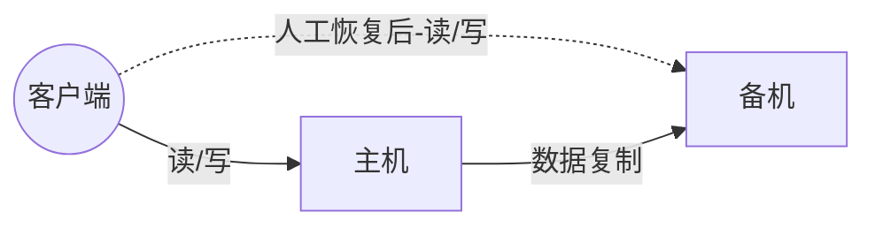

**主备复制方案**：
1. 主机存储数据，通过复制通道将数据复制到备机；
2. 正常情况下，客户端无论读写操作，都发送给主机，备机不对外提供任何读写服务；
3. 主机故障情况下(如主机宕机)，客户端不会自动将请求发给备机，此时整个系统处于不可用状态，不能读写数据，但数据并没有全部丢失，因为备机上有数据。
4. 如果主机能够恢复(不管是人工恢复还是自动恢复)，客户端继续访问主机，主机继续将数据复制给备机；
5. 如果主机不能恢复(例如，机器硬盘损坏，短时间内无法恢复)，则需要人工操作，将备机升为主机，然后让客户端访问新的主机(即原来的备机)；同时，为了继续保持主备架构，需要人工增加新的机器作为备机；
6. 主机不能恢复的情况下，成功写入了主机但还没有复制到备机的数据会丢失，需要人工进行排查和恢复，也许有的数据就永远丢失了，业务上需要考虑如何应对此类风险；
7. 如果主备间数据复制延迟，由于备机并不对外提供读写操作，因此对业务没有影响；但如果延迟较多，恰好此时主机又宕机了，则可能丢失较多数据，因此对于复制延迟也不能掉以轻心。一般的做法是做复制延迟的监控措施，当延迟的数据量较大时及时告警，由人工干预处理。

**优点**就是简单，具体表现：
1. 对于客户端来说，不需要感知备机的存在，即使灾难恢复后，原来的备机被人工修改为主机后，对于客户端来说，只是认为主机的地址换了而已，无须知道是原来的备机升级为主机了；
2. 对于主机和备机来说，双方只需要进行数据复制即可，无须进行状态判断和主备倒换这类复杂的操作。

**缺点**：
1. 备机仅仅只为备份，并没有提供读写操作，硬件成本上有浪费；
2. 故障后需要人工干预，无法自动恢复。

**适用场景**：
* 内部的后台管理系统使用主备架构的情况会比较多，如学生管理系统、员工管理系统等。因为**这类系统的数据变更频率很低，即使在某些场景下丢失，也可以通过人工的方式补全**。

##### 5.4.1.2 主从复制
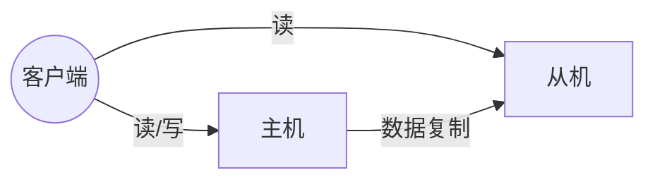

**主从复制方案**：
1. 主机存储数据，通过复制通道将数据复制到从机；
2. 正常情况下，客户端写操作发送给主机，读操作可发送给主机也可以发送给从机，具体如何选择，可以根据业务的特点选择，可以随机读、可以轮询读、也可以只读主机等；
3. 主机故障情况下(如主机宕机)，客户端无法进行写操作，但可以将读操作发送给从机，从机继续响应读操作，此时和写操作相关的业务不可用(如论坛发帖)，但和读操作相关的操作不受影响(如论坛看帖)；
4. 如果主机能够恢复(不管是人工恢复还是自动恢复)，客户端继续将写操作请求发送给主机，主机继续将数据复制给从机；
5. 如果主机不能恢复(如机器硬盘损坏，短时间内无法恢复)，则需要人工操作，将备机升为主机，然后让客户端访问新的主机(即原来的从机)；同时，为了继续保持主从架构，需要人工增加新的机器作为从机；
6. 主机不能恢复的情况下，成功写入了主机但还没有复制到从机的数据会丢失，需要人工进行排查和恢复，也许有的数据就永远丢失了，业务上需要考虑如果应对此类危险；
7. 如果主从间数据复制延迟，则会出现主从读取的数据不一致的问题。例如，用户刚发了一个新帖，此时数据还没有从主机复制到从机，用户刷新了页面，这个读操作请求发送到了从机，从机上并没有用户最新发表的帖子，这时用户就看不到刚才发的帖子了，会以为帖子丢了；如果再刷新一次，可能又展现出来了，因为第二次刷新的读请求发给了主机；
8. 如果主从间延迟较多，恰好此时主机又宕机了，则可能丢失较多的数据，因此对于复制延迟也不能掉以轻心。一般的做法是做复制延迟的监控措施，当延迟的数据量较大时及时告警，由人工干预处理。

主从复制与主备复制相比，有以下不同的优点：
1. 主从复制在主机故障时，读操作相关的业务不受影响；
2. 主从复制架构的从机提供读操作，发挥了硬件的性能。

**缺点**：
1. 主从复制要比主备复制复杂更多，主要体现在客户端需要感知主从关系，并将不同的操作发送给不同的机器进行处理；
2. 故障后需要人工干预，无法自动恢复。

**适用场景**：
* 一般情况下，写少读多的业务使用主从复制的存储架构比较多。例如，论坛、BBS、新闻网站这类业务，此类业务的读操作时写操作数量的10倍甚至100倍以上。

##### 5.4.1.3 主备倒换与主从倒换
主备复制和主从复制方案存在两个共性的问题：
1. 主机故障后，无法进行写操作；
2. 如果主机无法恢复，需要人工指定新的主机角色。

**主备倒换和主从倒换方案就是为了解决上述两个问题而产生的。简单来说，这个方案就是在原有方案的基础上增加“倒换”功能，即系统自动决定主机角色，并完成角色切换。**

###### 5.4.1.3.1 设计关键
要实现一个完善的倒换方案，必须考虑如下几个关键的设计点：
1. **主备间状态判断**。主要包括两个方面，状态传递的渠道和状态检测的内容：
   * **状态传递的渠道**，是相互间互相连接，还是第三方仲裁？
   * **状态检测的内容**，例如，机器是否掉电，进程是否存在，响应是否缓慢等等。
2. **倒换策略**。主要包含几个方面，倒换时机、倒换策略、自动程度：
   * **倒换时机**。什么情况下备机(从机)应该升级为主机？时机器掉电后备机才升级，还是主机上的进程不存在就升级，还是主机响应时间超过2s就升级，还是3分钟内主机连续重启3次就升级等等。
   * **倒换策略**。原来的主机故障恢复后，要再次倒换，确保原来的主机继续做主机，还是原来的主机故障恢复后自动成为新的备机(从机)。
   * **自动程度**。倒换时完全自动的，还是半自动的？例如，系统判断当前需要倒换，但需要人工做最终的确认操作(例如，单机一下“倒换”按钮)。
3. **数据冲突解决**。当原有故障的主机恢复后，新旧主机之间可能存在数据冲突。例如，用户在旧主机上新增了一条ID为100的数据，这个数据还没有复制到旧的备机(从机)，此时发生了倒换，旧的备机升级为新的主机，用户又在新的主机是那个新增了一条ID为100的数据，当旧的故障主机恢复后，这两条ID都为100的数据，应该如何处理？

**以上设计点并没有放之四海而皆准的答案，不同的业务要求不一样，所以倒换方案比复制方案不只是多了一个倒换功能那么简单，而是复杂度上升了一个量级**。形象点来说，如果复制方案的代码是1000航，那么倒换方案的代码可能就是10000行，多出来的那9000行就是用于实现上述三个设计点的。

**根据状态传递渠道的不同，常见的主备倒换架构有三种形式**：
1. 互连式
2. 中介式
3. 模拟式

###### 5.4.1.3.2 常见架构-互连式
互连式就是指主备机直接建立状态传递的渠道，架构如下：

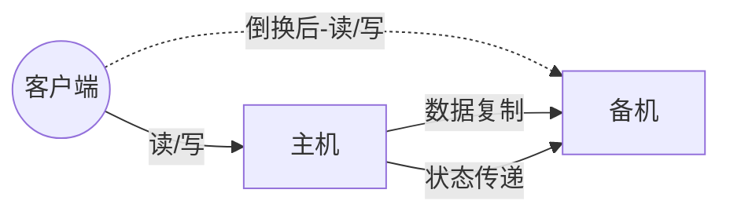

在主备复制的架构基础上，主机和备机多了一个“状态传递”的通道，这个通道就是用来传递状态信息的。**这个通道的具体实现可以有很多方式**：
1. 可以是网络连接(如各开一个端口)，也可以是非网络连接(用串口线连接)；
2. 可以是主机发送状态给备机，也可以式备机到主机来获取状态信息；
3. 可以和数据复制通道共用，也可以独立一条通道；
4. 状态传递通道可以是一条，也可以是多条，还可以是不同类型的通道混合(如网络+串口)；

为了充分利用主备自动倒换方案能够自动决定主机这个优势，**客户端这里也会有一些相应的改变，常见的方式有如下两种**：
1. 为了倒换后不影响客户端的访问，主机和备机(从机)之间共享一个对客户端来说唯一的地址。例如，虚拟IP，主机需要绑定这个虚拟的IP；
2. 客户端同时记录主备(从)机的地址，哪个能访问就访问哪个；备机虽然能收到客户端的操作请求，但是会直接拒绝，拒绝的原因就是“备机不对外提供服务”。

**缺点**：
* 如果状态传递的通道本身有故障(例如，网线被人不小心踢掉了)，那么备机也会认为主机故障了从而将自己升级为主机，而此时主机并没有故障，最终就可能出现两个主机。虽然可以通过增加多个通道来增强状态传递的可靠性，但这样做只是降低了通道故障概率而已，不能从根本上解决这个缺点。而且通道越多，后续的状态决策会更加复杂，因为对备机来说，可能从不同的通道收到了不同甚至矛盾的状态信息。

###### 5.4.1.3.3 常见架构-中介式

中介式就是指主备机两者之外引入第三方中介，主备机之间不直接连接，而都去连接中介，并且通过中介来传递状态信息，架构如下：

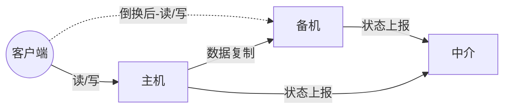

**中介式架构在状态传递和决策上比上面的连接式更简单**，原因如下：
1. **连接管理更简单**。主备机无须再建立和管理多种类型的状态传递连接通道，只要连接到中介即可，实际上是降低了主备机的连接管理复杂度。例如，互连式要求主机开一个监听端口，备机来获取状态信息；或者要求备机开一个监听端口，主机推送状态信息到备机；如果还采用了串口连接，则需要增加串口连接管理和数据读取。采用中介式后，主备机都只需要把状态信息发送给中介，或者从中介获取对方的状态信息。无论发送、还是获取，主备机都是作为中介的客户端去操作，复杂度会降低很多。
2. **状态决策更简单**。主备机的状态决策简单了，无须考虑多种类型的连接通道获取的状态信息如何决策的问题，只需要按照如下简单的算法即可完成状态决策。
   * 无论主机，还是备机，初始状态都是备机，并且只要与中介断开连接，就将自己降级为备机，因此可能出现双备机的情况。
   * 主机与中介断开后，中介能够立刻告知备机，备机将自己升级为主机。
   * 如果是网络终端导致主机与中介断连，主机自己会降级为备机，网络恢复后，旧的主机以新的备机身份向中介上报自己的状态。
   * 如果是掉电重启或进程重启，旧的主机初始状态为备机，与中介恢复连接后，发现已经有主机了，保持自己的备机状态不变。
   * 主备机与中介连接都正常的情况下，按照实际的状态决定是否进行倒换。例如，主机响应时间超过3s就进行倒换，主机降级为备机，备机升级为主机即可。

**附加的代价**：
* **关键代价在于如何实现中介本身的高可用**。如果中介宕机，整个系统就进入了双备的状态，写操作相关的业务就不可用了。幸运的是，开业方案已经有很成熟的解决方案，比如ZooKeeper。

MongoDB 的 Replica Set 采取的就是这种方式，基本架构如下：

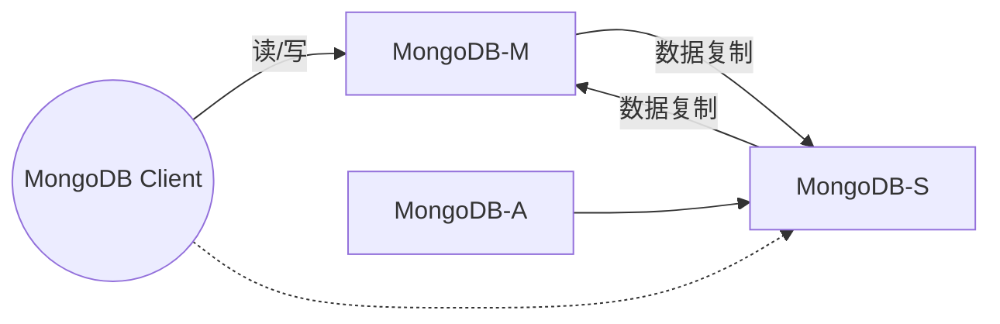

* MongoDB-M 表示主节点
* MongoDB-S 表示备节点
* MongoDB-A 表示仲裁节点
* 主备节点存储数据，仲裁节点不存储数据。客户端同时连接主节点和备节点，不连接仲裁节点
* 默认设置下，主节点提供所有增删查改服务，备节点不提供任何服务，但是可以通过设置使备节点提供查询服务，这样就可以减少主节点的压力。当客户端进行数据查询时，请求自动转到备节点上。这个设置叫做 Read Preference Modes，同时 Java 客户端提供了简单的配置方式，不必直接对数据库进行操作。
* 仲裁节点是一种特殊的节点，它本身并不存储数据，主要的作用是决定哪一个备节点在主节点挂掉之后提升为主节点，所以客户端不需要连接此节点。这里虽然只要一个备节点，但是仍需要一个仲裁节点来提升备节点级别。

###### 5.4.1.3.4 常见架构-模拟式
模拟式就是指主备机之间并不传递任何状态数据，而是备机模拟成一个客户端，向主机发起模拟的读写操作，根据读写操作的响应情况来判断主机的状态，架构如下：

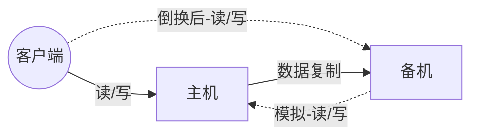

对比互连式倒换架构，模拟式倒换架构的主备机之间只有数据复制通道，而没有状态传递通道，备机通过模拟的读写操作来探测主机的状态，然后根据读写操作的响应情况来进行状态决策。

模拟式倒换架构与互连式倒换架构相比，有如下优点：
* 实现更加简单，因为省去了状态传递通道的建立和管理工作

模拟式倒换架构与互连式倒换架构相比，有如下缺点：
* 模拟式读写操作获取的状态只有响应信息(例如，HTTP 404、超时、响应时间超过3s等)，没有互连式那样多样(除了响应信息，还可以包含CPU负载、I/O负载、吞吐量、响应时间等)，基于有限的状态来做状态决策，可能出现偏差。

##### 5.4.1.4 主主复制
主主复制指的是两台机器都是主机，互相将数据复制给对方，客户端可以任意挑选其中一台机器进行读写操作，基本架构如下：

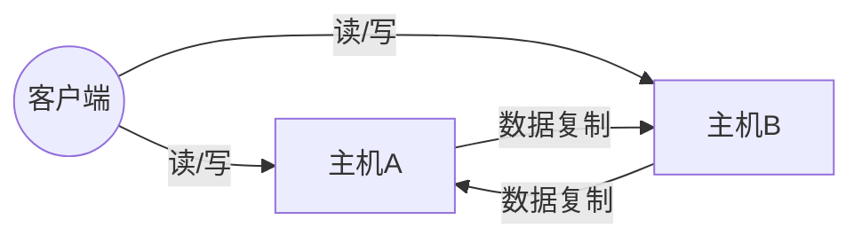

**主主复制方案**：
1. 两台主机都存储数据，通过复制通道将数据复制到另外一台主机；
2. 正常情况下，客户端可以将读写操作发送给任意一台主机；
3. 一台主机故障情况下，例如主机A宕机，客户端只需要将读写操作发送给主机B即可，反之亦然；
4. 如果故障的主机A能够恢复(不管是人工恢复还是自动恢复)，则客户端继续访问两台主机，两台主机间继续相互复制对方数据；
5. 如果故障的主机A不能恢复(如机器硬盘损坏，短时间内无法恢复)，则需要人工操作，增加一台新的机器作为主机；
6. 原有故障主机A不能恢复的情况下，成功写入了原有故障主机但还没有复制到正常主机B的数据会丢失，需要人工进行排查和恢复，也许有的数据就永远丢失了，业务上需要考虑如何应对此类风险；
7. 如果两台主机间复制延迟，则可能出现客户端刚写入了数据到主机A，然后到主机B去读取，此时读取不到刚刚写入的数据。

相比主备倒换架构，主主复制架构具有如下特点：
* 两台都是主机，不存在倒换的概念；
* 客户端无须区分不同角色的主机，随便将读写操作发送给哪台主机都可以。

**额外的复杂性和限制：如果采取主主复制架构，必须保证数据能够双向复制，而有很多数据是不能双向复制的**。例如：
* 用户注册后生成的用户ID，如果按照数字增长，那就不能双向复制，否则就会出现X用户在主机A注册，分配的用户ID是100，同时Y用户在主机B注册，分配的用户ID也是100，这就出现了冲突；
* 库存不能双向复制。例如，一件商品库存100件，主机A上减了1变成99，主机B上减了2件变成98，然后主机A将库存99复制到主机B，主机B原有的库存98被覆盖，变成了99，而实际上此时真正的库存是97。类似的还有余额数据。

**适用场景**：
* 主主复制架构对数据的设计有严格的要求，一般适合于那些临时性、可丢失、可覆盖的数据场景。例如用户登录产生的 session 数据(可以重新登录生成)，用户行为的日志数据(可以丢失)，论坛的草稿数据(可以丢失)等。

##### 5.4.1.5 数据集群
**主备、主从、主主架构本质上都有一个隐含的假设：主机能够存储所有数据。但主机本身的存储和处理能力肯定是有极限的。**

当数据量到了单台服务器无法存储和处理的时候，我们必须使用多台服务器来存储如此大量的数据，这就是数据集群架构。

简单来说，**数据集群架构就是多台机器组合在一起形成一个统一的系统，这里的多台数量上至少是3台**，相比而言，主备、主从都是2台机器。

**根据集群中机器承担的不同角色来划分，集群可以分为两类**：
* 数据集中集群
* 数据分散集群

###### 5.4.1.5.1 数据集中集群
数据集中集群与主备、主从这类架构相似，我们也可以称数据集中集群为一主多备或一主多从。无论是一主一备、一主一从、一主多备、一主多从，数据都只能往主机中写，而读操作可以参考主备、主从架构进行灵活多变。下图是读写全部到主机的一种架构：

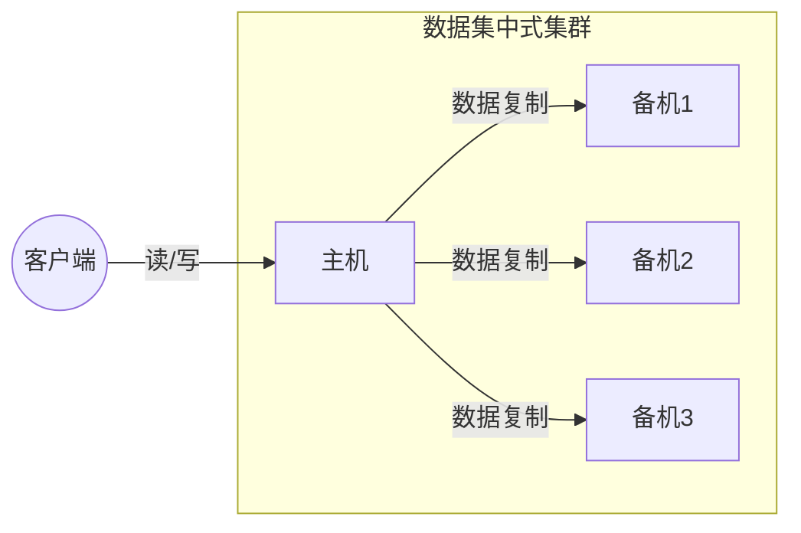

数据集中集群相较于主从、主备，整体复杂度更高一些：
1. 主机如何将数据复制给备机
   * 数据集中集群架构中，存在多条复制通道，会增大主机复制的压力。某些场景下我们需要考虑如何降低主机复制压力，或者降低主机复制给正常读写带来的压力。
   * 多条复制通道可能会导致多个备机之间数据不一致，某些场景下我们需要对备机之间的数据一致性进行检查和修正。例如，ZooKeeper在重新选举Leader后会进入恢复阶段。
2. 备机如何检测主机状态
   * 主备和主从架构中，只有一台备机需要进行主机状态判断。数据集中集群架构中，多台备机都需要对主机状态进行判断，而不同的备机判断的结果可能是不同的，如何处理不同备机对主机状态的不同判断，是一个复杂的问题。 
3. 主机故障后，如何决定新的主机
   * 主从架构中，如果主机故障，将备机升级为主机即可；而数据集中的集群架构中，有多台备机都可以升级为主机，但实际上只能允许一台备机升级为主机，那么究竟选择哪一台备机作为心的主机，备机之间如何协调，这也是一个复杂的问题。

目前开源的数据集中式集群以 ZooKeeper 为典型，ZooKeeper 通过 ZAB 协议来解决上述提到的几个问题，但 ZAB 协议比较复杂(类似Paxos算法)，如果我们需要自己去实现 ZAB 协议，那么复杂度同样会非常高。

**适用场景**：见“数据分散集群-适用场景”。

###### 5.4.1.5.2 数据分散集群
**数据分散集群指多个服务器组成一个集群，每台服务器都会负责存储一部分数据；同时，为了提升硬件利用率，每台服务器又会备份一部分数据。**

**数据分散集群的复杂点在于如何将数据分配到不同的服务器上，算法需要考虑如下设计点**：
1. **均衡性**。算法需要保证服务器上的数据分区基本是均衡的，不能存在某台服务器上的分区数量是另外一台服务器的几倍的情况。
2. **容错性**。当出现部分服务器故障时，算法需要将原来分配给故障服务器的数据分区分配给其他服务器。
3. **可伸缩性**。当集群容量不够，扩充新的服务器后，算法能够自动将部分数据分区迁移到新服务器，并保证扩容后所有服务器的均衡性。

**数据分散集群和数据集中集群的不同点**：在于数据分散集群中的每台服务器都可以处理读写请求，因此不存在数据集中集群中负责写的主机那样的角色。但在数据分区集群中，必须有一个角色来负责执行数据分配算法，这个角色可以是独立的一台服务器，也可以是集群自己选举出的一台服务器。如果是集群服务器选举出来一台机器承担数据分区分配的职责，则这台服务器一般也会叫做主机，但我们需要知道这里的“主机”和数据集中集群中的主机，其职责是有差异的。

数据分散集群的实现案例有，Hadoop、Elasticsearch等。

**适用场景**：
* 数据集中集群架构中，客户端只能将数据写到主机；数据分散集群架构中，客户端可以向任意服务器中读写数据。正是因为这个关键的差异，决定了两种集群的应用场景不同。
* 一般来说，**数据集中式集群适合数量不大，集群机器数量不多的场景**。
  * 例如 ZooKeeper 集群，一般推荐5台机器左右，数据量是单台服务器就能够支撑。
* 而**数据分散式集群，由于其良好的可伸缩性，适合业务数据量巨大，集群机器数量庞大的业务场景**。
  * 例如，Hadoop集群、HBase集群，大规模的集群可以达到上百台甚至上千台服务器。

##### 5.4.1.6 数据分区
前面的存储高可用架构都是基于硬件故障场景考虑和设计的，主要考虑当部分硬件可能损坏的情况下系统应该如何处理，但对于一些影响非常大的灾难或事故来说，有可能所有硬件全部故障。例如，水灾、地震等这些极端灾害或事故，可能会导致一个城市甚至一个地区的所有基础设施瘫痪，这种情况下基于硬件故障而设计高可用架构不再适用，我们需要**给予地理级别的故障来设计高可用架构，这就是数据分区架构产生的背景**。

**数据分区指将数据按照一定的规则进行分区，不同分区分不在不同的地理位置上，每个分区存储一部分数据，通过这种方式来规避地理级别的故障所造成的巨大影响**。采用了数据分区的架构后，即使某个地区发生严重的自然灾害或事故，受影响的也只是一部分数据，而不是全部数据都不可用：当故障恢复后，其他地区备份的数据也可以帮助故障地区快速恢复业务。

**数据分区架构需要考虑多个方面**：
1. **数据量。数据量的大小直接决定了分区的规则复杂性**。例如，适用MySQL来存储数据，假设一台MySQL存储能力是500GB，那么2TB的数据就至少需要4台MySQL服务器，而如果数据是200TB，并不是增加到800台的MySQL服务器那么简单。如果按照4台服务器那样去平行管理800台服务器，**复杂度会发生本质的变化**，具体表现为：
   * 800台服务器里面可能每周都有一两台服务器故障，从800台里面定位出2台服务器故障，很多情况下并不是一件容易的事情，**运维复杂度高**。
   * 增加新的服务器，分区相关的配置甚至规则需要修改，而每次修改理论上都有可能影响已有的800台服务器的运行，**不小心改错配置的情况**在实践中太常见了。
   * 如此大量的数据，地理位置上全部集中于某个城市，风险很大，遇到火灾、地震这种故障时，数据可能全部丢失，因此**分区规则需要考虑地理容灾**。 
2. **分区规则**。数据量越大，分区规则会越复杂，考虑的情况也越多。地理位置有近有远，因此可以得到不同的分区规则，包括洲际分区、国家分区、城市分区。具体采取哪种或哪几种规则，需要综合考虑业务范围、成本等因素。通常情况下：
   * **洲际分区**主要用于面向不同大洲提供服务，由于跨洲通信的网络延迟已经大到不适合提供在线服务了，因此洲际间的数据中心可以不互通或仅作为备份；
   * **国家分区**主要用于面向不同国家的用户提供服务，不同国家有不同的语言、法律、业务等，国家间的分区一般也仅作为备份；
   * **城市分区**由于都在同一个国家或地区内，网络延迟较低，业务相似，分区同时对外提供服务，可以满足业务多活之类的需求。 
3. **复制规则**。数据分区将数据分散在多个地区，在某些异常或灾难情况下，虽然部分数据受影响，但整体数据并没有全部被影响，本身就相当于一个高可用方案了。但仅仅做到这点还不够，因为每个分区本身的数据量虽然只是整体数据的一部分，但还是很大，这部分数据如果损坏或丢失，损失同样难以接受。因此即使是分区架构，同样需要考虑复制方案。常见的分区复制规则有三种：
   * 集中式
   * 互备式
   * 独立式

###### 5.4.1.6.1 数据分区复制规则-集中式
**集中式备份指存在一个总的备份中心，所有的分区都将数据备份到备份中心**，基本架构如下：

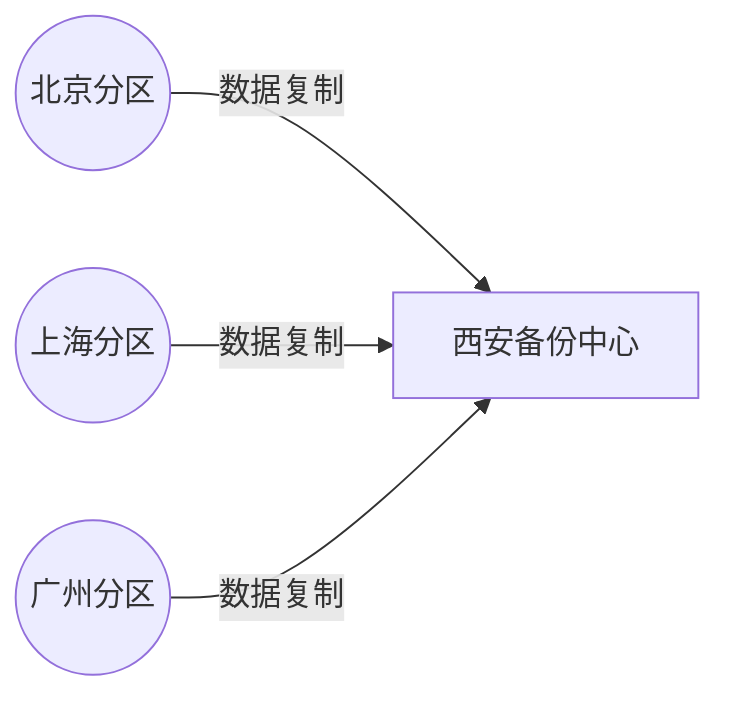

集中式备份架构**优点**：
* **设计简单**，各分区之间并无直接联系，可以做到互不影响；
* **扩展容易**，如果要增加第四个分区(例如，武汉分区)，只需要将武汉分区的数据复制到西安备份中心即可，其他分区不受影响。

集中式备份架构**缺点**：
* **成本较高**，需要建设一个独立的备份中心。

###### 5.4.1.6.2 数据分区复制规则-互备式
互备式备份指每个分区备份另外一个分区的数据，基本架构如下：

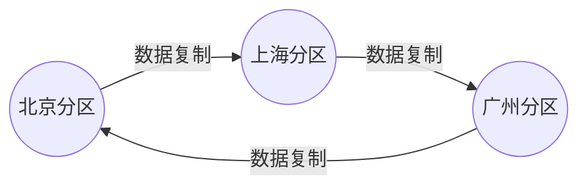

互备式备份架构的**优点**：
* **成本低**，直接利用已有的设备。

互备式备份架构的**缺点**：
* **设计比较复杂**，各个分区除了要承担业务数据存储，还需要承担备份功能，相互之间互相关联和影响；
* **扩展麻烦**，如果增加一个武汉分区，则需要修改广州分区的复制指向武汉分区，然后将武汉分区的复制指向北京分区。而原有北京分区已经备份了的广州分区的数据怎么处理也是个难题，不管是做数据迁移，还是广州分区历史数据保留在北京分区，新数据备份到武汉分区，无论哪种方式都很麻烦。

###### 5.4.1.6.3 数据分区复制规则-独立式
独立式备份指每个分区自己有独立的备份中心，基本架构如下：

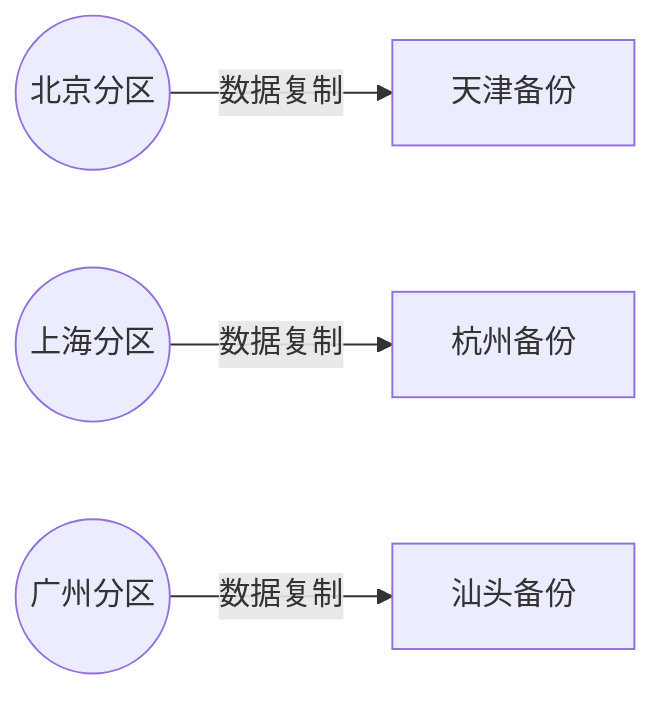

独立式备份架构的**优点**：
* 设计简单，各分区互不影响；
* 扩展容易，新增加的分区只需要搭建自己的备份中心即可。

独立式备份架构的**缺点**：
* 成本高，每个分区需要独立的备份中心，这个成本比集中式备份都要高很多，因为备份中心的场地成本式主要成本。

##### 5.4.1.7 存储高可用方案总结
| 方案               | 特点 | 适用场景 | 优点 | 缺点 |
| ------------------ | ---- | -------- | ---- | ---- |
| 主备复制           | ---  | ---      | ---  | ---  |
| 主从复制           | ---  | ---      | ---  | ---  |
| 互连式主备倒换     | ---  | ---      | ---  | ---  |
| 中介式主备倒换     | ---  | ---      | ---  | ---  |
| 模拟式主备倒换     | ---  | ---      | ---  | ---  |
| 主主复制           | ---  | ---      | ---  | ---  |
| 数据集中集群       | ---  | ---      | ---  | ---  |
| 数据分散集群       | ---  | ---      | ---  | ---  |
| 集中式数据分区集群 | ---  | ---      | ---  | ---  |
| 互备式数据分区集群 | ---  | ---      | ---  | ---  |
| 独立式数据分区集群 | ---  | ---      | ---  | ---  |

#### 5.4.2 计算高可用
##### 5.4.2.1 主备
##### 5.4.2.2 主从
##### 5.4.2.3 对称集群
##### 5.4.2.4 非对称集群

#### 5.4.3 常见组件的高可用方案
##### 5.4.3.1 Kubernetes
##### 5.4.3.2 MySQL
##### 5.4.3.3 MariaDB
##### 5.4.3.4 MongoDB
##### 5.4.3.5 Redis
##### 5.4.3.6 Elasticsearch
##### 5.4.3.7 Kafka

### 5.5 区域级高可用设计
#### 5.5.1 备份恢复
#### 5.5.2 异地多活

## 6 通过提升性能来提升可用性
## 7 通过提升伸缩性来提升可用性
## 8 通过提升可观测性来预防不可用问题

## 参考资料
1. 《可伸缩架构-云环境下的高可用与风险管理》
2. [酷壳-关于高可用的系统](https://coolshell.cn/articles/17459.html)
3. [Oracle: High Availability Concepts and Best Practices](https://docs.oracle.com/cd/A91202_01/901_doc/rac.901/a89867/pshavdtl.htm)
4. 《阿里云云计算架构师ACE认证培训课程》
5. [5分钟搞懂 Availability/Durability/MTTR/MTBF/RTO/RPO](https://zhuanlan.zhihu.com/p/569502612)
6. 《SRE Google 运维解密》
7. 《从零开始学架构》