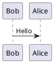

# RESTful API 设计

## 参考资料
1. [Microsoft, RESTful Web API 设计](https://learn.microsoft.com/zh-cn/azure/architecture/best-practices/api-design)
2. [Microsoft REST API Guidelines](https://github.com/microsoft/api-guidelines/tree/vNext)
3. [Zalando RESTful API and Event Guidelines](https://opensource.zalando.com/restful-api-guidelines/#)